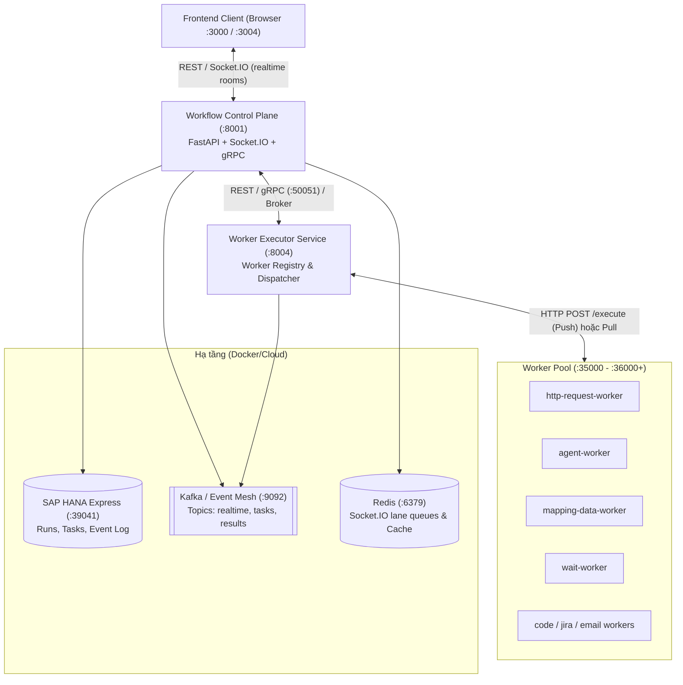
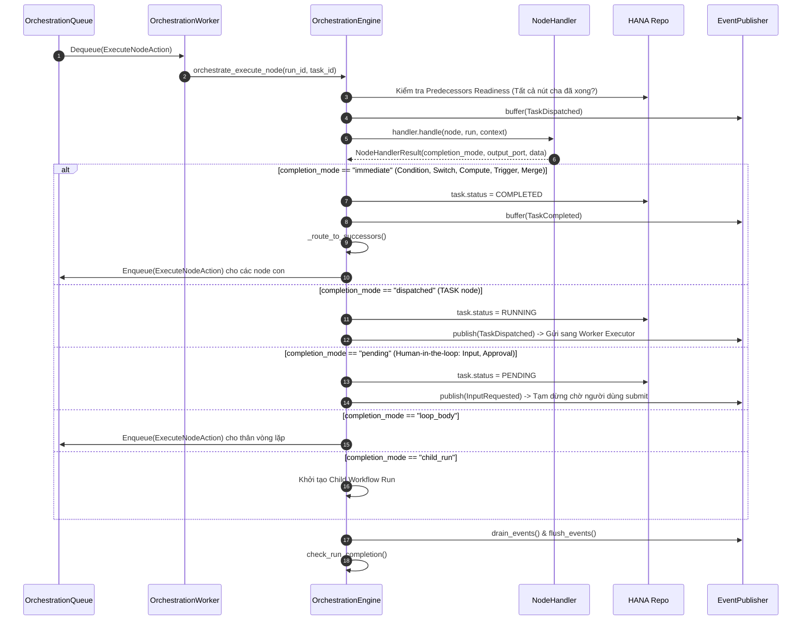

# Báo Cáo Thiết Kế Kiến Trúc: AI Workflow Management

> **Tài liệu tổng quan toàn diện về hệ thống điều phối quy trình AI (AI Workflow Orchestration Platform / Control Plane)**

---

## 1. Tổng Quan Hệ Thống & Triết Lý Thiết Kế (System Overview)

**AI Workflow Management** là nền tảng điều phối luồng công việc AI cốt lõi (Control Plane) cho SimpleMDG. Hệ thống lập kế hoạch, điều phối, thực thi và giám sát các quy trình phức tạp kết hợp giữa các mô hình AI/LLM, tác vụ xử lý dữ liệu, API bên ngoài và tương tác con người (Human-in-the-loop).

Hệ thống được thiết kế theo triết lý **Event-Driven Orchestration** (lấy cảm hứng từ [n8n](https://n8n.io/) nhưng nâng cấp chuẩn doanh nghiệp):

- **Event-First:** Mỗi bước thực thi là sự tiêu thụ của 1 event và phát sinh 0 hoặc nhiều event mới; không phụ thuộc vào một scheduler tập trung duyệt đồ thị tĩnh.
- **Runtime Validation Only:** Khác với các engine truyền thống duyệt và xác thực DAG tĩnh toàn bộ trước khi chạy, hệ thống cho phép workflow được chấp nhận linh hoạt. Xác thực (schema, ràng buộc) chỉ diễn ra ngay khi event đến node tương ứng.
- **Replayable (Event Sourcing):** Chuỗi Event Log là nguồn chân lý duy nhất (Source-of-Truth). Trạng thái thực thi (`RunState`) có thể được khôi phục hoặc replay từ bất kỳ thời điểm nào trong quá khứ.
- **Phân tách trách nhiệm (Engine Split):** Tách biệt rõ ràng 3 mối quan tâm:
  1. **Dispatcher:** Duyệt quan hệ đồ thị, đánh giá điều kiện và tính toán fanout sang các node kế tiếp.
  2. **Executor:** Thực thi các node handlers (xử lý nội bộ hoặc ủy thác cho external worker).
  3. **Projector:** Chiếu và cập nhật trạng thái `Run` / `Task` vào kho dữ liệu.
- **Hiển thị Realtime:** Phát streaming event qua WebSocket (Socket.IO) / Push Gateway để canvas giao diện sáng đèn từng node theo thời gian thực.

---

## 2. Cấu Trúc Thư Mục & Topology Triển Khai (Layout & Topology)

```
apps/backend/ai-workflow-management/
├── workflow/
│   ├── workflow-control-plane-service/  # [Port 8001] "Bộ não" điều phối (Control Plane)
│   ├── worker-executor-service/         # [Port 8004] Quản lý & Dispatcher worker ngoại vi
│   ├── worker/                          # Hệ sinh thái Workers thực thi tác vụ
│   │   ├── worker-sdk/                  # SDK chuẩn hóa cho tất cả worker (Clean Architecture)
│   │   ├── http-request-worker/         # [Port 36000] Gọi HTTP/RESTful APIs
│   │   ├── agent-worker/                # Tích hợp LLMs (OpenAI, Claude, v.v.)
│   │   ├── mapping-data-worker/         # Biến đổi dữ liệu, ánh xạ cấu trúc JSON/Array
│   │   ├── wait-worker/                 # Hẹn giờ, trì hoãn theo thời gian thực
│   │   ├── database-connection-worker/  # Kết nối & truy vấn CSDL
│   │   ├── email-worker/, jira-worker/, ms-teams-worker/, ...
│   ├── libs/
│   │   └── json-csv-streamer/           # Thư viện streaming dữ liệu lớn (JSON/CSV)
│   ├── proto/ & workflow_proto/         # Protobuf definitions cho gRPC communication
│   ├── docs/                            # Toàn bộ tài liệu phân tích thiết kế chi tiết
│   │   └── design/                      # 40+ tài liệu RFC, spec và sơ đồ PlantUML
```

### Sơ Đồ Topology Giao Tiếp



---

## 3. Kiến Trúc Clean Architecture 4 Lớp

Hệ thống tuân thủ nghiêm ngặt **Clean Architecture** (Quy tắc phụ thuộc: Tầng ngoài phụ thuộc tầng trong, tầng Domain lõi hoàn toàn độc lập với Frameworks).

```
Layer 4: Frameworks & Drivers (HANA DB, Kafka, Redis, FastAPI, gRPC Server, Prometheus)
   ▲
Layer 3: Interface Adapters (REST Controllers, gRPC Servicers, Event Consumers)
   ▲
Layer 2: Application Core (Use Cases, Orchestration Engine, Successor Processor)
   ▲
Layer 1: Enterprise Domain (Entities, Value Objects, Domain Events, Fanout Logic)
```

### 3.1. Layer 1 — Domain Layer
- **Entities:** `Workflow`, `Run`, `Task`, `Node`, `Edge/Wire`, `EventLogEnvelope`.
- **Value Objects:** `NodeType` (16+ loại node), `TaskStatus` (`PENDING`, `RUNNING`, `COMPLETED`, `FAILED`, `SKIPPED`), `RunStatus` (`RUNNING`, `PAUSED`, `COMPLETED`, `FAILED`, `CANCELLED`), `Port` (`main`, `error`, `true`, `false`, `default`).
- **Domain Events:** Hơn 30 sự kiện nghiệp vụ:
  - *Vòng đời Run:* `RunStarted`, `RunCompleted`, `RunFailed`, `RunCancelled`, `RunPaused`, `RunResumed`.
  - *Vòng đời Task:* `TaskDispatched`, `TaskCompleted`, `TaskFailed`, `TaskSkipped`, `InputRequested`.
  - *Topology & Vòng lặp:* `EdgeTraversed`, `NodeOutputProduced`, `LoopStarted`, `LoopIterationCompleted`, `LoopCompleted`.
- **Hàm Thuần Túy (Pure Functions):**
  - `compute_fanout()`: Tính toán nút kế tiếp, lọc output ports, kiểm tra tính sẵn sàng của node tiền nhiệm (predecessor readiness), và tính toán **Cascade-Skip**.
  - `apply_event()` & `rebuild_run_state()`: Chiếu và tái tạo trạng thái Run từ log sự kiện.

### 3.2. Layer 2 — Application Layer
- **Điều Phối Lõi (Orchestration Core):**
  - `OrchestrationEngine`: Điều phối quy trình xử lý vòng đời.
  - `NodeExecutionRunner`: Chuẩn bị môi trường, kiểm tra điều kiện tiên quyết và kích hoạt handlers.
  - `SuccessorProcessor`: Tiếp nhận kết quả từ node, tính fanout và sinh task kế tiếp.
  - `TaskFactory`: Tạo thực thể Task kèm theo kế thừa ngữ cảnh phạm vi (`scope_stack`).
  - `LoopIterationDriver` & `EventDrivenLoopDriver`: Quản lý vòng lặp và chuyển bước lặp.
  - `ChildWorkflowCoordinator`: Khởi chạy và giám sát các Sub-workflow con.
- **Node Handlers (16 Node Types):**
  - *Flow Control:* `TriggerNodeHandler`, `ConditionNodeHandler`, `SwitchNodeHandler`, `ParallelNodeHandler`, `MergeNodeHandler`.
  - *Vòng lặp:* `LoopNodeHandler`, `LoopExitNodeHandler`, `LoopContinueNodeHandler`.
  - *Tác vụ & Tính toán:* `TaskNodeHandler` (ủy thác worker), `ComputeNodeHandler` (chạy script Python/NodeJS).
  - *Human-in-the-Loop:* `InputNodeHandler`, `HumanActionNodeHandler`, `DataEditNodeHandler`, `FileUploadNodeHandler`.
  - *Sub-workflow:* `WorkflowNodeHandler`.
- **Hơn 90 Use Cases Chuyên Biệt:**
  - Quản lý Run: `StartRunUseCase`, `CancelRunUseCase`, `PauseRunUseCase`, `ResumeRunUseCase`, `RerunRunUseCase`.
  - Xử lý Task: `CompleteTaskUseCase`, `FailTaskUseCase`, `ResumePendingTaskUseCase`.
  - Thao tác Dữ liệu: `EditNodeDataUseCase`, `GetNodeOutputUseCase`, `StoreOutputUseCase`.
  - API Gateway Apps & Functions: `CreateGatewayAppUseCase`, `SyncGatewayAppOpenAPIUseCase`, v.v.

### 3.3. Layer 3 — Adapters Layer
- **REST Controllers:** FastAPI Routers cung cấp đầy đủ API RESTful: `/api/v1/runs`, `/api/v1/workflows`, `/api/v1/nodes`, `/api/v1/tasks`, `/api/v1/gateways`.
- **gRPC Server:** Cung cấp các service gRPC hiệu năng cao (`TaskDispatchService`, `PushGatewayService`, `WorkerRegistryService`).
- **Socket.IO Event Handlers:** Lắng nghe và quản lý kết nối realtime từ frontend: `join:run`, `leave:run`, `join:workflow`.

### 3.4. Layer 4 — Frameworks & Infrastructure Layer
- **Repositories (HANA & In-Memory):** `HanaRunRepository`, `HanaTaskRepository`, `HanaWorkflowRepository`, `HanaEventLogRepository`.
- **Event Publishing Decorator Chain:** Chuỗi decorator xử lý event đa tầng trước khi xuất bản ra broker.
- **Orchestration Queue:** Hàng đợi hành động điều phối nội bộ (`MemoryOrchestrationQueue` cho local/test và `BrokerOrchestrationQueue` cho Kafka/Event Mesh).

---

## 4. Cơ Chế Vận Hành Điều Phối (Engine Mechanics)

### 4.1. Mô Hình Thực Thi Thống Nhất (Uniform Execution — `_exec_uniform`)

Mọi node type trong hệ thống đều trải qua đường dẫn xử lý thống nhất:



### 4.2. Bảng Chế Độ Hoàn Thành (Completion Modes)

| Completion Mode | Loại Node Áp Dụng | Hành Vi Của Engine |
|---|---|---|
| `immediate` | `TRIGGER`, `CONDITION`, `SWITCH`, `PARALLEL`, `MERGE`, `COMPUTE`, `LOOP_EXIT`, `LOOP_CONTINUE` | Hoàn tất ngay lập tức trong process Control Plane; tự động route tiếp sang node kế tiếp. |
| `dispatched` | `TASK` | Ủy thác sang external worker qua `worker-executor-service`. Engine chờ worker gọi webhook callback `/complete`. |
| `pending` | `INPUT`, `HUMAN_ACTION`, `DATA_EDIT`, `FILE_UPLOAD` | Tạm dừng nhánh thực thi, chờ tác vụ người dùng submit qua API. |
| `child_run` | `WORKFLOW` | Tạo một Run độc lập cho sub-workflow, truyền input binding và theo dõi hoàn thành. |
| `loop_body` | `LOOP` | Lên lịch thực thi các node con trong thân vòng lặp theo từng phần tử mảng. |
| `deferred` | `MERGE` | Tạm hoãn khi chưa đủ điều kiện quorum (chờ các nhánh song song khác chạy tới). |

### 4.3. Thuật Toán Fanout & Cascade-Skip
- **Đánh giá Cổng ra (Port Evaluation):** Node `CONDITION` chỉ trả về port `true` hoặc `false`; `SWITCH` trả về port tương ứng với case khớp.
- **Cascade-Skip via BFS:** Nhánh rẽ không được chọn sẽ kích hoạt thuật toán BFS đánh dấu toàn bộ cây con phụ thuộc là `SKIPPED`.
- **Quy tắc an toàn:** Một node chỉ bị skip nếu **tất cả** các node tiền nhiệm của nó đều bị skip. Nếu còn ít nhất một đường dẫn hợp lệ khác hội tụ vào, node sẽ tiếp tục chờ.

### 4.4. Vòng Lặp & Phân Cấp Phạm Vi (Scope Hierarchy)
- **Vòng lặp Lồng nhau (Nested Loops):** Mỗi tầng lặp được cấp một `invocation_id` duy nhất (tạo bằng hash deterministic `uuid5`).
- **Phân tách Ngữ cảnh (Scope Isolation):** Dữ liệu vòng lặp được cô lập trong `task.scope_stack`. Biến nội bộ vòng lặp được truy xuất: `{{$loop.index}}`, `{{$loop.item}}`, `{{$loop.total}}`.
- **Điều khiển Vòng lặp:** Hỗ trợ lệnh thoát ngắt (`LOOP_EXIT` - break) và chuyển lượt (`LOOP_CONTINUE` - continue).

---

## 5. Chuỗi Xuất Bản Sự Kiện (Event Publishing Chain)

Mọi sự kiện được xuất bản trong Control Plane đều đi qua chuỗi **Decorator Pattern** gồm 5 tầng trước khi phân phối tới client:

```
[Caller: Engine / UseCase]
       │
       ▼
1. EventLogAppendingPublisher ──> [Append vào HANA DB: Write-Ahead Log]
       │
       ▼
2. RealtimeBroadcastingPublisher ──> [Đẩy vào Topic Kafka/EventMesh: "realtime.events" (key=root_run_id)]
       │                                     │
       │                                     ├─► SocketIORealtimeConsumer ──► Socket.IO Rooms: run:{run_id}
       │                                     └─► PushGatewayRealtimeConsumer ──► Push Gateway API
       ▼
3. EnrichingEventPublisher ──> [Thêm metadata, root_run_id cho external consumers]
       │
       ▼
4. HttpTaskDispatcher / GrpcTaskDispatcher ──► [Fork riêng cho event task.dispatched -> Gửi sang Worker Executor]
       │
       ▼
5. BackendPublisher ──> [Gửi đến Console / Kafka Broker / SAP Event Mesh]
```

### Ưu Điểm Thiết Kế:
- **Write-Ahead Logging (WAL):** Sự kiện luôn được ghi log bền vững trước khi phát tán ra mạng.
- **Thứ Tự Tuyệt Đối (Strict Ordering):** Sự kiện phân vùng theo `root_run_id` trên Kafka, đảm bảo mọi sự kiện của cùng 1 run được xử lý tuần tự, chống race condition.
- **Ưu Tiên Sự Kiện (`EventCollector`):**
  - *Ưu tiên 0 (IMMEDIATE):* `task.dispatched`, `input.requested`, `child_run.started`.
  - *Ưu tiên 1 (NORMAL):* `edge.traversed`, `task.completed`, `condition.evaluated`.
  - *Ưu tiên 2 (TERMINAL):* `run.completed`, `run.failed`, `run.cancelled`.

---

## 6. Worker Subsystem & Worker SDK

### 6.1. Worker Executor Service
- **Dynamic Worker Registry:** Worker tự động gửi bản tin heartbeat để đăng ký năng lực (`worker_type`, `node_types`, địa chỉ `endpoint`).
- **Liveness Sweeper:** Tự động phát hiện và loại bỏ các worker bị ngắt kết nối (stale workers).
- **Chế Độ Dispatch:**
  - *Push Mode:* Executor chủ động gọi `POST /api/v1/execute` tới worker rảnh.
  - *Pull Mode:* Worker chủ động kéo task về xử lý theo hạn mức (Pull-lease model).
- **Backpressure:** Tự động phản hồi tín hiệu nghẽn tải (`CONCURRENCY_LIMIT`, `WORKER_SATURATED`, `ADMISSION_FULL`) giúp broker tự động retry mà không làm tràn bộ nhớ.

### 6.2. Worker SDK
Cung cấp khung nền tảng cho phép viết các Worker mới nhanh chóng:
- Tự động tích hợp đăng ký (`HttpWorkerRegistry`), kiểm tra sức khỏe (`/health`), xuất metrics (Prometheus).
- Hỗ trợ 2 chế độ: `SERVER` (FastAPI container độc lập) hoặc `HEADLESS` (script ngầm).
- Danh mục Workers tiêu biểu:
  - `http-request-worker`: Hỗ trợ GET, POST, PUT, DELETE, PATCH kèm Auth (Basic, Bearer, OAuth2).
  - `agent-worker`: Tích hợp các LLM (OpenAI, Anthropic Claude), hỗ trợ Prompt Templates & History.
  - `mapping-data-worker`: Xử lý trích xuất dữ liệu mảng lồng nhau, chuyển đổi cấu trúc JSON.
  - `wait-worker`: Tạm dừng theo thời lượng hoặc tới mốc thời gian xác định.

---

## 7. Phân Giải Biến & Quản Lý Dữ Liệu (Variable Resolution)

### Cú Pháp Biểu Thức (n8n Syntax):
- `{{ $trigger.user_id }}`: Lấy dữ liệu từ payload khởi tạo ban đầu.
- `{{ $node_id.data.items[0].id }}`: Tham chiếu kết quả của bất kỳ node nào đã chạy trước đó.
- `{{ $loop.item }}` / `{{ $loop.index }}`: Tham chiếu phần tử và chỉ số vòng lặp hiện tại.
- `{{ $metadata.run_id }}`: Truy xuất metadata của lần chạy.

### Chuỗi Phân Giải Biến (`VariableResolver`):
1. Tra cứu ngược đồ thị từ các node tiền nhiệm (`completed_tasks`).
2. Tra cứu trong `run.context.variables`.
3. Tra cứu biến hệ thống và metadata.
4. **Hỗ Trợ Dữ Liệu Dung Lượng Lớn:** Dữ liệu dung lượng lớn (CSV, file BLOB) được lưu trữ qua `DataStoreService` và chỉ truyền tham chiếu file (`file_ref`), tránh phình RAM của Control Plane.

---

## 8. Độ Bền Vững & Tối Ưu Enterprise (Resilience & Hardening)

1. **Optimistic Locking & CAS Retry (`save_run_with_cas_retry`):**
   - Sử dụng cơ chế Compare-And-Swap dựa trên `version` khi cập nhật vào CSDL SAP HANA, chống xung đột ghi đồng thời từ nhiều worker.
2. **Transactional Outbox Pattern:**
   - Event được ghi đồng thời vào bảng outbox trong cùng transaction DB với entity, sau đó Outbox Dispatcher background loop sẽ quét và đẩy lên Kafka.
3. **Giám Sát Tài Nguyên & Bộ Nhớ Chuyên Sâu:**
   - `EventLoopLagMonitor`: Theo dõi độ trễ của Asyncio Event Loop trong Python để phát hiện nghẽn I/O.
   - `CacheExpiryJanitor`: Dọn dẹp cache khóa bảo mật (`run_credentials`) tự động sau TTL.
   - `MallocTrimJanitor`: Định kỳ gọi `malloc_trim` giải phóng bộ nhớ không sử dụng của arena glibc về cho hệ điều hành.
4. **Durable Timers & Schedulers:**
   - Lập lịch cron định kỳ (`fire_due_schedules`) và quản lý timer bền vững, có khả năng phục hồi sau sự cố restart pod.

---

## 9. Bảng Điểm Truy Cập & Port Mạng

| Dịch Vụ | Port | Giao Thức | Mục Đích & Tài Liệu API |
|---|---|---|---|
| **API Gateway** | `8000` | HTTP / REST | Cổng vào chính cho client: `http://localhost:8000/docs` |
| **Workflow Control Plane** | `8001` | HTTP / REST & Socket.IO | Engine điều phối: `http://localhost:8001/docs` |
| **Control Plane gRPC** | `50051` | gRPC | Giao tiếp nội bộ tốc độ cao giữa các services |
| **Worker Executor Service**| `8004` | HTTP / REST | Quản lý Worker & Dispatch: `http://localhost:8004/docs` |
| **Worker Replicas** | `35000+` | HTTP / REST | Endpoints thực thi nhiệm vụ chuyên biệt (`/api/v1/execute`) |
| **SAP HANA Express** | `39041` | SQL / HDB | Cơ sở dữ liệu quan hệ lưu trữ dữ liệu bền vững |
| **Apache Kafka** | `9092` | PLAINTEXT | Message broker truyền thông điệp event và task queue |
| **Redis** | `6379` | RESP | Phối hợp phân tán Socket.IO clusters và cache |
