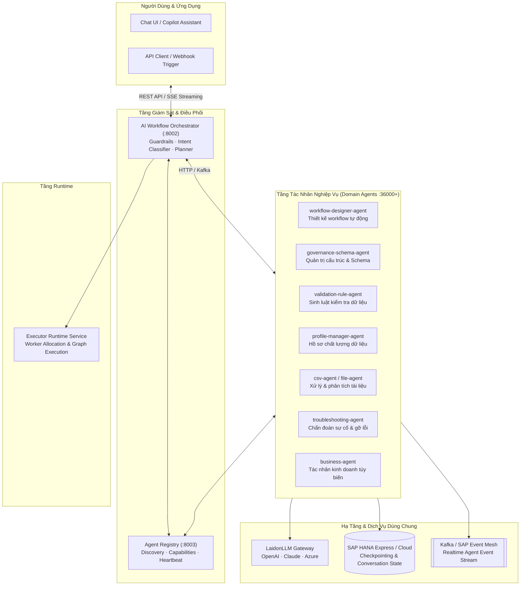

# 02. Topology Hệ Thống Đa Tác Nhân (Agent Topology)

> **Phân hệ:** AI Agent Subsystem  
> **Chủ đề:** Bản đồ kết nối giữa Orchestrator, Agent Registry, Runtime Service và mạng lưới Domain Agents.

---

## 1. Sơ Đồ Topology Tổng Thể

Hệ thống Agent vận hành theo mô hình **Hierarchical Multi-Agent Architecture** (Kiến trúc phân cấp đa tác nhân), trong đó một Orchestrator trung tâm đóng vai trò người giám sát (Supervisor), kết hợp cùng Registry để điều phối các tác nhân chuyên biệt.

---

## 2. Các Luồng Tương Tác Chính

### 2.1. Tiếp Nhận & Phân Loại Yêu Cầu (Intent Classification & Guardrails)
1. Người dùng gửi tin nhắn hoặc yêu cầu ngôn ngữ tự nhiên vào **Orchestrator**.
2. **InputGuard** kiểm duyệt an toàn nội dung (chống Prompt Injection, rà soát PII).
3. **IntentClassifier** phân tích mục đích của người dùng:
   - Nếu là câu hỏi thông thường ➔ Trả lời trực tiếp qua LLM.
   - Nếu là yêu cầu nghiệp vụ chuyên biệt ➔ Tra cứu **Agent Registry** để tìm Agent phù hợp nhất theo nhãn năng lực (Capabilities matching).

---

### 2.2. Phối Hợp Đa Tác Nhân (Agent-to-Agent Delegation)
1. Orchestrator kích hoạt **AgentCallCoordinator**:
   - Chuyển giao ngữ cảnh hội thoại và dữ liệu cần xử lý sang Agent được chọn (ví dụ: `workflow-designer-agent`).
2. Agent chuyên biệt thực thi đồ thị LangGraph nội bộ:
   - Gọi các công cụ nghiệp vụ (Tools).
   - Tương tác với CSDL SAP HANA hoặc phân tích tài liệu.
3. Nếu Agent cần sự can thiệp của con người (Human-in-the-loop) hoặc cần gọi thêm Agent phụ khác (Sub-agent):
   - Kích hoạt cơ chế **`interrupt()`** của LangGraph.
   - Trạng thái được lưu vào **HanaCheckpointSaver**.
   - Trả về mã ngắt kèm câu hỏi xác nhận cho người dùng.

---

### 2.3. Khám Phá Động (Dynamic Discovery via Agent Registry)
Mỗi Agent khi khởi động sẽ tự động kết nối với **Agent Registry**:
- Gửi thông tin định danh: `agent_id`, `version`, `endpoint`, danh sách `capabilities` (ví dụ: `domain=governance, action=create_rule`).
- Duy trì nhịp tim định kỳ (Heartbeat).
- Nhờ vậy, Orchestrator không cần hardcode địa chỉ của từng Agent, có thể tự động nhận biết khi có Agent mới tham gia vào cụm mạng.
