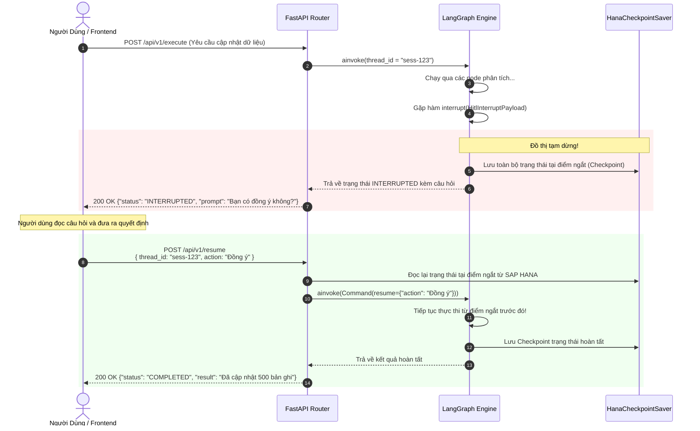

# 02. Lưu Trữ Điểm Phục Hồi & Tương Tác Con Người (Checkpointing & HITL)

> **Phân hệ:** AI Agent Subsystem  
> **Chủ đề:** Cơ chế Checkpointing trên SAP HANA, kỹ thuật Human-in-the-loop (HITL) ngắt luồng và phục hồi phiên chạy (Resume).

---

## 1. Cơ Chế Lưu Trữ Điểm Phục Hồi (Checkpointing)

Trong các ứng dụng AI doanh nghiệp, một lượt hội thoại có thể kéo dài qua nhiều ngày hoặc cần tạm dừng chờ phê duyệt. Nếu chỉ lưu trạng thái trên RAM của tiến trình, bất kỳ lần restart pod nào cũng sẽ làm mất toàn bộ ngữ cảnh làm việc.

Agent SDK giải quyết vấn đề này bằng cơ chế **Checkpointing**:
- **Cơ chế hoạt động:** Sau mỗi lần một Node trong LangGraph hoàn thành, trạng thái (`State`) cùng phiên bản luồng (`thread_id`, `checkpoint_id`) sẽ tự động được tuần tự hóa và ghi vào kho lưu trữ bền vững.
- **Hai bộ Checkpointer được cung cấp:**
  1. **`MemorySaver`:** Dành cho môi trường phát triển cục bộ và kiểm thử tự động (Unit test). Lưu trong RAM, tốc độ cao, biến mất khi tắt app.
  2. **`HanaCheckpointSaver`:** Dành cho môi trường Production trên SAP BTP. Lưu trữ trạng thái bền vững chuẩn ACID vào các bảng quản lý checkpoint trong **SAP HANA Cloud / Express**.

---

## 2. Kỹ Thuật Tương Tác Con Người: Human-in-the-Loop (HITL)

Human-in-the-loop là yêu cầu bắt buộc đối với các tác vụ nhạy cảm:
- Thay đổi cấu trúc bảng dữ liệu trong SAP.
- Xóa hàng loạt hồ sơ khách hàng.
- Phê duyệt quy trình chuyển đổi dữ liệu tài chính.

### 2.1. Cơ Chế Ngắt Tại Runtime (`interrupt()`)
Bên trong logic của Node, nếu Agent nhận thấy hành động cần phê duyệt, nó gọi hàm `interrupt()`:

```python
from langgraph.types import interrupt
from agent_sdk.layer1_domain.entities import HitlInterruptPayload

async def execute_sensitive_action_node(state: MyAgentState, deps: Dependencies) -> dict:
    if state.requires_approval and not state.is_approved:
        # Tạm dừng đồ thị LangGraph ngay lập tức
        user_response = interrupt(
            HitlInterruptPayload(
                question="Bạn có đồng ý cập nhật 500 bản ghi dữ liệu vào bảng SAP KNA1 không?",
                options=["Đồng ý", "Từ chối"],
                context={"records_count": 500, "table": "KNA1"}
            )
        )
        
        # Khi luồng được resume, giá trị user_response sẽ xuất hiện tại đây!
        if user_response.get("action") != "Đồng ý":
            return {"status": "REJECTED", "message": "Người dùng đã từ chối thao tác."}

    # Thực thi hành động sau khi được duyệt
    await deps.sap_service.update_records(...)
    return {"status": "SUCCESS"}
```

---

## 3. Sơ Đồ Tuần Tự HITL & Resume



---

## 4. Ưu Điểm Nổi Bật Của Thiết Kế

1. **Hoàn Toàn Không Lưu Trạng Thái Trên Web Server (Stateless Web Tier):**
   - Giữa thời điểm ngắt và thời điểm người dùng phản hồi (có thể cách nhau vài tiếng), web server không phải giữ bất kỳ socket, thread hay bộ nhớ RAM nào cho phiên đó.
   - Request `resume` có thể được gửi tới bất kỳ instance nào trong cụm cluster, instance đó chỉ cần đọc checkpoint từ SAP HANA để tiếp tục chạy.
2. **Khả Năng Khôi Phục Sự Cố (Fault Tolerance):**
   - Nếu máy chủ bị sập đúng lúc đang chờ duyệt, phiên chạy vẫn an toàn 100% trong CSDL.
