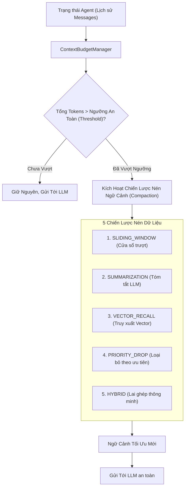

# 03. Quản Lý Ngân Sách Ngữ Cảnh (Context Budget Management)

> **Phân hệ:** AI Agent Subsystem  
> **Chủ đề:** Tránh tràn cửa sổ ngữ cảnh LLM với `ContextBudgetManager` và 5 chiến lược nén dữ liệu (Compaction Strategies).

---

## 1. Bài Toán Tràn Ngữ Cảnh (Context Window Overflow)

Trong các Agent hội thoại và quy trình đa bước:
- Mỗi lần Agent gọi công cụ, kết quả trả về (JSON schema lớn, hàng trăm dòng log, tài liệu phân tích) được nhồi liên tục vào lịch sử hội thoại (`messages`).
- Sau 10–15 lượt trao đổi, tổng số lượng token nhanh chóng vượt qua giới hạn của mô hình (ví dụ: 128k tokens của GPT-4o) hoặc làm chi phí API tăng vọt và suy giảm chất lượng suy luận (hiện tượng "Lost in the middle").

Agent SDK giải quyết triệt để bài toán này thông qua thành phần chuyên trách: **`ContextBudgetManager`**.

---

## 2. Kiến Trúc Bộ Quản Lý Ngân Sách Ngữ Cảnh



---

## 3. Chi Tiết 5 Chiến Lược Nén (Compaction Strategies)

### 3.1. `SLIDING_WINDOW` (Cửa Sổ Trượt Đơn Giản)
- **Cách thức:** Luôn giữ lại System Prompt ban đầu và `K` tin nhắn gần nhất (ví dụ: 10 tin nhắn cuối cùng). Toàn bộ tin nhắn cũ nằm ngoài cửa sổ trượt sẽ bị cắt bỏ.
- **Ưu điểm:** Tốc độ tính toán siêu nhanh, không tốn thêm chi phí gọi API.
- **Nhược điểm:** Mất toàn bộ bối cảnh của các thỏa thuận hoặc dữ liệu người dùng cung cấp ở đầu cuộc trò chuyện.

---

### 3.2. `SUMMARIZATION` (Tóm Tắt Tự Động Bằng LLM)
- **Cách thức:** Khi lịch sử đạt ngưỡng giới hạn, SDK kích hoạt một tác vụ chạy ngầm sử dụng một mô hình nhỏ và rẻ (như GPT-4o-mini hoặc Claude 3.5 Haiku) để tóm tắt 80% tin nhắn cũ thành một đoạn văn ngắn gọn (Executive Summary):
  ```text
  [Tóm tắt bối cảnh trước đó: Người dùng muốn kiểm tra bảng KNA1, đã chọn 500 khách hàng ở Hà Nội, đang chờ bước xác nhận mã số thuế...]
  ```
- **Ưu điểm:** Giữ được đầy đủ mạch suy luận và các quyết định quan trọng mà vẫn giảm được 70–80% số lượng token.

---

### 3.3. `VECTOR_RECALL` (Lưu Trữ & Truy Xuất Ngữ Nghĩa)
- **Cách thức:** Các tin nhắn và kết quả tool cũ được chuyển thành vector embedding và lưu vào cơ sở dữ liệu vector.
- Trong các lượt hội thoại sau, SDK chỉ tìm kiếm và kéo lại (Retrieve) các mẩu thông tin có độ tương đồng ngữ nghĩa cao nhất với câu hỏi hiện tại.

---

### 3.4. `PRIORITY_DROP` (Cắt Giảm Dựa Trên Mức Độ Ưu Tiên)
- **Cách thức:** Hệ thống phân loại thông điệp theo thứ tự ưu tiên:
  1. `SYSTEM_PROMPT` (Ưu tiên cao nhất - Không bao giờ xóa).
  2. `USER_REQUEST` (Yêu cầu của người dùng - Giữ lại).
  3. `AI_FINAL_ANSWER` (Câu trả lời chốt - Giữ lại).
  4. `TOOL_OUTPUT` (Dữ liệu thô từ API - Ưu tiên xóa đầu tiên khi cần dung lượng).
- Chiến lược này giải phóng dung lượng cực lớn bằng cách cắt bỏ các payload JSON khổng lồ của Tool calls mà Agent đã đọc xong từ các vòng lặp trước.

---

### 3.5. `HYBRID` (Chiến Lược Lai Ghép Mặc Định Cho Doanh Nghiệp)
- Kết hợp hoàn hảo giữa **Priority Drop** (loại bỏ kết quả tool cũ) ➔ **Summarization** (tóm tắt các đoạn chat cũ) ➔ và **Sliding Window** (giữ nguyên 5 tương tác gần nhất).
- Đảm bảo Agent luôn thông minh, hiểu bối cảnh sâu mà ngân sách token luôn nằm trong tầm kiểm soát an toàn.
