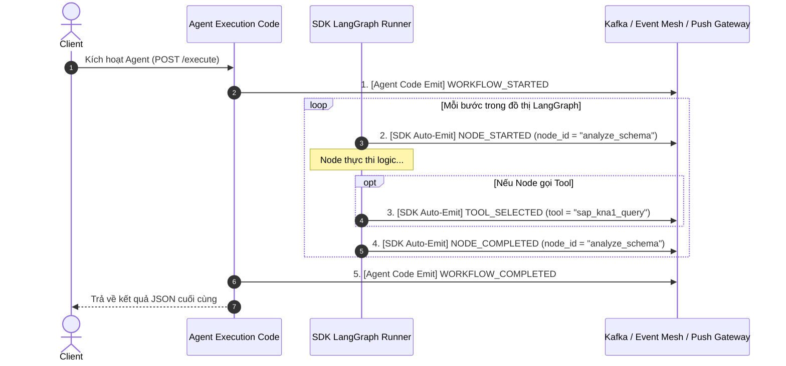

# 04. Giao Thức Truyền Thông & Vòng Đời Sự Kiện (Transports & Events)

> **Phân hệ:** AI Agent Subsystem  
> **Chủ đề:** Hai chế độ chạy SERVER vs CONSUMER, hệ thống sự kiện 2 tầng (SDK vs Agent Code), và truyền phát sự kiện ra Push Gateway.

---

## 1. Hai Chế Độ Vận Hành (Dual Run Modes)

Mỗi Agent xây dựng từ Agent SDK có thể chạy ở một trong hai chế độ truyền thông tùy theo biến môi trường `RUN_MODE`:

```
┌─────────────────────────────────────────────────────────────┐
│                    Agent Microservice                       │
│  ┌─────────────────────────────┐┌─────────────────────────┐ │
│  │   Chế Độ 1: SERVER          ││   Chế Độ 2: CONSUMER    │ │
│  │   (FastAPI HTTP REST :36000)││   (Kafka / Event Mesh)  │ │
│  │   POST /api/v1/execute      ││   Topic: agent.tasks    │ │
│  │   POST /api/v1/resume       ││   Topic: agent.resumes  │ │
│  └─────────────────────────────┘└─────────────────────────┘ │
└─────────────────────────────────────────────────────────────┘
```

| Tiêu Chí | Chế Độ SERVER (`RUN_MODE=SERVER`) | Chế Độ CONSUMER (`RUN_MODE=CONSUMER`) |
|---|---|---|
| **Giao thức** | HTTP RESTful (FastAPI + Uvicorn). | Message Queue Consumer (Kafka / SAP Event Mesh). |
| **Cổng mạng** | Lắng nghe trên cổng mặc định `36000`. | Không mở bất kỳ cổng inbound nào. |
| **Cơ chế kích hoạt**| Request-Response trực tiếp. | Đọc thông điệp từ Topic, xử lý và bắn kết quả sang Result Topic. |
| **Trường hợp dùng** | Gọi đồng bộ từ Chat UI, kiểm thử cục bộ, Webhook. | Hệ thống xử lý nền, phân tán chịu tải cao, microservices bất đồng bộ. |

---

## 2. Hệ Thống Sự Kiện 2 Tầng (Two-Tier Event Lifecycle)

Khi một Agent thực thi, nó phát ra một chuỗi các sự kiện thời gian thực giúp người dùng trên giao diện có thể theo dõi Agent đang suy nghĩ gì, đang chạy node nào và gọi tool gì:



### Phân Định Trách Nhiệm Phát Sự Kiện:
1. **SDK Tự Động Phát (SDK Auto-Emits):**
   - Nhà phát triển **không cần viết code phát sự kiện** cho từng node.
   - Khi đồ thị LangGraph chạy qua bất kỳ node nào, SDK tự động bắt hook và phát `NODE_STARTED`, `NODE_COMPLETED` kèm thời gian thực thi (latency).
   - Khi Agent quyết định kích hoạt công cụ, sự kiện `TOOL_SELECTED` tự động bắn ra kèm tên tool và tham số.
2. **Mã Nghiệp Vụ Phát (Agent Code Emits):**
   - Nhà phát triển chỉ phụ trách bắn các sự kiện cấp cao quản lý vòng đời toàn cục: `WORKFLOW_STARTED`, `WORKFLOW_COMPLETED`, `WORKFLOW_FAILED`.

---

## 3. Tích Hợp Đa Nền Tảng & Push Gateway

- **Chế độ Message Broker (`MESSAGING_MODE`):**
  - `mock`: In sự kiện ra console (cho local dev).
  - `local`: Kết nối Apache Kafka cục bộ (`localhost:9092`).
  - `sap`: Kết nối SAP Event Mesh trên đám mây SAP BTP qua giao thức AMQP / REST.
- **Tự động Fanout ra Push Gateway (`PUSH_GATEWAY_URL`):**
  - Nếu biến môi trường `PUSH_GATEWAY_URL` được cấu hình, SDK sẽ tự động chuyển tiếp song song các sự kiện này tới Push Gateway.
  - Cho phép client frontend nhận SSE (Server-Sent Events) streaming mượt mà mà không phải trực tiếp kết nối vào Kafka.
