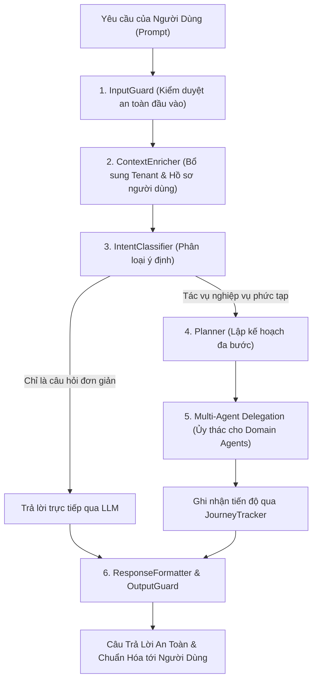

# 01. Kiến Trúc Bộ Điều Phối Hội Thoại (Orchestrator Architecture)

> **Phân hệ:** AI Agent Subsystem  
> **Chủ đề:** Bộ điều phối trung tâm `orchestrator`, hệ thống Guardrails bảo vệ, phân loại ý định (Intent Classification) và lập kế hoạch (Planner).

---

## 1. Vai Trò Của AI Workflow Orchestrator

Dịch vụ **`orchestrator`** (`apps/backend/agent/orchestrator/`) đóng vai trò là "Tổng đài thông minh" và người giám sát (Supervisor) cấp cao nhất của toàn bộ hệ sinh thái Agent.

Thay vì để người dùng phải tự tìm và gọi từng Agent riêng lẻ:
- Người dùng chỉ cần tương tác tại một cửa sổ Chat duy nhất với ngôn ngữ tự nhiên.
- Orchestrator phân tích câu hỏi, kiểm duyệt an toàn, lập kế hoạch và ủy thác công việc cho các tác nhân chuyên biệt.

---

## 2. Kiến Trúc Xử Lý 6 Tầng Của Orchestrator

Mỗi yêu cầu gửi tới Orchestrator đều trải qua một quy trình xử lý 6 bước nghiêm ngặt:

---

## 3. Các Thành Phần Nền Tảng

### 3.1. Hàng Rào Bảo Vệ An Toàn (Guardrails: `InputGuard` & `OutputGuard`)
- **`InputGuard`:**
  - Ngăn chặn tấn công **Prompt Injection** và Jailbreak (cố tình phá vỡ quy tắc hệ thống).
  - Rà soát và che giấu thông tin định danh cá nhân nhạy cảm (**PII Redaction**: CCCD, số thẻ tín dụng, mật khẩu).
  - Kiểm tra quyền hạn truy cập của người dùng đối với các tập dữ liệu yêu cầu.
- **`OutputGuard`:**
  - Đảm bảo câu trả lời từ AI không bị ảo giác (Hallucination), không chứa nội dung độc hại hoặc làm lộ dữ liệu cấu trúc nội bộ của máy chủ.

---

### 3.2. Bộ Phân Loại Ý Định (`IntentClassifier`)
Phân tích ngữ nghĩa câu lệnh và gán nhãn ý định người dùng vào các danh mục nghiệp vụ:
- `DESIGN_WORKFLOW`: Yêu cầu thiết kế luồng quy trình công việc mới.
- `ANALYZE_SCHEMA`: Yêu cầu phân tích hoặc sửa đổi cấu trúc bảng dữ liệu.
- `GENERATE_VALIDATION_RULES`: Yêu cầu sinh luật kiểm tra dữ liệu từ tài liệu nghiệp vụ.
- `TROUBLESHOOT_ERROR`: Yêu cầu chẩn đoán mã lỗi hoặc sự cố của một Workflow Run.
- `GENERAL_QA`: Hỏi đáp chung về tài liệu hướng dẫn sử dụng.

---

### 3.3. Bộ Lập Kế Hoạch (`Planner`) & Làm Giàu Ngữ Cảnh (`ContextEnricherService`)
- **`ContextEnricherService`:** Nạp các thông tin môi trường ngầm: người dùng này thuộc công ty nào (`tenant_id`), đang có vai trò gì (Admin hay Business User), hệ thống SAP nào đang kết nối.
- **`Planner`:** Nếu người dùng yêu cầu một công việc lớn ("Hãy kiểm tra file CSV này, tạo schema tương ứng trên SAP và thiết kế một workflow để import định kỳ mỗi tuần"), Planner sẽ phân rã thành một đồ thị công việc tuần tự:
  1. Gọi `file-agent` để đọc và phân tích cấu trúc cột của file CSV.
  2. Gọi `governance-schema-agent` để định nghĩa bảng dữ liệu.
  3. Gọi `workflow-designer-agent` để tạo luồng import hoàn chỉnh.

---

### 3.4. Theo Dõi Hành Trình (`JourneyTracker`) & Định Dạng Đầu Ra (`ResponseFormatter`)
- **`JourneyTracker`:** Ghi nhớ trạng thái phiên làm việc dài hạn, giúp người dùng có thể quay lại phiên làm việc cũ sau vài ngày mà không bị mất mạch thảo luận.
- **`ResponseFormatter`:** Chuẩn hóa câu trả lời thành định dạng trực quan: Markdown bảng biểu, Mermaid flowchart trực quan, hoặc các thẻ tương tác (Action Buttons: "Bấm vào đây để mở Workflow trên Canvas").
