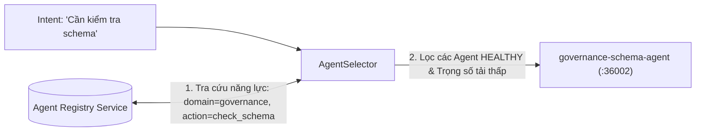
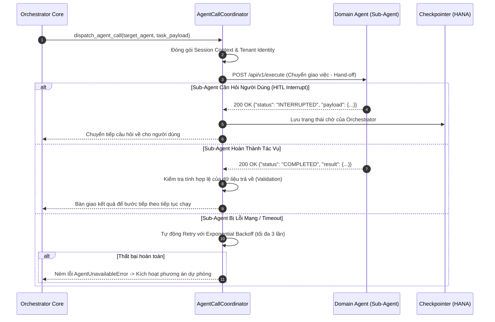

# 02. Cơ Chế Phối Hợp Đa Tác Nhân (Multi-Agent Coordination)

> **Phân hệ:** AI Agent Subsystem  
> **Chủ đề:** Lựa chọn Agent động (`AgentSelector`), bộ điều phối cuộc gọi tác nhân (`AgentCallCoordinator`), và mô hình Hand-off.

---

## 1. Cơ Chế Lựa Chọn Tác Nhân Động (`AgentSelector`)

Trong một hệ thống lớn, số lượng Domain Agents có thể tăng lên hàng chục hoặc hàng trăm service độc lập. Orchestrator không sử dụng các câu lệnh `if-else` cứng nhắc để gọi Agent, mà áp dụng cơ chế **Dynamic Agent Discovery & Selection**:

### Tiêu Chí Tuyển Chọn Của `AgentSelector`:
1. **Khớp nối năng lực (Capability Matching):** So khớp nhãn năng lực đã đăng ký của Agent với yêu cầu của bước hiện tại.
2. **Phiên bản tương thích (Version Constraints):** Ưu tiên các Agent có phiên bản `spec_version` tương thích với Tenant hiện tại.
3. **Trạng thái sức khỏe (Health & Liveness):** Chỉ điều hướng tới các Agent có bản tin Heartbeat hợp lệ trong vòng 60 giây gần nhất.

---

## 2. Bộ Phối Hợp Cuộc Gọi Tác Nhân (`AgentCallCoordinator`)

Khi Orchestrator quyết định chuyển việc cho một Domain Agent, lớp `AgentCallCoordinator` chịu trách nhiệm quản lý toàn bộ vòng đời của cuộc gọi này:

---

## 3. Các Mô Hình Phối Hợp Đa Tác Nhân Được Hỗ Trợ

Hệ thống hỗ trợ 3 mô hình giao tiếp giữa các tác nhân AI:

### 3.1. Mô Hình Giám Sát Phân Cấp (Supervisor Pattern - Mặc định)
- Orchestrator đóng vai trò là "Sếp" (Supervisor).
- Mọi giao tiếp giữa các tác nhân đều phải đi qua Orchestrator.
- **Ưu điểm:** Kiểm soát tuyệt đối an toàn, dễ theo dõi vết kiểm toán (Audit Trail) và dễ debug.

### 3.2. Mô Hình Chuyển Giao Quyền Điều Khiển (Hand-off Pattern)
- Orchestrator sau khi nhận diện người dùng muốn làm việc sâu về Workflow, nó chuyển toàn bộ phiên hội thoại sang cho `workflow-designer-agent`.
- `workflow-designer-agent` sẽ trực tiếp chat với người dùng trong nhiều lượt liên tiếp cho đến khi hoàn thành bản thiết kế, sau đó mới trả quyền điều khiển về lại cho Orchestrator.

### 3.3. Mô Hình Đồ Thị Phối Hợp Đồng Cấp (Multi-Agent Swarm / Network)
- Các Domain Agent có thể gọi lẫn nhau dưới dạng công cụ (Agent-as-a-Tool) thông qua `AgentDiscoveryService` mà không cần đi vòng qua Orchestrator trung tâm.
