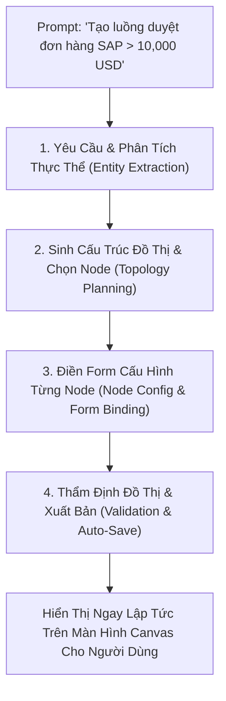

# 01. Tác Nhân Thiết Kế Quy Trình (Workflow Designer Agent)

> **Phân hệ:** AI Agent Subsystem  
> **Chủ đề:** Kiến trúc và năng lực của `workflow-designer-agent` — Chuyên gia tự động hóa thiết kế AI Workflow cho SimpleMDG Canvas.

---

## 1. Mục Tiêu & Năng Lực Cốt Lõi

**`workflow-designer-agent`** (`apps/backend/agent/workflow-designer-agent/`) là một trong những tác nhân thông minh quan trọng nhất của SimpleMDG. Nó giải phóng người dùng khỏi việc phải kéo thả thủ công từng node trên màn hình Canvas:
- **Hiểu yêu cầu nghiệp vụ tự nhiên:** Chuyển đổi một đoạn mô tả bằng lời nói hoặc văn bản thành một đồ thị quy trình hoàn chỉnh.
- **Tự động lựa chọn đúng Node Types:** Hiểu rõ mục đích của 21 loại node trong hệ thống để chọn đúng node điều kiện, node vòng lặp hay node tác vụ.
- **Tự động sinh Wires & Biểu thức Logic:** Thiết lập các cổng kết nối và viết biểu thức nội suy biến chuẩn cú pháp n8n `{{ ... }}`.
- **Xác thực cấu trúc đồ thị:** Đảm bảo workflow sinh ra không bị chu trình cụt, thiếu cổng ra hoặc xung đột schema trước khi lưu vào CSDL.

---

## 2. Quy Trình 4 Bước Thiết Kế Tự Động

### Bước 1: Phân Tích Thực Thể & Nghiệp Vụ
- Agent trích xuất:
  - Nguồn kích hoạt: Nhận dữ liệu đơn hàng từ webhook hoặc file.
  - Ngưỡng điều kiện: Giá trị đơn hàng (`order_amount`) lớn hơn `10,000`.
  - Hành động phân nhánh:
    - Nếu đúng ➔ Gửi form duyệt tới Giám đốc tài chính.
    - Nếu sai ➔ Tự động đồng bộ vào SAP S/4HANA.
  - Bước kết thúc: Gửi email thông báo trạng thái đơn hàng.

---

### Bước 2: Sinh Cấu Trúc Đồ Thị & Chọn Node
Agent quyết định sử dụng các node tương ứng trong catalog 21 node types:
1. `node_1` (Type: `TRIGGER`, Kind: `trigger`): Tiếp nhận đơn hàng.
2. `node_2` (Type: `CONDITION`, Kind: `logic`): Biểu thức `{{ $node_1.data.amount }} > 10000`.
3. `node_3` (Type: `HUMAN_ACTION`, Kind: `human`): Điểm dừng chờ Giám đốc duyệt (nằm trên nhánh `true`).
4. `node_4` (Type: `TASK`, Worker: `http-request-worker`): Gọi API SAP BAPI tạo đơn hàng (nhánh `false` hoặc sau khi duyệt).
5. `node_5` (Type: `TASK`, Worker: `email-worker`): Gửi email thông báo kết quả.

---

### Bước 3: Điền Form Cấu Hình Node (Auto-Form Binding)
- Dựa trên **Auto-form schema** của hệ thống, Agent tự động điền các tham số kỹ thuật:
  - Điền URL máy chủ SAP, phương thức HTTP, headers xác thực.
  - Thiết lập biểu thức lấy địa chỉ email khách hàng: `{{ $node_1.data.customer_email }}`.

---

### Bước 4: Thẩm Định Đồ Thị & Lưu Vào Control Plane
- Agent kích hoạt bộ kiểm tra đồ thị nội bộ (`DAGValidator`):
  - Kiểm tra tính liên thông: Đảm bảo mọi node đều có đường dẫn đi từ `TRIGGER` tới ít nhất một node kết thúc.
- Gọi REST API sang **Workflow Control Plane**:
  - `POST /api/v1/workflows`: Tạo bản ghi workflow mới ở trạng thái `DRAFT`.
- Trả về mã định danh `workflow_id` và link trực tiếp để người dùng mở ngay trên Canvas để kiểm tra trực quan.
