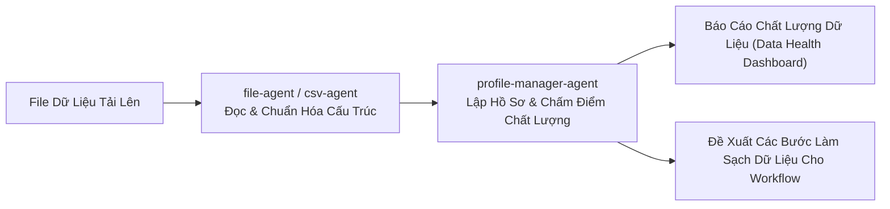

# 03. Các Tác Nhân Xử Lý File & Hồ Sơ Dữ Liệu

> **Phân hệ:** AI Agent Subsystem  
> **Chủ đề:** Bộ ba tác nhân chuyên trách xử lý tệp và hồ sơ chất lượng dữ liệu: `file-agent`, `csv-agent`, và `profile-manager-agent`.

---

## 1. `file-agent` (Xử Lý & Trích Xuất Tài Liệu Đa Định Dạng)

- **Mục đích:** Xử lý và đọc hiểu các định dạng tài liệu phi cấu trúc và bán cấu trúc (PDF, Word DOCX, Excel XLSX, JSON, XML).
- **Tính năng nổi bật:**
  - Tự động nhận diện cấu trúc văn bản, tiêu đề bảng biểu và hình ảnh nhúng.
  - Sử dụng mô hình OCR và Vision LLM để trích xuất thông tin hóa đơn (Invoices), đơn đặt hàng (Purchase Orders) hoặc hợp đồng kinh tế thành định dạng JSON có cấu trúc.
  - Tự động phát hiện ngôn ngữ và bộ mã ký tự (Encoding Detection).

---

## 2. `csv-agent` (Chuyên Gia Phân Tích Bảng Tính CSV)

- **Mục đích:** Khắc phục các bài toán hóc búa khi người dùng tải lên các file CSV xuất từ các hệ thống ERP cũ hoặc Excel.
- **Khả năng tự chữa lành (Self-Healing Parser):**
  - **Tự động nhận diện dấu phân cách (Delimiter Detection):** Phân biệt chính xác dấu phẩy `,`, dấu chấm phẩy `;`, dấu tab `\t` hoặc dấu gạch đứng `|`.
  - **Phát hiện lỗi định dạng dòng (Row Anomalies):** Nhận biết các dòng bị thừa/thiếu cột, các ô chứa ký tự xuống dòng (Newline inside quotes).
  - **Nhận diện kiểu dữ liệu thông minh:** Tự động suy luận kiểu dữ liệu cho từng cột (Datetime theo các định dạng `DD/MM/YYYY` hoặc `YYYY-MM-DD`, Tiền tệ, Số nguyên, Chuỗi ký tự).

---

## 3. `profile-manager-agent` (Lập Hồ Sơ & Đánh Giá Chất Lượng Dữ Liệu)

- **Mục đích:** Thực hiện **Data Profiling** toàn diện trên tập dữ liệu trước khi thực hiện di chuyển hoặc làm sạch.
- **Các chỉ số phân tích tự động:**
  1. **Tính Hoàn Thiện (Completeness):** Tỷ lệ phần trăm giá trị rỗng (Null / Blank / Missing) trên từng cột.
  2. **Tính Duy Nhất (Uniqueness):** Số lượng giá trị khác biệt (Distinct count) và phát hiện các bản ghi trùng lặp (Duplicates).
  3. **Phân Bố Giá Trị (Value Distribution):** Tính toán giá trị nhỏ nhất (Min), lớn nhất (Max), trung bình (Mean), trung vị (Median), độ lệch chuẩn và phát hiện các điểm dị biệt (Outliers).
  4. **Chấm Điểm Chất Lượng Dữ Liệu (Data Quality Score):** Tổng hợp thành thang điểm từ 0 đến 100% kèm theo biểu đồ phân tích trực quan cho nhà quản trị dữ liệu.

---

## 4. Phối Hợp Trong Chuỗi Di Chuyển Dữ Liệu

