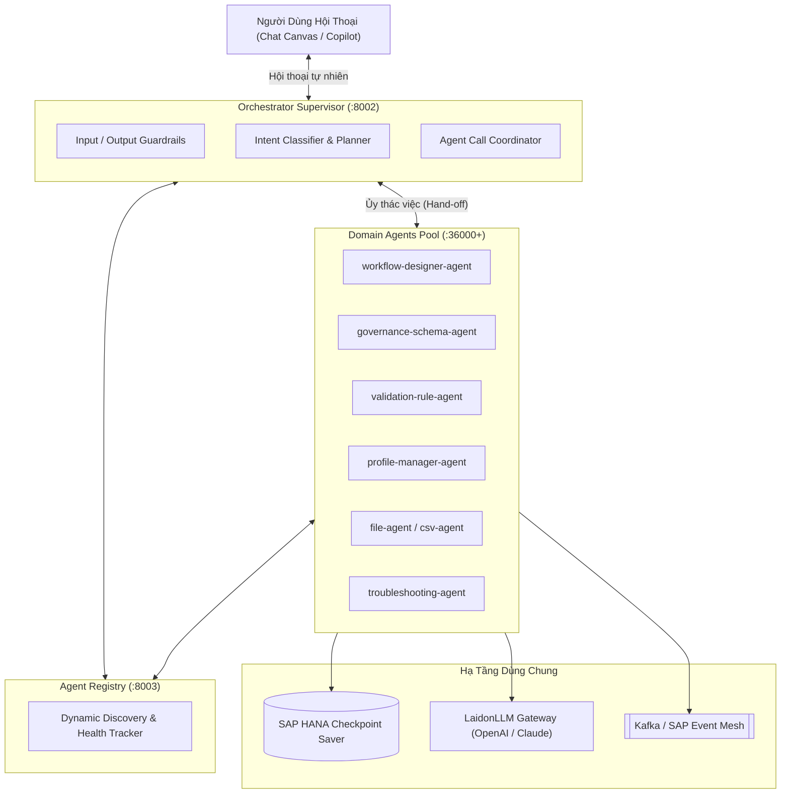

# Tài Liệu Thiết Kế Kiến Trúc: AI Agent Ecosystem

> **Hệ sinh thái các tác nhân AI tự trị (Autonomous & Conversational AI Agents)**  
> *Xây dựng trên nền tảng LangGraph, FastAPI, Clean Architecture 4 lớp và tích hợp sâu cùng SAP BTP & AI Workflow Management.*

---

## 📚 Mục Lục Toàn Bộ Tài Liệu Chi Tiết

Tài liệu được phân tách thành 4 phân hệ chuyên sâu:

### 1. [Kiến Trúc Tổng Thể (Architecture)](./01-architecture/)
- [01. Tổng Quan & Các Khái Niệm Cốt Lõi](./01-architecture/01-overview-and-philosophy.md): Bối cảnh, so sánh toàn diện giữa AI Workflow (Xác định) và AI Agent (Tự trị), nền tảng LangGraph, và mô hình hiệp lực.
- [02. Topology Hệ Thống Đa Tác Nhân](./01-architecture/02-agent-topology.md): Bản đồ kết nối Orchestrator, Agent Registry, Runtime Service, mạng lưới Domain Agents, SAP HANA Checkpointer và Kafka.
- [03. Kiến Trúc Phân Tầng Clean Architecture 4 Lớp](./01-architecture/03-clean-architecture-4-layers.md): Chi tiết 4 tầng: Domain Core (`AgentBaseState`), Application (`nodes.py`, use cases), Adapters (REST endpoints), Frameworks (`StateGraph`, HANA).

### 2. [Bộ Công Cụ Phát Triển Agent SDK (Agent SDK)](./02-agent-sdk/)
- [01. Các Bộ Dựng Đồ Thị (Graph Builders)](./02-agent-sdk/01-graph-builders.md): 4 builder paths: `ToolAgentBuilder` (ReAct nhanh), `AgentGraphBuilder` (Fluent API), `FlowGraphBuilder` (Declarative YAML), và `SubGraphAgentBuilder`.
- [02. Lưu Trữ Điểm Phục Hồi & Tương Tác Con Người (Checkpointing & HITL)](./02-agent-sdk/02-checkpointing-and-hitl.md): Checkpointer bền vững trên SAP HANA, hàm `interrupt()` ngắt luồng tại runtime, và cơ chế phục hồi không trạng thái qua `POST /api/v1/resume`.
- [03. Quản Lý Ngân Sách Ngữ Cảnh (Context Budget Management)](./02-agent-sdk/03-context-budget-management.md): Phòng chống tràn context window với `ContextBudgetManager` và 5 chiến lược nén: Sliding Window, Summarization, Vector Recall, Priority Drop, và Hybrid.
- [04. Giao Thức Truyền Thông & Vòng Đời Sự Kiện](./02-agent-sdk/04-transports-and-events.md): Dual run modes (SERVER trên cổng 36000 vs CONSUMER qua Kafka), hệ thống sự kiện 2 tầng (SDK auto-emits vs Agent code emits), và tích hợp Push Gateway.

### 3. [Bộ Điều Phối Hội Thoại Đa Tác Nhân (Orchestrator)](./03-orchestrator/)
- [01. Kiến Trúc Bộ Điều Phối Hội Thoại](./03-orchestrator/01-orchestrator-architecture.md): Quy trình xử lý 6 tầng: Guardrails bảo vệ (`InputGuard`, `OutputGuard`), bộ phân loại ý định `IntentClassifier`, bộ lập kế hoạch `Planner`, `JourneyTracker` và `ResponseFormatter`.
- [02. Cơ Chế Phối Hợp Đa Tác Nhân (Multi-Agent Coordination)](./03-orchestrator/02-multi-agent-coordination.md): Tuyển chọn tác nhân động qua `AgentSelector` và `AgentRegistry`, bộ điều phối cuộc gọi `AgentCallCoordinator`, mô hình Supervisor và Hand-off.

### 4. [Các Tác Nhân Nghiệp Vụ Chuyên Biệt (Domain Agents)](./04-domain-agents/)
- [01. Tác Nhân Thiết Kế Quy Trình (Workflow Designer Agent)](./04-domain-agents/01-workflow-designer-agent.md): Tự động phân tích yêu cầu tự nhiên, chọn đúng 21 loại node, sinh wires và xuất bản workflow vào Canvas.
- [02. Các Tác Nhân Quản Trị Schema & Luật Dữ Liệu](./04-domain-agents/02-governance-and-validation-agents.md): `governance-schema-agent` (quản trị schema, phân tích tương thích) và `validation-rule-agent` (sinh tự động các luật kiểm tra tính hợp lệ của dữ liệu).
- [03. Các Tác Nhân Xử Lý File & Hồ Sơ Dữ Liệu](./04-domain-agents/03-data-and-file-agents.md): `file-agent` (trích xuất tài liệu đa định dạng), `csv-agent` (tự chữa lành lỗi phân cách CSV), và `profile-manager-agent` (lập hồ sơ chất lượng dữ liệu).
- [04. Tác Nhân Chẩn Đoán Lỗi, Nghiệp Vụ & LaidonLLM Gateway](./04-domain-agents/04-business-and-troubleshooting-agents.md): `troubleshooting-agent` (phân tích nguyên nhân gốc rễ RCA khi workflow lỗi), `business-agent` & builder, và cổng kết nối mô hình `laidonllm`.

---

## 🚀 Sơ Đồ Kiến Trúc Đa Tác Nhân Phân Cấp

