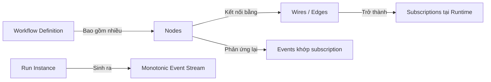

# 01. Tổng Quan & Triết Lý Thiết Kế (Overview & Philosophy)

> **Phân hệ:** AI Workflow Management  
> **Chủ đề:** Triết lý kiến trúc, nguồn gốc thiết kế và các nguyên lý cốt lõi.

---

## 1. Bối Cảnh & Động Lực (Context & Motivation)

Trong các hệ thống quản lý dữ liệu lớn và AI tích hợp (như SimpleMDG), các quy trình xử lý không còn là những bước tuần tự cố định. Chúng đòi hỏi sự linh hoạt cao: kết hợp giữa các tác vụ AI (LLM Prompting, Agent Planning), xử lý dữ liệu (ETL, Data Mapping), gọi API ngoài (SAP, Salesforce, RESTful services), và các điểm dừng chờ con người phê duyệt (Human-in-the-loop).

Các orchestration engine truyền thống (Airflow, Prefect thế hệ cũ, hoặc các workflow engine dựa trên DAG tĩnh) thường áp dụng quy trình:
1. Đọc định nghĩa workflow thành một Directed Acyclic Graph (DAG).
2. Xác thực toàn bộ đồ thị trước khi chạy (kiểm tra kiểu, tính chu trình, kiểm tra schema).
3. Duyệt đồ thị từ đầu đến cuối thông qua một central scheduler.

### Nhược điểm của cách tiếp cận truyền thống:
- **Tính cứng nhắc (Rigidity):** Bất kỳ thay đổi nhỏ nào ở cấu hình đồ thị đều đòi hỏi xác thực lại toàn bộ, dễ từ chối các workflow đang chạy một phần.
- **Không phù hợp với cấu trúc động (Dynamic Topologies):** Khó hỗ trợ các nhánh rẽ sinh ra tại runtime, sub-workflows động, hoặc sửa đổi luồng chạy khi đang execute.
- **Khớp nối chặt (Tight Coupling):** Bộ điều phối trung tâm phải lưu giữ toàn bộ hình thái đồ thị, gây điểm nghẽn hiệu năng khi scale ngang.
- **Xác thực lệch pha (Validation Mismatch):** Dữ liệu thực tế trả về từ các API bên thứ ba thường biến động so với schema tĩnh thiết kế trước, dẫn đến việc vẫn phải kiểm tra runtime — gây trùng lặp công sức.

---

## 2. Triết Lý Thiết Kế: Event-Driven Orchestration

Hệ thống được thiết kế theo tư duy **Event-First** lấy cảm hứng từ kiến trúc của **n8n**, nhưng được thiết kế lại để đáp ứng các tiêu chuẩn khắt khe của hệ thống doanh nghiệp (Enterprise Grade):

| Nguyên Lý | Ý Nghĩa Thực Thi |
|---|---|
| **Event-First** | Mỗi bước thực thi là sự tiêu thụ của một Event và phát sinh 0 hoặc nhiều Event mới. Không có scheduler trung tâm "bước" qua đồ thị. |
| **Runtime Validation Only** | Workflow được chấp nhận ở trạng thái hiện có. Việc xác thực schema và dữ liệu chỉ diễn ra ngay khi event thực sự chạm tới node. |
| **Per-Node Failure Policy** | Mỗi node tự cấu hình chính sách ứng phó sự cố: fail-fast, continue, retry tự động với exponential backoff, giá trị mặc định, hoặc định tuyến sang output lỗi (`error` port). |
| **Replayable (Event Sourcing)** | Event Log là nguồn chân lý duy nhất (Source-of-Truth). Bất kỳ `RunState` nào cũng có thể được khôi phục, phân nhánh (fork) hoặc replay từ bất kỳ thời điểm nào. |
| **Pluggable Event Bus** | Dùng chung một codebase engine, nhưng có thể cắm các driver bus khác nhau: in-process asyncio bus cho phát triển local/testing, và Kafka/SAP Event Mesh cho môi trường phân tán production. |
| **Stateless Horizontally Scalable** | Các node executor hoàn toàn không lưu trạng thái (stateless). Trạng thái nghiệp vụ được lưu tại kho Event Log + Snapshot Store. |
| **Trực Quan Hóa Realtime** | Mọi chuyển biến trạng thái đều phát ra UI events để canvas giao diện sáng đèn từng node theo thời gian thực tương tự n8n. |

---

## 3. Khái Niệm Cốt Lõi (Core Concepts)



### 3.1. Node
Đơn vị công việc tối thiểu. Node không cần biết vị trí của nó trong đồ thị tổng thể, nó chỉ quan tâm:
- Nó phản ứng lại sự kiện nào (thông qua bảng wire/subscription).
- Input schema và cấu hình thực thi của nó.
- Các cổng ra được đặt tên (`main`, `error`, `true`, `false`, `default`).

### 3.2. Wire (Subscription)
Một liên kết có hướng giữa cổng ra của một node nguồn và cổng vào của một node đích:
```yaml
from: fetch_customer_data.main
to: transform_customer.input
filter: "$.status == 200"   # Điều kiện lọc (Predicate) đánh giá tại runtime
map: "$.body"               # Phép chiếu dữ liệu (Projection)
```

### 3.3. Event
Gói tin chuẩn hoá di chuyển qua hệ thống với cấu trúc định danh rõ ràng:
- `event_id`: Định danh UUID duy nhất.
- `run_id` & `root_run_id`: Định danh phiên chạy cha / con.
- `type`: Loại sự kiện (`node.output`, `task.dispatched`, `edge.traversed`...).
- `source`: `{ node_id, port }`.
- `payload`: Dữ liệu sinh ra.
- `correlation`: Truy vết `trace_id` và `parent_event_id`.
- `causal_path`: Chuỗi đường dẫn nguyên nhân dẫn tới sự kiện này.

---

## 4. Phân Tách Trách Nhiệm Engine (Engine Split)

Để đạt được khả năng mở rộng ngang (Horizontal Scaling) và Replayability, kiến trúc phân rã `OrchestrationEngine` thành 3 thành phần độc lập:

```
                      ┌─────────────────────────┐
                      │   Event Bus / Queue     │
                      └───────────┬─────────────┘
                                  │
         ┌────────────────────────┼────────────────────────┐
         ▼                        ▼                        ▼
┌──────────────────┐    ┌──────────────────┐    ┌──────────────────┐
│    DISPATCHER    │    │     EXECUTOR     │    │    PROJECTOR     │
│  - Duyệt Wire    │    │  - Gọi Handler   │    │  - Chiếu state   │
│  - Tính Fanout   │    │  - Gọi Worker    │    │  - Ghi Run/Task  │
│  - Cascade-Skip  │    │  - Heavy I/O     │    │  - Có thể lag    │
│  - CPU Light     │    │  - Scale tự do   │    │  - Đảm bảo WAL   │
└──────────────────┘    └──────────────────┘    └──────────────────┘
```

1. **Dispatcher:** Nhẹ về tính toán, chỉ làm nhiệm vụ thuần túy: khi nhận kết quả node, tra cứu quan hệ, tính toán cổng kích hoạt, đánh giá skip và đẩy `ExecuteNodeAction` vào queue.
2. **Executor:** Chịu tải I/O lớn: kích hoạt các handler tính toán, kết nối HTTP/gRPC sang các worker ngoại vi, áp dụng timeout và retry.
3. **Projector:** Nhận luồng event và tuần tự hóa việc lưu trữ vào database quan hệ (SAP HANA). Projector có thể trễ so với luồng bus mà không ảnh hưởng tới tiến độ điều phối.
