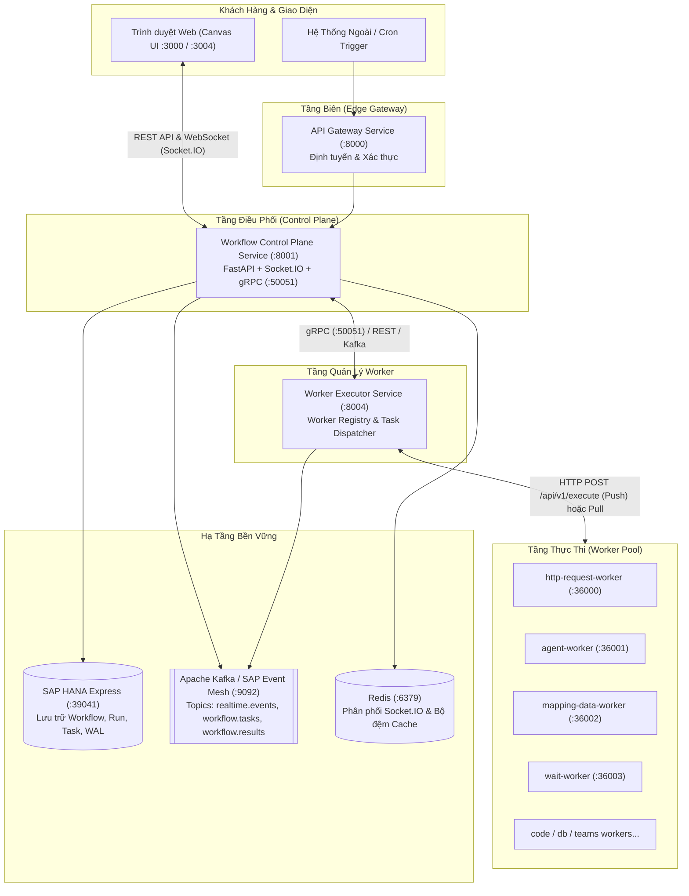

# 02. Topology Hệ Thống & Hạ Tầng (System Topology)

> **Phân hệ:** AI Workflow Management  
> **Chủ đề:** Bản đồ kết nối dịch vụ, mạng, cổng giao tiếp và các thành phần hạ tầng.

---

## 1. Sơ Đồ Tổng Thể (System Topology)

Hệ thống AI Workflow Management bao gồm nhiều dịch vụ phối hợp nhịp nhàng giữa tầng điều phối, tầng thực thi worker và hạ tầng lưu trữ phân tán.

---

## 2. Bảng Phân Bổ Cổng Mạng & Giao Thức (Ports & Protocols)

| Thành Phần | Cổng Mặc Định | Giao Thức | Mục Đích Sử Dụng |
|---|---|---|---|
| **API Gateway** | `8000` | HTTP / REST | Điểm tiếp nhận request từ bên ngoài vào hệ thống SimpleMDG |
| **Workflow Control Plane** | `8001` | HTTP / REST | API quản lý workflow, chạy run, xem kết quả, tương tác manual |
| **Control Plane Realtime** | `8001` | WebSocket (Socket.IO) | Truyền phát sự kiện thời gian thực tới Canvas frontend |
| **Control Plane gRPC** | `50051` | HTTP/2 (gRPC) | Giao tiếp nội bộ tốc độ cao giữa Control Plane và Executor |
| **Worker Executor Service** | `8004` | HTTP / REST | Đăng ký worker, nhận lệnh dispatch task và báo cáo kết quả |
| **Worker Replicas** | `35000+` | HTTP / REST | Điểm cuối thực thi tác vụ cụ thể của từng worker |
| **SAP HANA Express** | `39041` | SQL / HDB | Lưu trữ quan hệ chính (ACID) cho runs, tasks, event logs |
| **Apache Kafka** | `9092` | PLAINTEXT | Message broker điều phối queue hành động và luồng sự kiện |
| **Redis** | `6379` | RESP | Adapter phân tán cho Socket.IO cluster và caching |

---

## 3. Các Luồng Giao Tiếp Chính (Communication Flows)

### 3.1. Giao Tiếp Client ➔ Control Plane
- **RESTful API:** Dùng để tạo/sửa workflow, kích hoạt run (`POST /api/v1/runs`), tạm dừng, hủy bỏ hoặc submit dữ liệu nhập tay (`POST /runs/{run_id}/tasks/{task_id}/complete`).
- **Socket.IO Realtime:** Khi mở một màn hình theo dõi Run trên Canvas, client tự động gửi sự kiện `join:run` kèm `run_id`. Mọi event sinh ra trong quá trình chạy sẽ được push trực tiếp tới room `run:{run_id}` để update UI.

### 3.2. Giao Tiếp Control Plane ➔ Worker Executor
Hệ thống hỗ trợ 3 chế độ truyền thông (`TRANSPORT_MODE`):
1. **HTTP/REST (Mặc định cho Dev/Local):** `HttpTaskDispatcher` gửi HTTP POST trực tiếp đến endpoint của Worker Executor (`/api/v1/tasks/execute`).
2. **gRPC:** Gọi thông qua Protobuf service `TaskDispatchService` trên cổng `50051`, giảm độ trễ và tiết kiệm băng thông.
3. **Event Mesh / Kafka:** Đẩy thông điệp vào topic `workflow.tasks`. Worker Executor consume từ topic này, đảm bảo hoàn toàn bất đồng bộ và chống mất mát thông điệp khi tải cao.

### 3.3. Giao Tiếp Worker Executor ➔ Worker Pool
- **Push Mode:** Worker Executor chọn một instance rảnh trong danh sách đã đăng ký của `worker_type` đó, và thực hiện HTTP POST tới endpoint `/api/v1/execute` của Worker.
- **Pull Mode (Pull-Lease):** Worker định kỳ gửi request kéo task về (`GET /api/v1/tasks/pull`). Mô hình này tối ưu cho các worker xử lý nặng hoặc nằm sau firewall riêng biệt.

---

## 4. Chế Độ Vận Hành Môi Trường (Infra Modes)

Hệ thống có thể chuyển đổi linh hoạt giữa các chế độ thông qua biến môi trường cấu hình:

- **Chế độ `INFRA_MODE=mock` & `MESSAGING_MODE=console`:**
  - Chạy hoàn toàn trên bộ nhớ RAM (In-memory repositories & InMemory queue).
  - Không yêu cầu cài đặt Docker, SAP HANA hay Kafka.
  - Phù hợp cho kiểm thử đơn vị (Unit tests), CI/CD runner và phát triển giao diện nhanh.
- **Chế độ `INFRA_MODE=local` & `MESSAGING_MODE=local`:**
  - Sử dụng hạ tầng Docker (HANA Express, Kafka, Redis).
  - Đầy đủ tính năng ghi nhận dữ liệu bền vững và hàng đợi thông điệp thực tế.
- **Chế độ `INFRA_MODE=cloud` (Production / SAP BTP):**
  - Kết nối SAP HANA Cloud, SAP Event Mesh và Redis Enterprise.
  - Hỗ trợ đầy đủ Outbox Pattern và mở rộng quy mô tự động.
