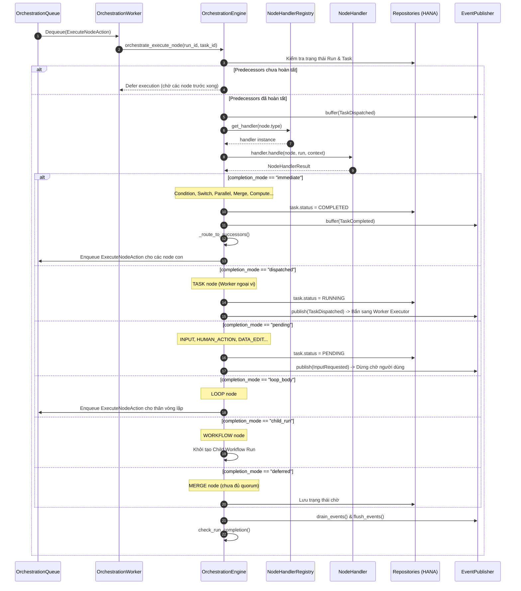

# 01. Mô Hình Thực Thi Thống Nhất (Uniform Execution Model)

> **Phân hệ:** AI Workflow Management  
> **Chủ đề:** Phương thức thực thi thống nhất `_exec_uniform`, các Completion Modes và danh mục 16 Node Types.

---

## 1. Giới Thiệu Mô Hình Thực Thi Thống Nhất (Phase 6 Architecture)

Trước đây, hệ thống có thể xử lý phân mảnh: các node điều kiện chạy inline bằng code riêng, các task worker gọi RPC riêng, và các điểm dừng chờ người dùng lại có đường dẫn logic tách biệt.

Từ **Phase 6**, hệ thống áp dụng kiến trúc **Uniform Execution**: Mọi node trong đồ thị đều đi qua cùng một điểm vào duy nhất:
```python
orchestrate_execute_node(run_id, task_id) -> _exec_uniform(...)
```

Mỗi node handler sau khi thực thi đều trả về một đối tượng chuẩn hóa:
```python
@dataclass
class NodeHandlerResult:
    completion_mode: str  # "immediate" | "dispatched" | "pending" | "child_run" | "loop_body" | "deferred"
    output_port: str = "main"
    data: Optional[Dict[str, Any]] = None
    error: Optional[str] = None
    skipped_nodes: List[str] = field(default_factory=list)
```

Engine chỉ cần phân nhánh xử lý dựa trên `completion_mode` mà không cần biết chi tiết logic bên trong của node đó là gì.

---

## 2. Sơ Đồ Tuần Tự Uniform Execution



---

## 3. Bảng Chi Tiết 16 Node Types

| Nhóm Tính Năng | Loại Node (`node_type`) | Mục Đích & Hoạt Động | Chế Độ Hoàn Thành (`completion_mode`) |
|---|---|---|---|
| **Khởi Động** | `TRIGGER` | Điểm bắt đầu nhận payload kích hoạt workflow. | `immediate` |
| **Rẽ Nhánh** | `CONDITION` | Rẽ 2 nhánh theo biểu thức logic (`true` hoặc `false`). | `immediate` |
| **Rẽ Nhánh** | `SWITCH` | Định tuyến nhiều nhánh theo giá trị khớp (`cases[]`) hoặc `default`. | `immediate` |
| **Song Song** | `PARALLEL` | Tách nhánh thực thi đồng thời nhiều đường dẫn độc lập. | `immediate` |
| **Hội Tụ** | `MERGE` | Đồng bộ hóa và chờ các nhánh song song hội tụ (Quorum join). | `immediate` hoặc `deferred` |
| **Vòng Lặp** | `LOOP` | Lặp qua các phần tử mảng, kích hoạt thân vòng lặp. | `loop_body` |
| **Vòng Lặp** | `LOOP_EXIT` | Ngắt vòng lặp khẩn cấp (tương tự lệnh `break`). | `immediate` |
| **Vòng Lặp** | `LOOP_CONTINUE`| Chuyển sang bước lặp tiếp theo (tương tự `continue`). | `immediate` |
| **Tác Vụ Ngoài**| `TASK` | Ủy thác thực thi cho external worker (HTTP, LLM...). | `dispatched` |
| **Tính Toán** | `COMPUTE` | Thực thi mã inline (Python / NodeJS sandbox). | `immediate` |
| **Sub-flow** | `WORKFLOW` | Gọi một workflow con độc lập như một quy trình con. | `child_run` |
| **Human In Loop**| `INPUT` | Tạm dừng để chờ người dùng nhập biểu mẫu dữ liệu. | `pending` |
| **Human In Loop**| `HUMAN_ACTION` | Tạm dừng để chờ người có thẩm quyền phê duyệt / từ chối. | `pending` |
| **Human In Loop**| `DATA_EDIT` | Cho phép người dùng chỉnh sửa trực tiếp dữ liệu trung gian. | `pending` |
| **Human In Loop**| `FILE_UPLOAD` | Chờ người dùng tải tệp đính kèm lên hệ thống. | `pending` |

---

## 4. Kiểm Tra Hoàn Thành Quy Trình (`check_run_completion`)

Sau khi mỗi node hoàn tất việc định tuyến:
1. Engine kiểm tra danh sách tất cả các lá của đồ thị (Leaf nodes - các node không có node con).
2. Nếu **toàn bộ các node lá** đều đã ở một trong các trạng thái cuối (`COMPLETED` hoặc `SKIPPED`), đồng thời không còn task nào đang `RUNNING` hoặc `PENDING` trong toàn bộ run:
   - Trạng thái Run được chuyển thành `COMPLETED`.
   - Engine phát ra sự kiện `RunCompleted`.
   - Nếu workflow có cấu hình Webhook Callback, engine sẽ gửi bản tin thông báo kết quả tới endpoint đã đăng ký.
