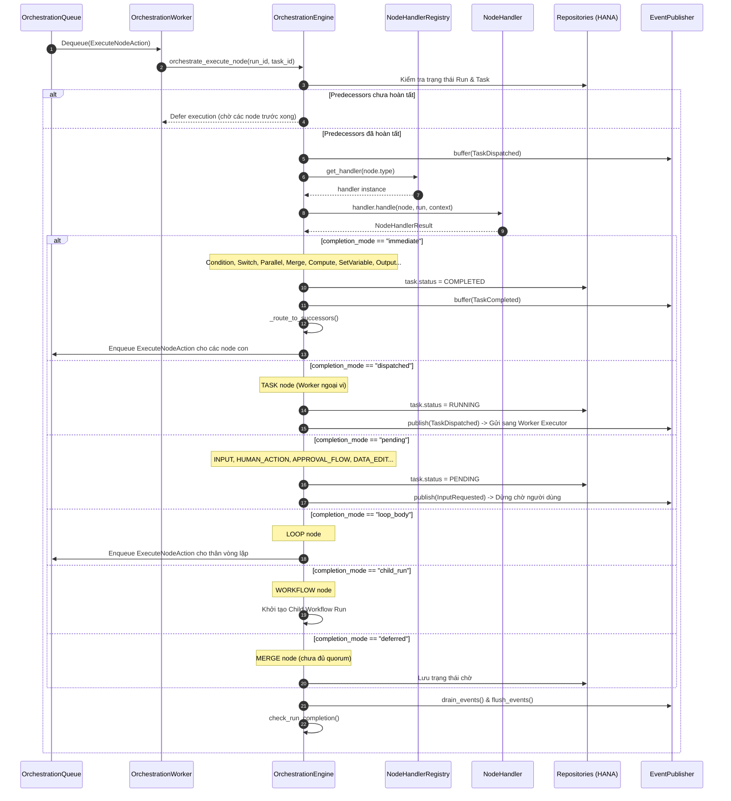

# 01. Mô Hình Thực Thi Thống Nhất & 21 Node Types

> **Phân hệ:** AI Workflow Management  
> **Chủ đề:** Phương thức thực thi thống nhất `_exec_uniform`, các Completion Modes và danh mục đầy đủ 21 Node Types thực tế trong codebase.

---

## 1. Giới Thiệu Mô Hình Thực Thi Thống Nhất (Phase 6 Architecture)

Từ **Phase 6**, hệ thống áp dụng kiến trúc **Uniform Execution**: Mọi node trong đồ thị đều đi qua cùng một điểm vào duy nhất:
```python
orchestrate_execute_node(run_id, task_id) -> _exec_uniform(...)
```

Mỗi node handler sau khi thực thi đều trả về một đối tượng chuẩn hóa:
```python
@dataclass
class NodeHandlerResult:
    completion_mode: str  # "immediate" | "dispatched" | "pending" | "child_run" | "loop_body" | "deferred"
    output_port: str = "main"
    data: Optional[Dict[str, Any]] = None
    error: Optional[str] = None
    skipped_nodes: List[str] = field(default_factory=list)
```

Engine phân nhánh xử lý dựa trên `completion_mode` mà không cần biết chi tiết logic bên trong của node đó là gì.

---

## 2. Bảng Phân Loại Toàn Diện 21 Node Types (Chuẩn Codebase Thực Tế)

Dựa trên enum [`NodeType`](file:///C:/Users/Public/Documents/Project/github-proj/solace-root/data-migration/apps/backend/ai-workflow-management/workflow/workflow-control-plane-service/app/layer1_domain/value_objects/node_type.py) và từ điển phân loại [`NodeKind`](file:///C:/Users/Public/Documents/Project/github-proj/solace-root/data-migration/apps/backend/ai-workflow-management/workflow/workflow-control-plane-service/app/layer1_domain/value_objects/node_kind.py):

| STT | Loại Node (`node_type`) | Nhóm Chức Năng (`node_kind`) | Mục Đích Sử Dụng | Chế Độ Hoàn Thành (`completion_mode`) |
|---|---|---|---|---|
| 1 | `TRIGGER` | `trigger` | Điểm bắt đầu của quy trình, tiếp nhận payload kích hoạt ban đầu. | `immediate` |
| 2 | `TASK` | *Tùy worker* (`read` / `action`) | Ủy thác tác vụ cho worker ngoại vi (HTTP, Agent LLM, Database...). | `dispatched` |
| 3 | `CONDITION` | `logic` | Rẽ 2 nhánh nhị phân (`true` / `false`) theo biểu thức so sánh. | `immediate` |
| 4 | `SWITCH` | `logic` | Định tuyến nhiều nhánh theo giá trị khớp (`cases[]`) hoặc `default`. | `immediate` |
| 5 | `PARALLEL` | `logic` | Tách nhánh thực thi đồng thời nhiều đường dẫn độc lập (Fan-out). | `immediate` |
| 6 | `MERGE` | `logic` | Hội tụ các luồng song song, chờ đủ điều kiện (Quorum join). | `immediate` hoặc `deferred` |
| 7 | `LOOP` | `logic` | Khởi tạo vòng lặp mảng, nạp biến và kích hoạt thân vòng lặp. | `loop_body` |
| 8 | `LOOP_EXIT` | `logic` | Ngắt vòng lặp khẩn cấp (tương đương lệnh `break`). | `immediate` |
| 9 | `LOOP_CONTINUE` | `logic` | Chuyển ngay sang lần lặp kế tiếp (tương đương `continue`). | `immediate` |
| 10 | `WAIT` | `logic` | Tạm dừng luồng theo timer bền vững hoặc mốc thời gian. | `immediate` / `pending` |
| 11 | `WORKFLOW` | `logic` | Kích hoạt Sub-workflow con độc lập với input/output binding. | `child_run` |
| 12 | `COMPUTE` | `transform` | Thực thi mã tính toán inline (Python / NodeJS script sandbox). | `immediate` |
| 13 | `SET_VARIABLE` | `transform` | Gán hoặc cập nhật biến vào ngữ cảnh `run.context.variables`. | `immediate` |
| 14 | `OUTPUT` | `util` | Định nghĩa dữ liệu đầu ra cuối cùng của toàn bộ Workflow Run. | `immediate` |
| 15 | `INPUT` | `human` | Tạm dừng quy trình chờ người dùng nhập form dữ liệu. | `pending` |
| 16 | `HUMAN_ACTION` | `human` | Tạm dừng chờ người có thẩm quyền bấm Approve hoặc Reject. | `pending` |
| 17 | `DATA_EDIT` | `human` | Tạm dừng cho phép người dùng sửa đổi trực tiếp dữ liệu trung gian. | `pending` |
| 18 | `TEMPLATE_DATA_EDIT` | `human` | Chỉnh sửa dữ liệu theo mẫu template bảng biểu định sẵn. | `pending` |
| 19 | `FILE_UPLOAD` | `human` | Tạm dừng chờ người dùng tải file tài liệu đính kèm lên hệ thống. | `pending` |
| 20 | `APPROVAL_FLOW` | `human` | Quy trình phê duyệt nâng cao nhiều bước phân cấp. | `pending` |
| 21 | `PROMPT` | `action` | Soạn thảo và gửi prompt trực tiếp tới mô hình LLM. | `immediate` / `dispatched` |

---

## 3. Bản Đồ Phân Loại Node (`NodeClass` & `Collection Buckets`)

Để phục vụ giao diện kéo thả (Canvas Palette):
- **Phân loại cấp cao (`NodeClass`):**
  - `TECHNICAL`: Các node kỹ thuật nền tảng (Condition, Switch, Parallel, Merge, Loop, Compute...).
  - `BUSINESS`: Các node nghiệp vụ gắn với quy trình doanh nghiệp (Approval, Data Edit, Gateway Functions...).
- **Collection Buckets:**
  - `Core`: Thư mục chứa toàn bộ các node built-in có sẵn của hệ thống.
  - `My Nodes`: Thư mục chứa các node tùy biến do từng Tenant tự tạo (Business nodes / Custom functions).

---

## 4. Sơ Đồ Tuần Tự Xử Lý Uniform Execution


