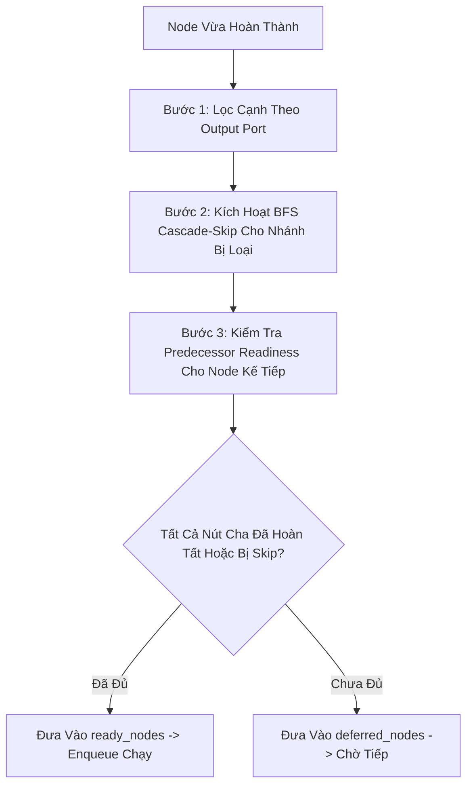

# 02. Thuật Toán Fanout & Cascade-Skip

> **Phân hệ:** AI Workflow Management  
> **Chủ đề:** Hàm thuần túy `compute_fanout`, đánh giá cổng ra, thuật toán BFS Cascade-Skip và kiểm tra Predecessor Readiness.

---

## 1. Bản Chất Của `compute_fanout()`

Hàm `compute_fanout()` được đặt tại `layer1_domain/fanout.py`. Đây là một **Hàm thuần túy (Pure Function)** — không phụ thuộc CSDL, không ghi log, không sinh side-effect:

```python
def compute_fanout(
    node: Node,
    workflow: Workflow,
    completed_node_ids: Set[str],
    skipped_node_ids: Set[str],
    output_port: str = "main",
    taken_edge_ports: Optional[Dict[str, str]] = None,
) -> FanoutDecision:
```

### Kết quả trả về (`FanoutDecision`):
- `ready_nodes`: Danh sách các node kế tiếp đã đủ điều kiện để chạy ngay lập tức.
- `deferred_nodes`: Các node có dây nối tới nhưng chưa đủ điều kiện (cần chờ thêm các nhánh tiền nhiệm khác).
- `cascade_skipped_nodes`: Danh sách các node bị bỏ qua do nằm trên nhánh không được chọn.
- `traversed_edges`: Danh sách các cạnh đồ thị thực sự được đi qua.

---

## 2. Quy Trình 3 Bước Của Thuật Toán



### Bước 1: Lọc Cạnh Theo Port (Port-Based Edge Filtering)
- Mỗi node có thể phát dữ liệu ra một hoặc nhiều cổng.
- Ví dụ:
  - Node `CONDITION` trả về cổng `true` hoặc cổng `false`.
  - Node `SWITCH` trả về cổng khớp với rule tương ứng (`case_1`, `case_2`, hoặc `default`).
  - Node thông thường trả về cổng `main` (hoặc `error` nếu lỗi).
- Engine chỉ duyệt các cạnh xuất phát từ cổng khớp với kết quả thực tế.

---

### Bước 2: Thuật Toán BFS Cascade-Skip (Bỏ Qua Nhánh Phụ Thuộc)

Khi một nhánh rẽ không được chọn (ví dụ: điều kiện ra `true`, nên nhánh `false` bị hủy):
1. Tất cả các cạnh xuất phát từ cổng không được chọn sẽ được đưa vào hàng đợi BFS (Breadth-First Search).
2. Duyệt xuôi theo chiều đồ thị để tìm tất cả các node con phụ thuộc.
3. **Quy tắc an toàn (Safe Skip Rule):**
   > *Một node chỉ bị đánh dấu là `SKIPPED` nếu **TẤT CẢ** các node tiền nhiệm (predecessors) của nó đều đã bị skip hoặc không khả dụng.*
4. Nếu một node có 2 đường đi tới (ví dụ: 1 nhánh từ `true` và 1 nhánh từ `false` cùng đổ về), node đó sẽ **KHÔNG** bị skip, mà vẫn được giữ lại để nhánh `true` tiếp tục kích hoạt nó.

---

### Bước 3: Kiểm Tra Tính Sẵn Sàng Tiền Nhiệm (Predecessor Readiness)

Trước khi quyết định cho một node kế tiếp chạy:
- Engine kiểm tra tập hợp tất cả các node cha (`incoming_nodes`) của node đó trong workflow.
- Điều kiện sẵn sàng:
  $$\forall p \in \text{incoming\_nodes}, \quad p \in (\text{completed\_node\_ids} \cup \text{skipped\_node\_ids})$$
- Nếu ít nhất một node cha vẫn đang chạy hoặc đang chờ, node kế tiếp sẽ được đưa vào `deferred_nodes`. Khi node cha cuối cùng hoàn thành, nó sẽ tự động kích hoạt node này.

---

## 3. Lợi Ích Của Kiến Trúc

1. **Khử Bỏ Race Condition:** Việc kiểm tra readiness đảm bảo các node hội tụ (Merge, Join) không bao giờ bị kích hoạt sớm khi các nhánh song song khác chưa về đích.
2. **Không Treo Luồng (Deadlock-Free):** Khi một nhánh bị cascade-skip, các node con bị skip được đánh dấu rõ ràng, giúp các node hội tụ phía sau nhận biết được nhánh đó đã "xong" (ở trạng thái skip) để tiếp tục tính toán mà không bị chờ vĩnh viễn.
3. **Deterministic & Testable:** Là một hàm thuần túy, logic fanout có thể được kiểm thử đơn vị với độ bao phủ 100% bằng cách truyền các cấu trúc đồ thị giả lập mà không cần dựng database hay worker.
