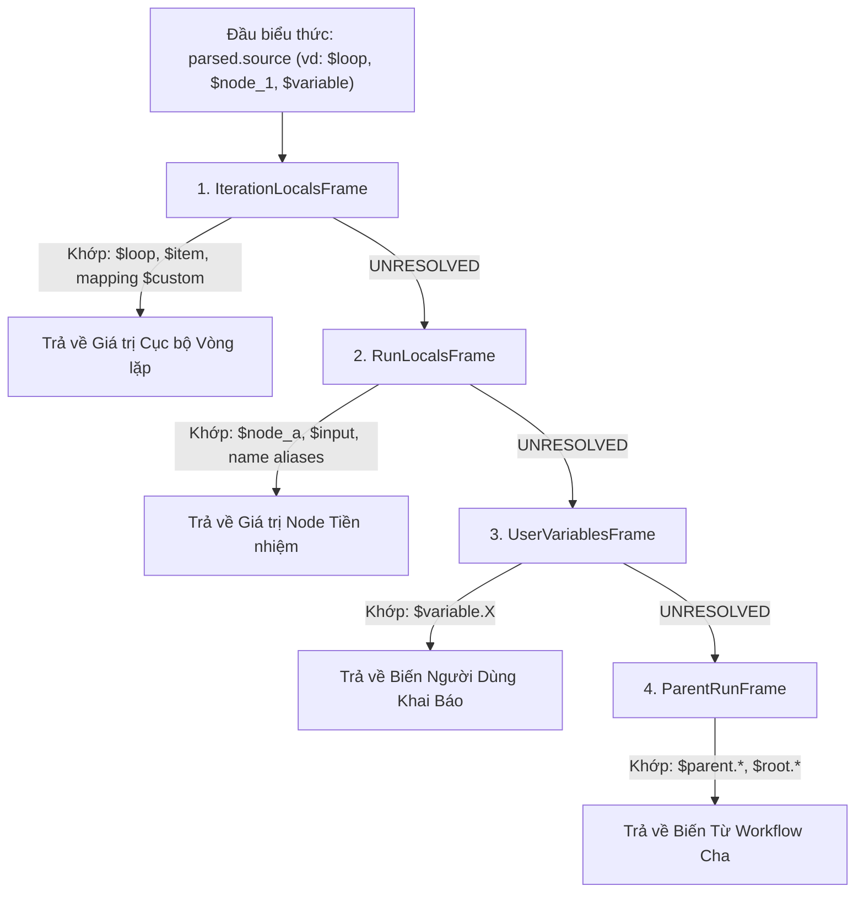

# 03. Vòng Lặp & Phân Cấp Phạm Vi Biến (Loop & Scope Hierarchy)

> **Phân hệ:** AI Workflow Management  
> **Chủ đề:** Xử lý vòng lặp lồng nhau, định danh `invocation_id`, cô lập phạm vi bằng `scope_stack`, và chuỗi Chain of Responsibility của `ResolutionScope`.

---

## 1. Thách Thức Của Vòng Lặp Trong Event-Driven Engine

Trong một engine xử lý theo sự kiện phân tán, vòng lặp (Loops) tạo ra 3 bài toán kỹ thuật lớn:
1. **Trùng lặp định danh:** Nếu node `process_item` nằm trong vòng lặp 100 lần, làm sao phân biệt được task của lần lặp 1 với lần lặp 2?
2. **Vòng lặp lồng nhau (Nested Loops):** Một vòng lặp ngoài duyệt qua các `Department`, và một vòng lặp trong duyệt qua các `Employee` của phòng ban đó.
3. **Phạm vi biến (Scope Isolation):** Node bên trong vòng lặp phải truy xuất được dữ liệu của phần tử hiện tại (`{{$loop.item}}`), nhưng không được làm biến dạng biến của vòng lặp ngoài hoặc các luồng song song khác.

---

## 2. Giải Pháp: `invocation_id` & `scope_stack`

### 2.1. Định Danh Xác Định `invocation_id` (UUID5)
Mỗi lần kích hoạt một vòng lặp hoặc một iteration, engine sinh ra một `invocation_id` hoàn toàn xác định (deterministic) thông qua thuật toán hash `uuid5`:

```python
invocation_id = uuid5(
    NAMESPACE_DNS,
    f"{run_id}:{loop_node_id}:{parent_invocation_id}:{iteration_index}"
)
```
- **Đặc tính Idempotency:** Nếu một bước bị retry hoặc replay lại từ đầu từ Event Log, `invocation_id` sinh ra sẽ giống hệt lần chạy trước, đảm bảo an toàn tuyệt đối khi phân phối song song.

---

### 2.2. Ngăn Xếp Phạm Vi (`scope_stack`)

Mỗi thực thể `Task` lưu giữ một danh sách ngăn xếp đại diện cho độ sâu vòng lặp mà nó đang thuộc về:

```json
[
  {
    "node_id": "loop_departments",
    "iteration": 2,
    "invocation_id": "a1b2c3d4-..."
  },
  {
    "node_id": "loop_employees",
    "iteration": 5,
    "invocation_id": "e5f6g7h8-..."
  }
]
```

- Khi một task con được sinh ra trong thân vòng lặp, `TaskFactory` tự động sao chép `scope_stack` từ task cha và gắn thêm lớp hiện tại.
- Khi truy xuất biến `{{$loop.item}}`, hệ thống sẽ bóc phần tử đỉnh của `scope_stack` (phạm vi gần nhất) để lấy giá trị chính xác.

---

## 3. Mô Hình Phân Cấp Khung Phạm Vi (Chain of Responsibility)

Cơ chế phân giải biến thực tế trong codebase (`layer1_domain/value_objects/resolution_scope.py`) được thiết kế theo mẫu **Composite + Chain of Responsibility**:



1. **`IterationLocalsFrame`:** Ưu tiên giải quyết các biến nội bộ vòng lặp hiện tại: `$loop`, `$item`, `$custom`.
2. **`RunLocalsFrame`:** Giải quyết các tham chiếu đến các node đã hoàn thành trong cùng run: `$node_a`, `$input`.
3. **`UserVariablesFrame`:** Giải quyết các biến do người dùng định nghĩa ở cấp workflow: `$variable.X`.
4. **`ParentRunFrame`:** Nếu node đang chạy trong một Sub-workflow con, frame này cho phép đọc ngược dữ liệu từ workflow cha thông qua `$parent.*` hoặc `$root.*`.

---

## 4. Các Biến Tự Động Của Vòng Lặp

| Biến | Kiểu Dữ Liệu | Ý Nghĩa |
|---|---|---|
| `{{$loop.item}}` | `Any` | Dữ liệu của phần tử đang được xử lý trong lần lặp hiện tại |
| `{{$loop.index}}` | `int` | Chỉ số lần lặp hiện tại (bắt đầu từ 0) |
| `{{$loop.total}}` | `int` | Tổng số lượng phần tử cần xử lý trong mảng |
| `{{$loop.is_first}}` | `bool` | Trả về `true` nếu là lần lặp đầu tiên |
| `{{$loop.is_last}}` | `bool` | Trả về `true` nếu là lần lặp cuối cùng |

---

## 5. Các Node Điều Khiển Vòng Lặp

- **`LOOP_EXIT` (Break):** Lập tức chấm dứt toàn bộ vòng lặp, giải phóng tài nguyên và kích hoạt cổng ra ngoài (`exit_edge`).
- **`LOOP_CONTINUE` (Continue):** Bỏ qua các bước còn lại của lần lặp hiện tại, kích hoạt `LoopIterationAction` kế tiếp.
