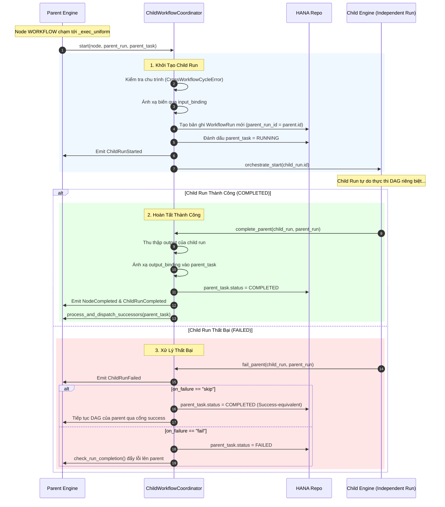

# 04. Điều Phối Sub-Workflow & Quy Trình Con (Child Workflows)

> **Phân hệ:** AI Workflow Management  
> **Chủ đề:** Bộ điều phối `ChildWorkflowCoordinator`, vòng đời Sub-workflow con, cơ chế Input/Output Binding và phòng chống chu trình chéo (Cross-Workflow Cycles).

---

## 1. Giới Thiệu Về Node `WORKFLOW`

Trong các quy trình phức tạp của doanh nghiệp, việc phân rã một workflow khổng lồ thành các **Sub-workflow nhỏ hơn (Reusable Sub-flows)** là nguyên tắc thiết kế tối quan trọng. Node `WORKFLOW` cho phép nhúng một workflow khác vào trong quy trình hiện tại như một bước thực thi độc lập.

Quy trình con được quản lý bởi `ChildWorkflowCoordinator` (`layer2_application/orchestration/child_workflow_coordinator.py`).

---

## 2. Vòng Đời 3 Giai Đoạn Của Sub-Workflow



---

## 3. Cơ Chế Ánh Xạ Biến (Input & Output Binding)

Sub-workflow hoạt động trong một không gian ngữ cảnh (Context) hoàn toàn độc lập với workflow cha:

### 3.1. Input Binding (Cha ➔ Con)
Trước khi khởi chạy con, `ChildWorkflowCoordinator` đọc cấu hình `input_binding` trên node `WORKFLOW` của cha:
```yaml
input_binding:
  customer_id: "{{ $fetch_order.data.customer_id }}"
  order_amount: "{{ $trigger.body.amount }}"
  processing_mode: "STRICT"
```
Các giá trị này được phân giải từ context của cha và nạp vào `child_run.input_data`, đóng vai trò là payload đầu vào cho node `TRIGGER` của con.

### 3.2. Output Binding (Con ➔ Cha)
Khi con hoàn thành, node `OUTPUT` của con sẽ tạo ra dữ liệu tổng kết. `ChildWorkflowCoordinator` sử dụng `output_binding` để map ngược lại vào context của cha:
```yaml
output_binding:
  approval_status: "{{ $child.output.status }}"
  invoice_number: "{{ $child.output.invoice_id }}"
```
Các biến này trở thành kết quả của node `WORKFLOW` trong cha, sẵn sàng để các node kế tiếp của cha sử dụng qua `{{ $workflow_node.data.approval_status }}`.

---

## 4. An Toàn Hệ Thống: Chu Trình Chéo & Giới Hạn Đệ Quy

1. **Phát hiện Chu Trình Chéo (`CrossWorkflowCycleError`):**
   - Nếu Workflow A gọi Workflow B, và Workflow B lại gọi ngược lại Workflow A, hệ thống sẽ bị treo vô tận.
   - Khi `start()` được gọi, coordinator duyệt chuỗi phả hệ `parent_run_id` ngược lên tận `root_run_id`. Nếu phát hiện `workflow_id` hiện tại đã từng xuất hiện trong cây gia phả của lần chạy này, hệ thống ném ngay lỗi `CrossWorkflowCycleError` và dừng lại an toàn.
2. **Giới Hạn Độ Sâu Tối Đa (`MAX_CHILD_DEPTH = 100`):**
   - Ngăn chặn việc lồng sub-workflow quá sâu làm cạn kiệt tài nguyên bộ nhớ.
