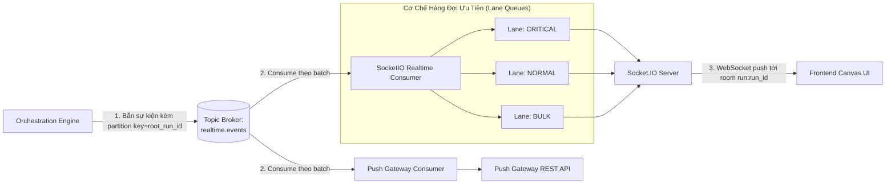

# 02. Cơ Chế Phân Phối Realtime (Realtime Delivery)

> **Phân hệ:** AI Workflow Management  
> **Chủ đề:** Truyền phát sự kiện thời gian thực qua Message Broker, cơ chế Lane Queues, tích hợp Socket.IO và Push Gateway.

---

## 1. Kiến Trúc Phân Phối Bất Đồng Bộ

Để giao diện người dùng (Canvas) phản hồi tức thì mà không làm chậm nhịp độ xử lý tính toán của Orchestration Engine, kiến trúc tách rời việc sinh sự kiện và việc gửi sự kiện qua mạng tới client:

---

## 2. Các Room Đăng Ký (Subscription Rooms)

Giao diện frontend đăng ký nhận thông điệp thông qua cơ chế Rooms chuẩn của Socket.IO:

| Tên Room | Khi Nào Đăng Ký? | Dữ Liệu Nhận Được |
|---|---|---|
| `run:{run_id}` | Người dùng mở màn hình chi tiết một lần chạy (Run View). | Nhận tất cả sự kiện chuyển trạng thái node, task hoàn thành, lỗi của run đó. |
| `run:{parent_run_id}` | Giao diện theo dõi sub-workflow. | Nhận sự kiện từ workflow con cập nhật tiến độ cho workflow cha. |
| `workflow:{workflow_id}` | Người dùng đang ở màn hình thiết kế hoặc danh sách run của 1 workflow. | Nhận sự kiện khi có run mới được kích hoạt, workflow được publish bản mới. |
| `worker:health` | Màn hình Dashboard quản trị hệ thống. | Nhận thông tin nhịp tim và số lượng replica khả dụng của từng loại worker. |

---

## 3. Cơ Chế Hàng Đợi Ưu Tiên (Priority Lane Queues)

Khi một workflow xử lý dữ liệu lớn (ví dụ: vòng lặp qua 10,000 dòng dữ liệu), số lượng sự kiện bắn ra có thể làm nghẽn kênh truyền WebSocket. 

`SocketIORealtimeConsumer` áp dụng kỹ thuật **Lane Queues** gồm 3 làn riêng biệt:

1. **Làn CRITICAL (Ưu tiên cao nhất):**
   - Sự kiện: `run.completed`, `run.failed`, `input.requested` (cần người dùng can thiệp ngay).
   - Được rút và phát đi ngay lập tức, không bị giữ lại.
2. **Làn NORMAL (Ưu tiên tiêu chuẩn):**
   - Sự kiện: `task.dispatched`, `task.completed`, `edge.traversed`.
   - Cập nhật hiệu ứng đổi màu node trên canvas theo tiến độ thực tế.
3. **Làn BULK (Ưu tiên thấp):**
   - Sự kiện log chi tiết, dữ liệu trung gian khối lượng lớn.
   - Được nén hoặc gom nhóm (batching/throttling) trước khi phát nhằm bảo vệ băng thông trình duyệt.

---

## 4. Tích Hợp Push Gateway

Bên cạnh Socket.IO phục vụ cho các kết nối trực tiếp từ trình duyệt trong cùng mạng nội bộ, hệ thống tích hợp thêm `PushGatewayRealtimeConsumer`:
- Sử dụng khi triển khai trên môi trường đám mây hoặc micro-frontend phân tán nhiều domain.
- Consumer đọc từ topic `realtime.events` và thực hiện HTTP POST sang dịch vụ **Push Gateway**.
- Push Gateway chịu trách nhiệm duy trì kết nối SSE (Server-Sent Events) hoặc Webhook ra các hệ thống đối tác bên ngoài mà không làm lộ trực tiếp máy chủ Control Plane.
