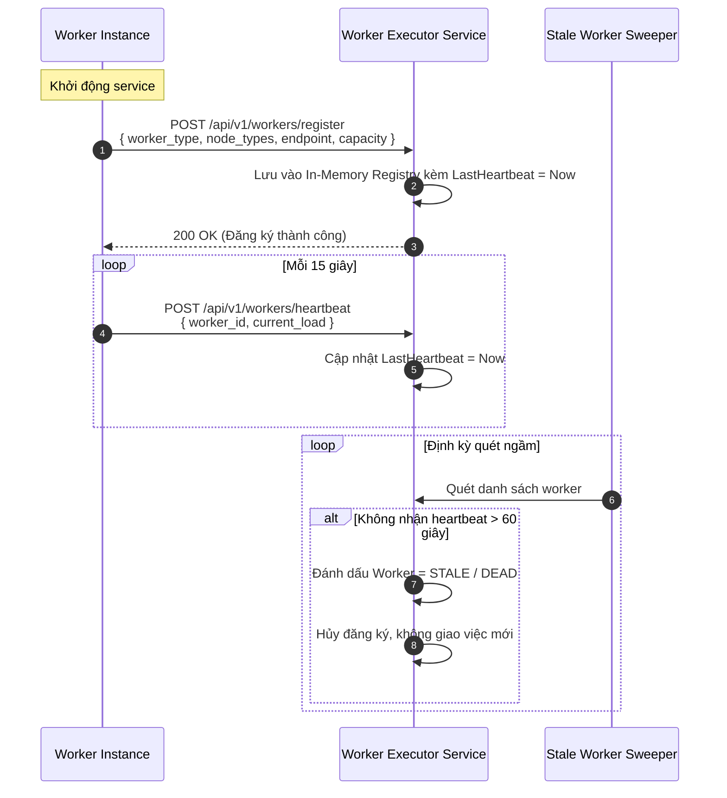

# 01. Dịch Vụ Quản Lý & Điều Phối Worker (Worker Executor Service)

> **Phân hệ:** AI Workflow Management  
> **Chủ đề:** Kiến trúc của Worker Executor Service, cơ chế Dynamic Registry, kiểm soát nhịp tim Heartbeat, và 2 mô hình Push vs Pull Dispatch.

---

## 1. Vai Trò Của Worker Executor Service (Cổng 8004)

`worker-executor-service` đóng vai trò là tầng trung gian điều phối tác vụ (Broker / Dispatcher) giữa Control Plane và mạng lưới các Worker ngoại vi:
- **Độc lập về quy mô:** Cho phép tăng giảm số lượng worker pod theo nhu cầu tải mà không cần khởi động lại hay cấu hình lại Control Plane.
- **Che giấu hạ tầng mạng:** Control Plane chỉ cần biết `worker_type` (ví dụ `http-request`, `agent`), còn việc worker đó đang chạy ở IP nào, port nào, còn sống hay đã chết do Executor quản lý.
- **Bảo vệ chống quá tải:** Áp dụng các chính sách Backpressure, Rate-limiting và giới hạn số lượng tác vụ đồng thời trên từng worker.

---

## 2. Cơ Chế Đăng Ký Động & Quản Lý Nhịp Tim (Dynamic Registry & Heartbeat)

---

## 3. Hai Mô Hình Phân Phối Tác Vụ: Push vs Pull

### 3.1. Mô Hình Push (Mặc định)
- **Cơ chế:** Khi Control Plane yêu cầu thực thi task, Executor tra cứu danh sách worker đang `HEALTHY` của loại đó, áp dụng giải thuật chọn lựa (Round-Robin hoặc Least-Connections), rồi gửi request `POST /api/v1/execute` tới worker.
- **Ưu điểm:** Độ trễ thấp, tác vụ được kích hoạt ngay lập tức.
- **Nhược điểm:** Yêu cầu worker phải mở cổng HTTP và Executor có thể truy cập mạng trực tiếp tới worker.

### 3.2. Mô Hình Pull (Pull-Lease Model)
- **Cơ chế:** 
  1. Executor lưu các task cần xử lý vào hàng đợi bộ nhớ hoặc topic.
  2. Worker chủ động gửi HTTP request định kỳ: `POST /api/v1/tasks/pull` để xin việc dựa trên dung lượng rảnh của mình.
  3. Executor cấp phát task kèm một **Lease Time** (thời hạn giữ việc, ví dụ 60 giây).
  4. Worker phải hoàn thành và nộp kết quả hoặc gia hạn lease trước khi hết hạn.
- **Ưu điểm:**
  - Tối ưu tuyệt đối cho các worker chạy trong mạng nội bộ phía sau tường lửa (NAT/Firewall) mà không cần mở port inbound.
  - Tự nhiên thích ứng theo tải: worker nào mạnh sẽ chủ động kéo nhiều việc hơn.

---

## 4. Tín Hiệu Chống Nghẽn Tải (Backpressure Signals)

Khi hệ thống chạm ngưỡng tải tối đa, Executor không âm thầm nuốt lỗi hay làm crash dịch vụ, mà ném ra các mã lỗi có chủ đích để tầng Message Broker tự động hoãn và thử lại:

| Mã Lỗi | Nguyên Nhân | Hành Vi Ứng Phó Của Hệ Thống |
|---|---|---|
| `CONCURRENCY_LIMIT` | Toàn bộ các slot chạy song song của loại worker này đã đầy. | Message Broker không `ack` thông điệp, đợi một khoảng lock TTL rồi redeliver lại. |
| `WORKER_SATURATED` | Worker phản hồi quá tải bộ nhớ / CPU. | Executor tạm dừng phân bổ thêm task cho replica đó. |
| `ADMISSION_FULL` | Hàng đợi Pull-queue đã vượt quá dung lượng byte tối đa. | Tạm ngừng nhận thêm tác vụ mới từ Control Plane. |
