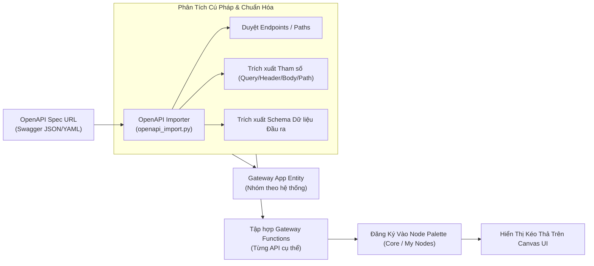

# 04. Tích Hợp API Gateway & OpenAPI Spec Importer

> **Phân hệ:** AI Workflow Management  
> **Chủ đề:** Hệ thống API Gateway Apps, bộ nhập khẩu OpenAPI Spec tự động, và biến đổi API thành các Node chức năng tùy biến.

---

## 1. Bối Cảnh: Biến API Bất Kỳ Thành Node Kéo Thả

Trong các doanh nghiệp, có hàng trăm REST API từ các hệ thống SAP S/4HANA, Salesforce, ServiceNow, hệ thống kế toán nội bộ... Việc viết worker thủ công bằng code cho từng API là không khả thi.

Hệ thống cung cấp phân hệ **Gateway App & OpenAPI Importer** (`layer1_domain/value_objects/gateway` và `layer2_application/features/create_gateway_app`):
- Cho phép người dùng dán đường dẫn URL hoặc nội dung file **OpenAPI / Swagger Spec (JSON/YAML)**.
- Hệ thống tự động phân tích và sinh ra các **Gateway Functions**.
- Mỗi Gateway Function lập tức trở thành một Node có thể kéo thả trực tiếp trên Canvas với form cấu hình tự động.

---

## 2. Kiến Trúc Bộ Nhập Khẩu OpenAPI (`openapi_import.py`)

---

## 3. Các Thành Phần Cấu Trúc (Core Components)

### 3.1. `GatewayApp`
Đại diện cho một ứng dụng hoặc hệ thống bên ngoài:
- `app_name`: Tên định danh duy nhất (ví dụ: `sap-s4hana-finance`, `salesforce-crm`).
- `base_url`: Địa chỉ máy chủ gốc (ví dụ: `https://api.s4hana.example.com`).
- `auth_config`: Cấu hình xác thực dùng chung cho toàn bộ app (`Basic`, `Bearer`, `OAuth2`, `API Key Header`).
- `host_allowlist`: Danh sách các domain được phép gọi nhằm đảm bảo an toàn mạng (SSRF Protection).

### 3.2. `GatewayFunction`
Đại diện cho một API endpoint cụ thể thuộc App:
- `function_name`: Tên hàm (ví dụ: `get_customer_by_id`, `create_purchase_order`).
- `http_method`: `GET`, `POST`, `PUT`, `DELETE`, `PATCH`.
- `path_template`: Đường dẫn URI hỗ trợ tham số hóa (ví dụ: `/customers/{customer_id}/orders`).
- `params[]`: Danh sách tham số đầu vào được trích xuất từ spec (`param_location`: `query`, `header`, `path`, `body`).
- `output_fields[]`: Cấu trúc dữ liệu trả về dự kiến, giúp các node phía sau có thể gợi ý biến (Auto-complete) trên giao diện.

---

## 4. Cơ Chế Đồng Bộ Định Kỳ (`SyncGatewayAppOpenAPIUseCase`)

- Với các hệ thống đang trong quá trình phát triển, tài liệu API có thể thay đổi liên tục.
- Hệ thống cung cấp tác vụ nền `sync_gateway_app_openapi`:
  - Định kỳ quét `spec_url` của các Gateway App đã đăng ký.
  - Tự động phát hiện các endpoint mới thêm vào hoặc các trường dữ liệu thay đổi.
  - Cập nhật định nghĩa node mà không làm gián đoạn các workflow đang chạy.
