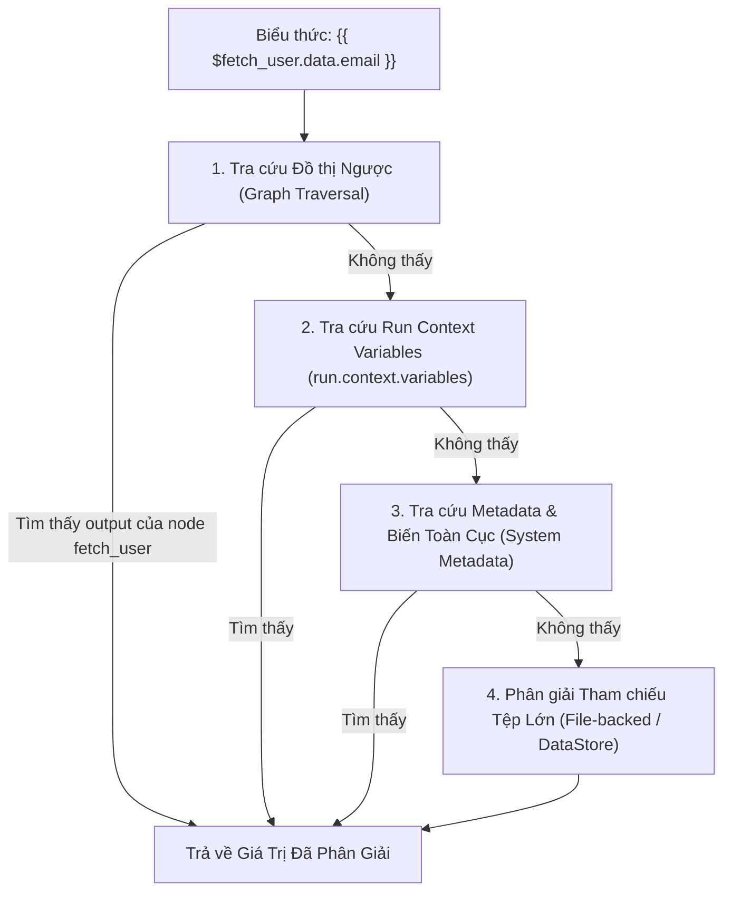

# 01. Luồng Dữ Liệu & Phân Giải Biến (Data Flow & Variables)

> **Phân hệ:** AI Workflow Management  
> **Chủ đề:** Cú pháp biểu thức n8n, chuỗi phân giải biến `VariableResolver`, và giải pháp xử lý streaming dữ liệu dung lượng lớn (Big Data / CSV).

---

## 1. Cú Pháp Biểu Thức Biến (Expression Syntax)

Hệ thống sử dụng cú pháp biểu thức hai dấu ngoặc nhọn `{{ ... }}` tương tự như [n8n](https://n8n.io/) nhằm mang lại trải nghiệm thân thiện và dễ cấu hình cho người dùng canvas:

| Cú Pháp Biểu Thức | Ý Nghĩa & Nguồn Dữ Liệu |
|---|---|
| `{{ $trigger.body.user_id }}` | Lấy giá trị từ payload kích hoạt ban đầu của workflow. |
| `{{ $fetch_user.data.email }}` | Tham chiếu trực tiếp dữ liệu đầu ra của node có ID là `fetch_user`. |
| `{{ $input.items[0] }}` | Lấy dữ liệu từ cổng đầu vào trực tiếp truyền từ node liền trước. |
| `{{ $loop.item }}` | Tham chiếu phần tử đang được lặp trong vòng lặp hiện tại. |
| `{{ $loop.index }}` | Số thứ tự lần lặp hiện tại (bắt đầu từ 0). |
| `{{ $metadata.run_id }}` | Lấy thông tin ngữ cảnh hệ thống (Run ID, Workflow ID, Start Time). |
| `{{ $vars.global_api_key }}` | Lấy biến môi trường / biến cấu hình toàn cục của workflow. |

---

## 2. Chuỗi Phân Giải Biến (`VariableResolver`)

Khi một node chuẩn bị thực thi, `VariableResolver` (`layer2_application/resolve/variable_resolver.py`) được gọi để chuyển đổi tất cả các chuỗi biểu thức trong cấu hình node thành giá trị dữ liệu thực tế theo chuỗi 4 tầng tra cứu:



1. **Tra cứu Đồ thị Ngược (Graph Traversal):** Duyệt ngược cây phụ thuộc từ các task đã hoàn thành (`completed_tasks`).
2. **Tra cứu Context Variables:** Đọc từ kho biến trạng thái của Run được cập nhật sau mỗi node.
3. **Tra cứu System Metadata:** Điền các thông tin môi trường, phiên bản và định danh.
4. **Phân giải Tham chiếu Tệp Lớn:** Tự động tải nội dung nếu trường đó đang trỏ tới một file lưu trữ ngoài.

---

## 3. Xử Lý Dữ Liệu Lớn & Streaming (Large Data & CSV Handling)

### Vấn đề:
Khi workflow xử lý một file Excel hoặc CSV chứa 500,000 dòng dữ liệu, nếu toàn bộ dữ liệu này được nhồi dưới dạng JSON vào `run.context.variables` và lưu vào bảng Database:
- Gây cạn kiệt RAM của Control Plane.
- Gây nghẽn băng thông mạng của Message Broker (Kafka/Event Mesh).
- Database phình to và hiệu năng đọc/ghi giảm sút nghiêm trọng.

### Giải pháp Kiến Trúc (`libs/json-csv-streamer` & `DataStoreService`):
1. **Truyền theo Tham Chiếu (Pass-by-Reference):**
   - Thay vì truyền toàn bộ nội dung dữ liệu, worker lưu file vào Object Storage (S3, MinIO, hoặc HANA BLOB) và chỉ trả về một `file_ref`:
   ```json
   {
     "type": "file_reference",
     "storage_id": "hana_blob",
     "path": "/runs/run-123/artifacts/customers_large.csv",
     "rows_count": 500000,
     "size_bytes": 45000000
   }
   ```
2. **Streaming Từng Phần (Stream Processing):**
   - Node tiếp theo khi cần xử lý (ví dụ: vòng lặp qua từng dòng) sẽ sử dụng thư viện `json-csv-streamer` để đọc luồng dữ liệu theo từng chunk/dòng mà không bao giờ tải toàn bộ file 45MB vào RAM cùng một lúc.
