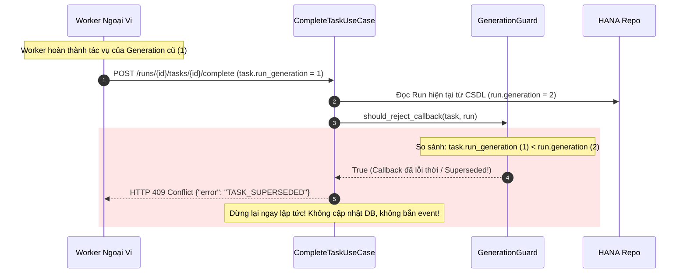

# 03. Run Generation Guard & Tái Tạo Trạng Thái (Event Sourcing Replay)

> **Phân hệ:** AI Workflow Management  
> **Chủ đề:** Chống Zombie Callback bằng `generation_guard`, mô hình Event Sourcing Replay, và cấu trúc `ProjectedRunState` Schema v3.

---

## 1. Cơ Chế Run Generation Guard (`generation_guard.py`)

### 1.1. Bài Toán Zombie Callback (The Zombie Callback Problem)
Trong quá trình phát triển và kiểm thử workflow:
1. Người dùng bấm chạy thử một Run (Generation = 1).
2. Engine dispatch một tác vụ HTTP chậm sang worker (mất 2 phút để xử lý).
3. Người dùng sốt ruột, bấm **Reset / Re-run** ngay lập tức. Hệ thống tăng `run.generation` lên 2 và bắt đầu chạy lại từ đầu.
4. Một lát sau, worker của lần chạy cũ (Generation 1) mới xử lý xong và gửi webhook callback `POST /complete` về cho Control Plane.
5. **Hậu quả nếu không có Guard:** Kết quả lỗi thời của Generation 1 sẽ ghi đè lên task đang chạy của Generation 2, làm sai lệch toàn bộ luồng dữ liệu!

---

### 1.2. Giải Pháp Thế Hệ Chạy (Generation Guard Check)



### 1.3. Ba Chế Độ Cấu Hình (`GENERATION_GUARD_MODE`)
- `off`: Tắt kiểm tra (không khuyến khích trên production).
- `shadow`: Ghi log và tăng metric Prometheus `superseded_generation_callbacks_total` nhưng vẫn cho phép callback đi tiếp (dùng để đo lường tỷ lệ lệch thế hệ trước khi bật cứng).
- `on` (Mặc định Production): Thực thi nghiêm ngặt, từ chối toàn bộ callback lỗi thời bằng mã HTTP 409 `TASK_SUPERSEDED`.

---

## 2. Tái Tạo Trạng Thái Từ Event Log (Event Sourcing Replay)

### 2.1. Cấu Trúc `ProjectedRunState` (Schema Version 3)
Thay vì xem bảng `WF_RUNS` là nguồn dữ liệu duy nhất, hệ thống có thể xây dựng lại toàn bộ trạng thái của một Run từ đầu đến cuối chỉ bằng cách duyệt tuần tự chuỗi `EventLogEnvelope`.

Cấu trúc `ProjectedRunState` (`layer1_domain/run_projection.py`):
```python
@dataclass(frozen=True)
class ProjectedRunState:
    SCHEMA_VERSION: ClassVar[int] = 3  # Đã nâng lên v3 để hỗ trợ pending_timers
    run_id: str
    workflow_id: str
    status: str
    completed_nodes: Set[str]
    skipped_nodes: Set[str]
    child_runs: Dict[str, str]
    variables: Dict[str, Any]
    pending_timers: Dict[str, str]
```

### 2.2. Hàm Thuần Túy `evolve(state, event)`
Mỗi sự kiện được "gấp" (fold) vào trạng thái bằng logic khử trùng lặp (Idempotent Reducer):
- Nhận `RunStarted` ➔ Cập nhật `status = "RUNNING"`, `started_at = timestamp`.
- Nhận `NodeOutputProduced` ➔ Cập nhật biến vào `variables[node_id]`.
- Nhận `TaskCompleted` ➔ Thêm `node_id` vào tập `completed_nodes`.
- Nhận `TaskSkipped` ➔ Thêm `node_id` vào tập `skipped_nodes`.
- Nhận `TimerCreated` ➔ Thêm vào `pending_timers`.
- Nhận `TimerFired` ➔ Gỡ khỏi `pending_timers`.

---

## 3. Khả Năng Shadow-Parity & Tự Phục Hồi (Self-Healing)

1. **Kiểm Tra Tính Nhất Quán (Shadow Parity Diff):**
   - Hệ thống định kỳ chạy một tác vụ ngầm so sánh trạng thái lưu trong bảng `WF_RUNS` và trạng thái tái tạo từ `ProjectedRunState`.
   - Nếu phát hiện sai lệch (diff), hệ thống phát cảnh báo để kỹ sư kiểm tra tính toàn vẹn dữ liệu.
2. **Tự Phục Hồi Schema Snapshot (Self-Healing):**
   - Khi `SCHEMA_VERSION` được nâng cấp (ví dụ từ v2 lên v3), các snapshot cũ sẽ tự động bị bỏ qua, hệ thống tự động replay lại từ log gốc và ghi đè snapshot phiên bản v3 mới nhất mà không yêu cầu migrate database thủ công.
