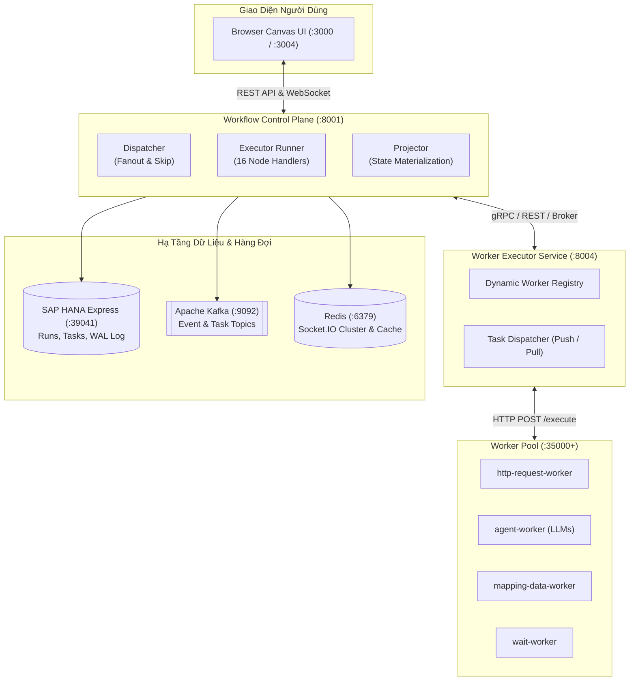

# Tài Liệu Thiết Kế Kiến Trúc: AI Workflow Management

> **Nền tảng điều phối quy trình AI cốt lõi (AI Workflow Orchestration Platform / Control Plane)**  
> *Lấy cảm hứng từ triết lý Event-Driven của n8n, thiết kế chuẩn doanh nghiệp (Enterprise Grade).*

---

## 📚 Mục Lục Tài Liệu Chi Tiết

Tài liệu được phân tách thành 5 phân hệ chuyên sâu theo cấu trúc thư mục module hóa:

### 1. [Kiến Trúc Tổng Thể (Architecture)](./01-architecture/)
- [01. Tổng Quan & Triết Lý Thiết Kế](./01-architecture/01-overview-and-philosophy.md): Động lực, triết lý Event-Driven Orchestration, Runtime Validation Only, Event Sourcing Replayability, và phân rã 3 thành phần (Dispatcher, Executor, Projector).
- [02. Topology Hệ Thống & Hạ Tầng](./01-architecture/02-system-topology.md): Bản đồ dịch vụ, bảng cổng mạng (8000, 8001, 50051, 8004, 35000+), tích hợp SAP HANA Express, Apache Kafka và Redis.
- [03. Kiến Trúc Phân Tầng Clean Architecture](./01-architecture/03-clean-architecture-layers.md): Phân tích chi tiết 4 tầng: Domain Core, Application Use Cases, Interface Adapters và Frameworks/Drivers.

### 2. [Bộ Máy Điều Phối (Orchestration Engine)](./02-engine/)
- [01. Mô Hình Thực Thi Thống Nhất](./02-engine/01-uniform-execution-model.md): Phương thức `_exec_uniform`, 6 chế độ hoàn thành (`immediate`, `dispatched`, `pending`, `child_run`, `loop_body`, `deferred`) và danh mục 16 Node Types.
- [02. Thuật Toán Fanout & Cascade-Skip](./02-engine/02-fanout-and-cascade-skip.md): Hàm thuần túy `compute_fanout()`, duyệt BFS loại bỏ nhánh phụ thuộc, và kiểm tra tính sẵn sàng tiền nhiệm (Predecessor Readiness).
- [03. Vòng Lặp & Phân Cấp Phạm Vi](./02-engine/03-loop-and-scope-hierarchy.md): Quản lý vòng lặp lồng nhau (Nested Loops), định danh xác định `invocation_id` (uuid5), ngăn xếp `scope_stack`, và các node điều khiển `LOOP_EXIT`, `LOOP_CONTINUE`.

### 3. [Hệ Thống Sự Kiện & Realtime (Event System)](./03-event-system/)
- [01. Chuỗi Xuất Bản Sự Kiện](./03-event-system/01-event-publishing-chain.md): Chuỗi Decorator Pattern 5 tầng (Write-Ahead Log, Realtime Broadcast, Enrich, Task Dispatch Fork, Backend Publisher), và phân cấp ưu tiên `EventCollector`.
- [02. Cơ Chế Phân Phối Realtime](./03-event-system/02-realtime-delivery.md): Topic phân vùng `realtime.events`, cơ chế hàng đợi 3 làn (CRITICAL, NORMAL, BULK) của Socket.IO Consumer, và tích hợp Push Gateway.

### 4. [Hệ Sinh Thái Workers (Workers Ecosystem)](./04-workers/)
- [01. Dịch Vụ Quản Lý Worker Executor](./04-workers/01-worker-executor-service.md): Quản lý đăng ký động (Dynamic Registry), nhịp tim Heartbeat, Stale Sweeper, và 2 chế độ phân phối Push vs Pull (Pull-lease model).
- [02. Bộ Công Cụ Worker SDK](./04-workers/02-worker-sdk.md): Clean Architecture trong Worker SDK, 2 chế độ SERVER vs HEADLESS, và hướng dẫn từng bước viết một worker mới.
- [03. Danh Mục Các Worker Tiêu Biểu](./04-workers/03-workers-catalog.md): Chi tiết tính năng các worker có sẵn: `http-request-worker`, `agent-worker` (LLMs), `mapping-data-worker`, `wait-worker`, v.v.

### 5. [Độ Bền Vững & Dữ Liệu (Resilience & Data Flow)](./05-resilience/)
- [01. Luồng Dữ Liệu & Phân Giải Biến](./05-resilience/01-data-flow-and-variables.md): Biểu thức n8n `{{ ... }}`, 4 tầng tra cứu của `VariableResolver`, và giải pháp xử lý streaming dữ liệu lớn (CSV/BLOB) qua `DataStoreService`.
- [02. Tính Bền Vững & Tối Ưu Enterprise](./05-resilience/02-production-hardening.md): Khóa lạc quan CAS Retry, Transactional Outbox Pattern, các Janitor giải phóng RAM (`malloc_trim`), giám sát độ trễ event loop, và bộ hẹn giờ bền vững (Durable Timers).

---

## 🚀 Sơ Đồ Kiến Trúc Tổng Thể

