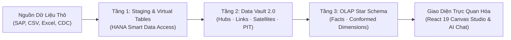

# 01. Tổng Quan & Các Khái Niệm Cốt Lõi (Overview & Core Concepts)

> **Phân hệ:** BI Dashboard & Analytics Platform  
> **Chủ đề:** Mục đích kiến trúc, chuỗi chuyển đổi 3 tầng (Staging ➔ Data Vault 2.0 ➔ Star Schema ➔ Canvas), và Clean Architecture.

---

## 1. Bối Cảnh & Động Lực (Context & Motivation)

Trong các hệ thống quản trị dữ liệu tổng thể (Master Data Governance - MDG) và di chuyển dữ liệu (Data Migration), một bài toán lớn là: **Làm thế nào để trực quan hóa dữ liệu lịch sử khổng lồ, theo dõi tiến độ di chuyển dữ liệu và phân tích chất lượng dữ liệu thời gian thực?**

Các giải pháp BI truyền thống thường gặp 2 bế tắc lớn:
1. **Thiết kế quá giòn gãy (Brittle ETL):** Khi hệ thống nguồn (Legacy ERP, CRM) thay đổi cấu trúc bảng, toàn bộ pipeline phân tích bị gãy hoàn toàn.
2. **Không bảo toàn dấu vết lịch sử (Lack of Traceability):** Khó theo dõi được bản ghi này được sửa đổi khi nào, bởi nguồn nào, và tại sao nó lại được ánh xạ vào báo cáo.

**BI Dashboard Platform** giải quyết triệt để vấn đề này bằng việc kết hợp **Data Vault 2.0** với **OLAP Star Schema** trên nền tảng **SAP HANA In-Memory Columnar Database**.

---

## 2. Chuỗi Chuyển Đổi Dữ Liệu 3 Tầng (The 3-Tier Data Lifecycle)

Hệ thống vận hành theo chu trình chuẩn hóa 3 tầng rõ rệt:

### Chi Tiết 3 Tầng Chuyển Đổi:
1. **Tầng Staging (L0/L1 Ingestion):**
   - Kết nối trực tiếp vào CSDL SAP HANA thông qua **Smart Data Access (SDA)** và các bảng ảo (Virtual Tables).
   - Nạp tệp lớn CSV/XLSX bằng engine đa luồng **Polars** với tốc độ hàng chục ngàn dòng mỗi giây.
   - Nhận diện schema, sinh hồ sơ chất lượng dữ liệu (Profiling).
2. **Tầng Lưu Trữ Doanh Nghiệp (Data Vault 2.0):**
   - Phân rã dữ liệu thành: **Hubs** (Thực thể kinh doanh cốt lõi), **Links** (Mối quan hệ kinh doanh), và **Satellites** (Thuộc tính và lịch sử thay đổi).
   - Đảm bảo tính kiểm toán (Full Auditability), bất biến và không bao giờ bị ghi đè.
3. **Tầng Phân Tích Thông Minh (OLAP Star Schema / Data Marts):**
   - Data Vault rất mạnh về lưu trữ nhưng có quá nhiều phép JOIN phức tạp.
   - Hệ thống tự động chuyển đổi Data Vault thành **Star Schema Manifest** gồm: **Bảng Sự Kiện (Fact Tables)**, **Bảng Chiều Dữ Liệu Thống Nhất (Conformed Dimensions)**, và **Bảng Ảnh Chụp Mốc Thời Gian (Point-In-Time - PIT Tables)**.
   - Cho phép các công cụ BI và biểu đồ truy vấn với tốc độ mili-giây.

---

## 3. Kiến Trúc Phân Tầng Clean Architecture 4 Lớp

Tương tự như toàn bộ hệ sinh thái SimpleMDG, phân hệ `bi-dashboard` tuân thủ nguyên tắc Clean Architecture:

| Tầng Kiến Trúc | Thư Mục Trong Codebase | Trách Nhiệm Chính |
|---|---|---|
| **Layer 1: Domain** | `app/layer1_domain/` | Các thực thể thuần túy: `VaultBlueprint`, `StarManifest`, `DashboardDefinition`, `ChartDefinition`, `ChangeEvent`. |
| **Layer 2: Application**| `app/layer2_application/` | Các Use Cases chuyên sâu: sinh DDL Data Vault, tự động tạo Star Schema, biên soạn truy vấn SQL động, áp dụng luật bảo mật dòng (RLS). |
| **Layer 3: Adapters** | `app/layer3_adapters/` | Các REST Controllers v1 mount tại `/api/v1/olap/*` (hơn 130 endpoints), DTOs, Serializers. |
| **Layer 4: Frameworks**| `app/layer4_frameworks/` | SAP HANA Connectors, Polars File Ingestion, XSUAA Auth Provider, Event Bus Publisher. |
