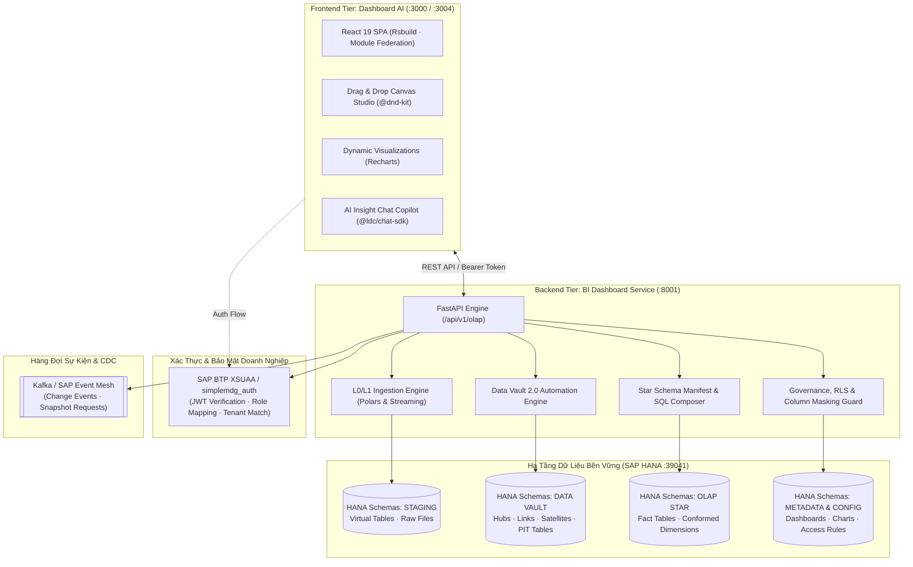

# 02. Topology Hệ Thống & Cổng Giao Tiếp (System Topology)

> **Phân hệ:** BI Dashboard & Analytics Platform  
> **Chủ đề:** Bản đồ liên kết hệ thống, giao tiếp giữa Backend FastAPI và Frontend React 19, tích hợp SAP HANA và XSUAA.

---

## 1. Sơ Đồ Topology Tổng Thể

---

## 2. Các Cổng Giao Tiếp & Quy Chuẩn Định Tuyến

| Thành Phần | Cổng Mặc Định | Giao Thức / Endpoint Gốc | Trách Nhiệm Chính |
|---|---|---|---|
| **Frontend Dashboard AI** | `3000` (hoặc `3004`) | HTTP / Module Federation | Giao diện kéo thả canvas, hiển thị biểu đồ, bộ lọc chéo (Cross-filters). |
| **Backend BI Dashboard** | `8001` | HTTP `/api/v1/olap` | Cung cấp toàn bộ 134 endpoints cho Ingestion, Vault, Star Schema, Charts và Dashboards. |
| **SAP HANA Database** | `39041` (hoặc `443` Cloud) | SQL / `hdbcli` Connection Pool | Kho lưu trữ in-memory duy nhất cho cả 3 tầng dữ liệu (Staging, Vault, Star). |
| **SAP XSUAA Service** | Cloud HTTPS | OAuth2 / JWT Tokens | Cung cấp token xác thực phân quyền theo vai trò (`ADMIN`, `ANALYST`, `VIEWER`). |

---

## 3. Xác Thực & Đa Người Thuê (Multi-Tenancy)

- Hệ thống sử dụng thư viện nội bộ **`simplemdg_auth`** tích hợp trực tiếp với SAP BTP XSUAA.
- **Xác thực theo từng Router (Per-Router Auth):**
  - Giúp phân định rành mạch các route công khai (Health checks, doc specs) và các route nghiệp vụ bắt buộc phải có Bearer Token.
- **Nguyên tắc `enforce_tenant_match`:**
  - Token JWT mang thông tin `tenant_id` của phiên làm việc.
  - Nếu payload trong request body hoặc query parameter cố tình truyền một `tenant_id` khác với token, hệ thống lập tức từ chối với mã lỗi `403 Forbidden`.
