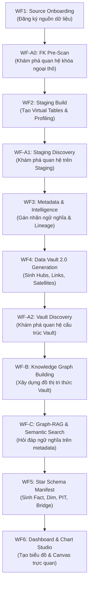

# 03. Chuỗi 11 Giai Đoạn Vận Hành Pipeline (End-to-End Workflows)

> **Phân hệ:** BI Dashboard & Analytics Platform  
> **Chủ đề:** Chuỗi 11 giai đoạn tuyến tính từ kết nối dữ liệu thô tới Dashboard hoàn chỉnh, và chuỗi truyền biến Variable Bus.

---

## 1. Sơ Đồ Xương Sống Tuyến Tính (Linear Backbone)

Quy trình xây dựng toàn diện một hệ thống BI từ đầu đến cuối được tự động hóa qua 11 quy trình con (Workflows), có cơ chế kiểm tra điều kiện (Gate) nghiêm ngặt trước khi chuyển bước:

---

## 2. Chi Tiết 11 Giai Đoạn Pipeline

### 2.1. Giai Đoạn Nguồn & Staging (Sources & Staging)
- **WF1 — Source Onboarding (`/sources/register`):**
  - Kiểm tra kết nối (`test-connection`), lưu thông tin kết nối CSDL SAP HANA hoặc nguồn streaming.
  - Tự động phân nhánh: Nếu là SAP HANA thì dùng Virtual Tables (không stream), nếu là CDC/Kafka thì bật streaming.
- **WF-A0 — FK Pre-Scan (`/discover/relationships`):**
  - Quét trước từ điển dữ liệu để nhận diện các khóa ngoại (Foreign Keys) tiềm năng giữa các bảng thô.
- **WF2 — Staging Build (`/staging/virtual-tables`):**
  - Tạo bảng ảo (Virtual Table) trong SAP HANA kết nối tới nguồn ngoài qua Smart Data Access (SDA).
  - Kích hoạt tác vụ lập hồ sơ chất lượng dữ liệu (`/profiles`).
- **WF-A1 — Staging Discovery (`/discover/staging-relationships`):**
  - Khám phá và xác thực các mối quan hệ thực tế giữa các bảng staging.

---

### 2.2. Giai Đoạn Data Vault & Đồ Thị Tri Thức (Vault & Graph)
- **WF3 — Metadata Intelligence (`/metadata`):**
  - Đánh giá phân bố giá trị từng cột, tự động gán nhãn ngữ nghĩa (Semantic Labels: Khách hàng, Tiền tệ, Ngày tháng) và xây dựng biểu đồ phả hệ (Lineage Graph).
- **WF4 — Data Vault 2.0 Automation (`/vault/generate-schema`):**
  - Tự động sinh cấu trúc Data Vault: tạo các bảng Hub, Link, Satellite, thực thi DDL và kích hoạt nạp dữ liệu.
- **WF-A2 — Vault Discovery (`/discover/vault-relationships`):**
  - Xác nhận toàn vẹn các khóa Hash Key giữa Hubs và Links.
- **WF-B — Knowledge Graph Building (`/graph/build-from-vault`):**
  - Chuyển đổi toàn bộ cấu trúc Data Vault thành đồ thị tri thức trong **SAP HANA Graph Workspace**.
- **WF-C — Graph-RAG & Metadata Chat (`/graph/query`):**
  - Cho phép người dùng hoặc AI Copilot hỏi đáp bằng ngôn ngữ tự nhiên về ý nghĩa của từng trường dữ liệu trong kho.

---

### 2.3. Giai Đoạn Star Schema & Dashboard (Analytics Mart & Presentation)
- **WF5 — Star Schema Manifest (`/schema/auto-generate`):**
  - Tự động sinh mô hình hình sao (Star Schema): chọn các Fact Tables chứa số đo (Measures), tạo Conformed Dimensions chứa thuộc tính phân tích, và sinh bảng Point-in-Time (PIT) để tối ưu tốc độ truy vấn lịch sử.
- **WF6 — Dashboard & Chart Studio (`/dashboards/bootstrap-workspace`):**
  - Tự động sinh danh mục biểu đồ mẫu phù hợp với dữ liệu (Bar, Line, Pie, KPI Card).
  - Khởi tạo không gian làm việc Dashboard hoàn chỉnh, sẵn sàng cho người dùng kéo thả và tương tác.

---

## 3. Chuỗi Truyền Biến Xuyên Suốt (The Variable Bus)

Để 11 giai đoạn trên có thể tự động chạy liền mạch, hệ thống duy trì một chuỗi giá trị định danh được truyền từ đầu đến cuối:

$$\text{source\_id} \longrightarrow \text{profile\_id} \longrightarrow \text{blueprint\_id} \longrightarrow \text{manifest\_id} \longrightarrow \text{chart\_id} \longrightarrow \text{dashboard\_id}$$

Mỗi bước phát ra khóa định danh của mình làm đầu vào bắt buộc cho bước kế tiếp, đảm bảo tính toàn vẹn dữ liệu từ gốc tới ngọn.
