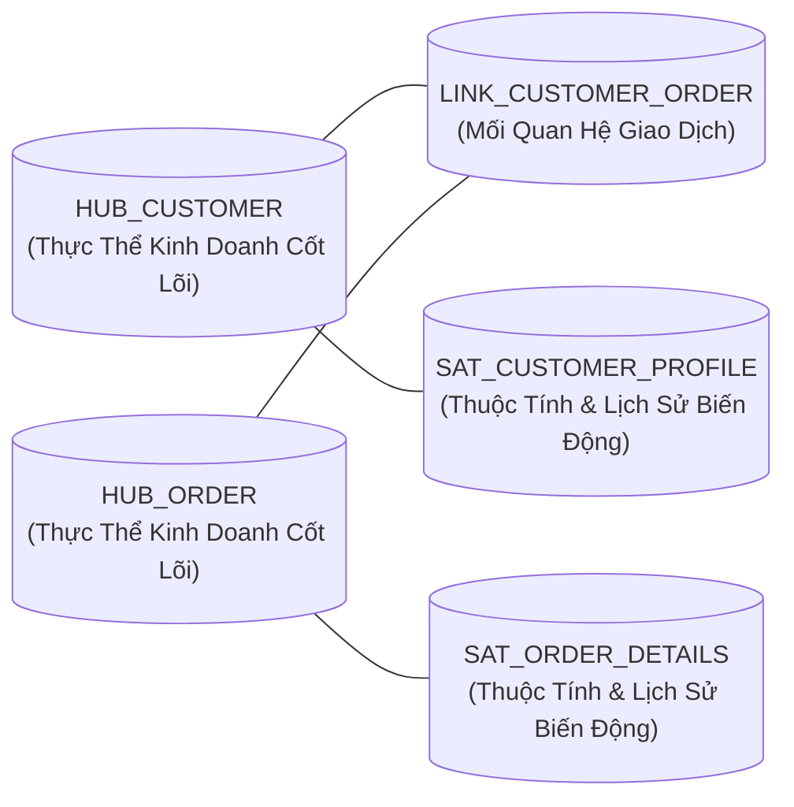

# 01. Mô Hình Hóa Data Vault 2.0 (Hubs, Links, Satellites)

> **Phân hệ:** BI Dashboard & Analytics Platform  
> **Chủ đề:** Cấu trúc Data Vault 2.0, các thực thể Hub, Link, Satellite, cơ chế Hash Keys, và kỹ thuật Satellite Splitting.

---

## 1. Triết Lý Mô Hình Hóa Data Vault 2.0

Trong môi trường doanh nghiệp quy mô lớn, dữ liệu liên tục biến động và đến từ nhiều nguồn khác nhau. Mô hình quan hệ truyền thống 3NF (3rd Normal Form) rất khó mở rộng, trong khi mô hình Star Schema thuần túy lại dễ bị ghi đè mất lịch sử.

**Data Vault 2.0** giải quyết bài toán này bằng cách phân rã dữ liệu thành 3 thành phần độc lập:

---

## 2. Chi Tiết 3 Loại Bảng Cốt Lõi

### 2.1. Bảng Trung Tâm: Hub (Business Concept)
- **Mục đích:** Đại diện cho một khái niệm kinh doanh cốt lõi không bao giờ thay đổi (ví dụ: Khách hàng, Sản phẩm, Đơn hàng, Nhà cung cấp).
- **Cấu trúc trường chuẩn:**
  - `HUB_HASH_KEY`: Khóa băm (SHA256) tính toán từ Business Key.
  - `BUSINESS_KEY`: Mã định danh tự nhiên trong hệ thống nguồn (ví dụ: `CUSTOMER_ID = "CUST-001"`).
  - `LOAD_DATE`: Thời điểm dòng dữ liệu được nạp vào kho.
  - `RECORD_SOURCE`: Tên hệ thống nguồn cung cấp bản ghi (ví dụ: `"SAP_S4HANA"`).

---

### 2.2. Bảng Liên Kết: Link (Business Relationship)
- **Mục đích:** Đại diện cho mối quan hệ hoặc sự kiện kinh doanh liên kết giữa hai hoặc nhiều Hub (ví dụ: Khách hàng A mua Đơn hàng B, Nhà cung cấp C bán Linh kiện D).
- **Cấu trúc trường chuẩn:**
  - `LINK_HASH_KEY`: Khóa băm đại diện cho mối quan hệ.
  - `HUB_CUSTOMER_HASH_KEY`: Khóa ngoại trỏ về `HUB_CUSTOMER`.
  - `HUB_ORDER_HASH_KEY`: Khóa ngoại trỏ về `HUB_ORDER`.
  - `LOAD_DATE` & `RECORD_SOURCE`.

---

### 2.3. Bảng Vệ Tinh: Satellite (Descriptive Context & History)
- **Mục đích:** Lưu trữ toàn bộ các trường mô tả, thuộc tính chi tiết và **toàn bộ lịch sử biến động theo thời gian** (SCD Type 2 tự nhiên).
- **Nguyên tắc bất biến (Insert-Only):** Dữ liệu vệ tinh **không bao giờ bị UPDATE hoặc DELETE**. Mỗi khi có sự thay đổi thuộc tính ở nguồn, một dòng mới được INSERT vào Satellite kèm thời gian `LOAD_DATE`.
- **Cơ chế `HASH_DIFF`:**
  - Để nhận biết thuộc tính có thay đổi hay không mà không cần so sánh từng cột, hệ thống tính toán một mã băm `HASH_DIFF` từ toàn bộ các cột thuộc tính.
  - Nếu `HASH_DIFF` của bản ghi mới khác với bản ghi gần nhất trong kho ➔ Tự động INSERT dòng mới. Nếu giống hệt ➔ Bỏ qua không nạp lại.

---

## 3. Kỹ Thuật Nâng Cao: Satellite Splitting (Tách Vệ Tinh)

Không nên nhồi toàn bộ 50 cột thuộc tính vào một Satellite duy nhất. Hệ thống hỗ trợ tính năng **Satellite Split Map**:
1. **Tách Theo Tần Suất Biến Động (Rate of Change):**
   - *Sat_Customer_Core:* Chứa Tên, Ngày thành lập (Rất hiếm khi đổi).
   - *Sat_Customer_Financial:* Chứa Điểm tín dụng, Công nợ, Hạn mức (Thay đổi hàng ngày).
2. **Tách Theo Tiêu Chuẩn Bảo Mật (Security & Compliance):**
   - *Sat_Customer_General:* Các thông tin công khai nội bộ.
   - *Sat_Customer_PII:* Các thông tin bảo mật nhạy cảm (Số thẻ tín dụng, CCCD) được phân quyền bảo mật khắt khe và mã hóa riêng biệt.
