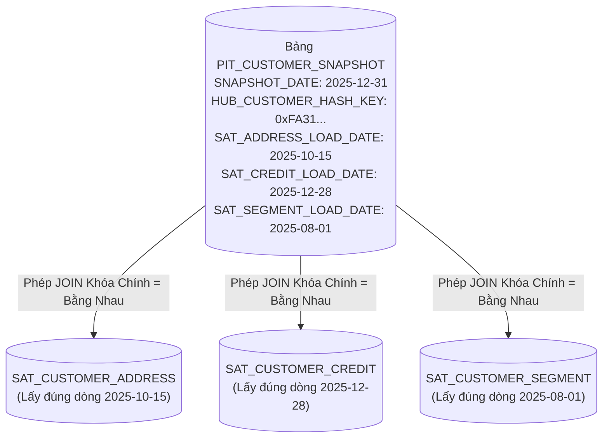

# 02. Bảng Thời Điểm PIT & Bảng Cầu Nối Bridge Tables

> **Phân hệ:** BI Dashboard & Analytics Platform  
> **Chủ đề:** Tối ưu hóa hiệu năng Data Vault bằng bảng Point-In-Time (PIT) và Bridge Tables.

---

## 1. Vấn Đề Hiệu Năng Khi Truy Vấn Lịch Sử Data Vault

Mô hình Data Vault 2.0 rất hoàn hảo cho việc lưu trữ nhưng lại là "cơn ác mộng" khi truy vấn báo cáo trực tiếp:
- Giả sử bạn muốn lập báo cáo: *"Tình trạng địa chỉ, hạn mức tín dụng và nhóm khách hàng của 1,000,000 khách hàng tại mốc thời gian 31/12/2025"*.
- Vì mỗi vệ tinh (Satellite) ghi nhận thay đổi vào các ngày khác nhau, câu lệnh SQL sẽ phải:
  1. JOIN giữa `HUB_CUSTOMER` với `SAT_CUSTOMER_ADDRESS`.
  2. JOIN tiếp với `SAT_CUSTOMER_CREDIT`.
  3. JOIN tiếp với `SAT_CUSTOMER_SEGMENT`.
  4. Ở mỗi Satellite, phải chạy một Subquery tương quan tốn kém: `WHERE LOAD_DATE = (SELECT MAX(LOAD_DATE) FROM SAT WHERE ... AND LOAD_DATE <= '2025-12-31')`.
- **Hậu quả:** Câu truy vấn chạy mất nhiều phút, làm treo CSDL!

---

## 2. Giải Pháp: Bảng Điểm Thời Gian (Point-In-Time - PIT Tables)

Bảng **Point-In-Time (PIT Table)** được thiết kế để giải quyết triệt để nút thắt cổ chai này:
- Bảng PIT được tạo trước định kỳ (ví dụ chụp ảnh snapshot vào cuối mỗi ngày hoặc cuối mỗi tháng).
- Chứa sẵn con trỏ chính xác tới dòng dữ liệu hợp lệ trong từng Satellite tại mốc thời gian đó:

### Lợi Thế Vượt Trội:
- Biến toàn bộ các phép so sánh `<= MAX(LOAD_DATE)` phức tạp thành **phép JOIN đẳng thức trực tiếp (`=`)** trên khóa chính.
- Tốc độ truy vấn báo cáo lịch sử tăng tốc từ hàng phút xuống **dưới 100 mili-giây** trên SAP HANA In-Memory!

---

## 3. Bảng Cầu Nối: Bridge Tables

Khi mô hình doanh nghiệp có các chuỗi liên kết nhiều bậc:
- `Customer` ➔ `Order` ➔ `OrderItem` ➔ `Product` ➔ `Supplier`
- Truy vấn Star Schema cần nối dữ liệu từ `Customer` tới `Supplier` sẽ phải đi qua 4 bảng Link và 5 bảng Hub khác nhau.

**Bảng Bridge (Bridge Table):**
- Làm phẳng (Flatten) mạng lưới liên kết phức tạp này thành một bảng cấu trúc sẵn:
  - `CUSTOMER_HASH_KEY`
  - `ORDER_HASH_KEY`
  - `PRODUCT_HASH_KEY`
  - `SUPPLIER_HASH_KEY`
  - `SNAPSHOT_DATE`
- Giúp câu truy vấn tổng hợp số liệu của Star Schema đi thẳng từ Fact tới Dimension mà không cần duyệt qua cây đồ thị Hub-Link rườm rà.
