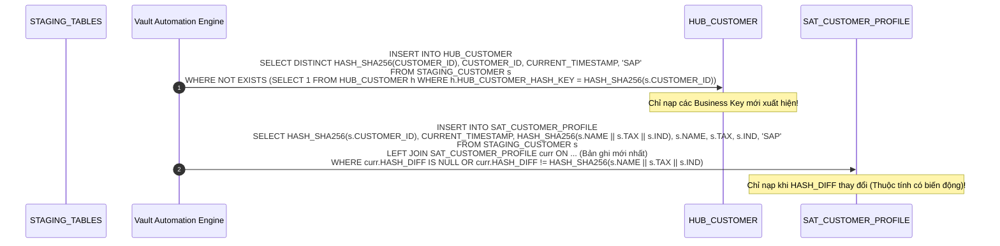

# 03. Tự Động Sinh DDL & Nạp Dữ Liệu (DDL & Automation)

> **Phân hệ:** BI Dashboard & Analytics Platform  
> **Chủ đề:** Tự động hóa sinh DDL SAP HANA, kịch bản nạp dữ liệu ELT với Hash Keys, và thích ứng biến đổi cấu trúc (Schema Drift).

---

## 1. Tự Động Hóa Sinh DDL Cho SAP HANA

Việc viết tay hàng chục file DDL và câu lệnh `CREATE TABLE` cho Data Vault 2.0 là công việc tốn kém thời gian và dễ xảy ra sai sót.

Module `vault_blueprint` (`app/layer2_application/use_cases/vault/`) tự động phân tích cấu trúc Staging và sinh DDL tối ưu riêng cho động cơ cột (Column Store) của SAP HANA:

```sql
-- DDL Sinh Tự Động Cho Hub
CREATE COLUMN TABLE "DATA_VAULT"."HUB_CUSTOMER" (
    "HUB_CUSTOMER_HASH_KEY" VARBINARY(32) NOT NULL,
    "CUSTOMER_ID" NVARCHAR(64) NOT NULL,
    "LOAD_DATE" TIMESTAMP NOT NULL,
    "RECORD_SOURCE" NVARCHAR(128) NOT NULL,
    PRIMARY KEY ("HUB_CUSTOMER_HASH_KEY")
);

-- DDL Sinh Tự Động Cho Satellite
CREATE COLUMN TABLE "DATA_VAULT"."SAT_CUSTOMER_PROFILE" (
    "HUB_CUSTOMER_HASH_KEY" VARBINARY(32) NOT NULL,
    "LOAD_DATE" TIMESTAMP NOT NULL,
    "HASH_DIFF" VARBINARY(32) NOT NULL,
    "CUSTOMER_NAME" NVARCHAR(256),
    "TAX_CODE" NVARCHAR(32),
    "INDUSTRY" NVARCHAR(64),
    "RECORD_SOURCE" NVARCHAR(128) NOT NULL,
    PRIMARY KEY ("HUB_CUSTOMER_HASH_KEY", "LOAD_DATE")
);
```

### Tối Ưu Hóa SAP HANA:
- **`VARBINARY(32)` Cho Hash Keys:** Lưu trữ mã băm SHA256 dưới dạng nhị phân 32 bytes thay vì chuỗi hex 64 ký tự ➔ Giảm 50% dung lượng RAM và tăng tốc độ JOIN in-memory lên 3 lần.
- **`COLUMN TABLE`:** Tận dụng khả năng nén cột (Columnar Compression) và vector hóa truy vấn của SAP HANA.

---

## 2. Kịch Bản Nạp Dữ Liệu ELT Tự Động (Data Loading Script)

Khi nạp dữ liệu từ Staging vào Data Vault, hệ thống thực thi câu lệnh SQL thuần túy (ELT Pushdown) trực tiếp trong SAP HANA:



---

## 3. Thích Ứng Biến Đổi Cấu Trúc Nguồn (Schema Drift Adaptation)

Khi hệ thống nguồn bổ sung thêm cột mới (ví dụ hệ thống SAP thêm trường `LOYALTY_TIER`):
- Hệ thống kích hoạt module `schema_drift_alert`.
- **Chiến lược không ngắt quãng (Non-Breaking Drift Handling):**
  - Tự động sinh lệnh `ALTER TABLE ADD COLUMN` trên Satellite hiện tại hoặc tạo một Satellite mới liên kết với Hub.
  - Các pipeline biểu đồ và dashboard hiện có vẫn hoạt động bình thường 100%, trường mới lập tức sẵn sàng để các nhà phân tích đưa vào báo cáo mới.
