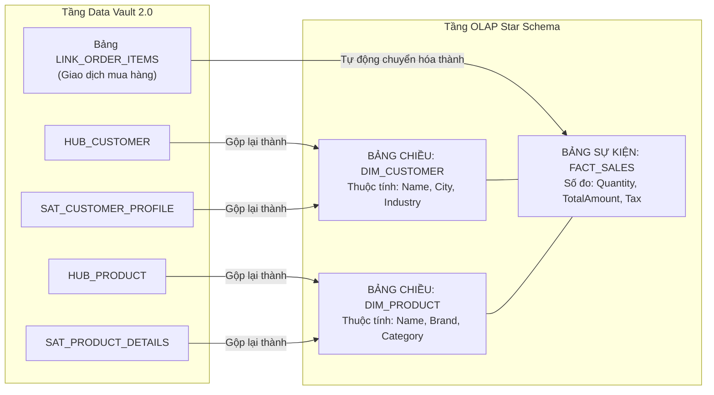

# 01. Bản Kê Mô Hình Hình Sao (Star Schema Manifest)

> **Phân hệ:** BI Dashboard & Analytics Platform  
> **Chủ đề:** Cấu trúc `StarManifest`, tự động chuyển đổi Data Vault sang Star Schema, Facts, Dimensions và Conformed Dimensions.

---

## 1. Vai Trò Của Star Schema Trong Tầng Trực Quan Hóa

Mặc dù Data Vault 2.0 là "vua lưu trữ" trong việc bảo toàn lịch sử và kiểm toán, nhưng người dùng doanh nghiệp (Business Users) và các công cụ vẽ biểu đồ chỉ có thể hiểu và làm việc hiệu quả với **Mô hình hình sao (Star Schema / Dimensional Model)**:
- **Bảng Sự Kiện (Fact Tables):** Chứa các số đo định lượng (Measures) như: Doanh thu, Số lượng bán, Chi phí, Thời gian xử lý.
- **Bảng Chiều Dữ Liệu (Dimension Tables):** Chứa các thuộc tính định tính dùng để cắt lát (Slice & Dice) dữ liệu: Tên khách hàng, Nhóm sản phẩm, Quốc gia, Kênh bán hàng.

Module `star_manifest` (`app/layer1_domain/entities/star_manifest.py`) tự động sinh ra bản kê này từ cấu trúc Data Vault.

---

## 2. Quy Tắc Chuyển Đổi Tự Động (Vault-to-Star Mapping Rules)

---

## 3. Chiều Dữ Liệu Dùng Chung: Conformed Dimensions

Trong doanh nghiệp lớn, dữ liệu bán hàng (Sales) và dữ liệu bảo hành (Support Tickets) là hai quy trình nghiệp vụ tách biệt. Tuy nhiên, cả hai đều liên quan tới cùng một đối tượng **Khách Hàng (Customer)** và cùng một trục **Thời Gian (Date)**.

Hệ thống hỗ trợ tính năng **Conformed Dimension**:
- Một bảng chiều duy nhất `DIM_CUSTOMER` được dùng chung cho cả `FACT_SALES` và `FACT_SUPPORT_TICKETS`.
- **Khả năng Drill-Across:** Cho phép người dùng kéo hai biểu đồ lên cùng một Dashboard và lọc chéo (Cross-Filter) theo nhóm khách hàng, cả hai biểu đồ bán hàng và bảo hành đều lập tức cập nhật tương ứng.
