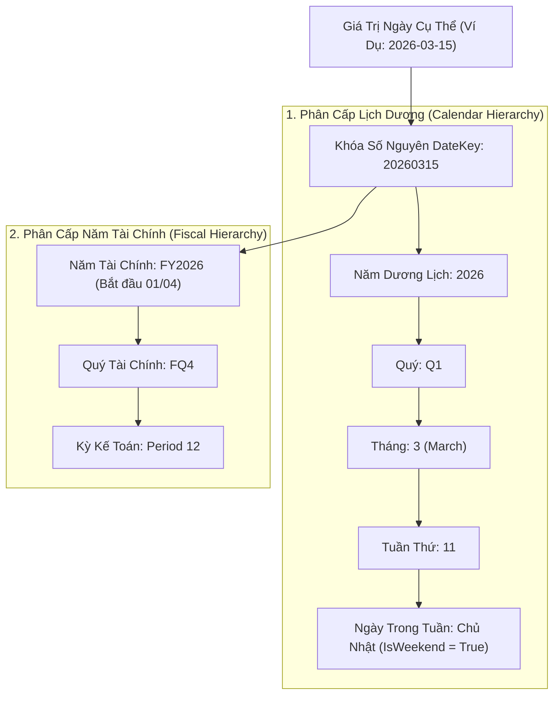

# 02. Bộ Sinh Chiều Thời Gian Đa Cấp (Date Dimension Generator)

> **Phân hệ:** BI Dashboard & Analytics Platform  
> **Chủ đề:** Chiều thời gian `DIM_DATE`, cấu trúc phân cấp lịch dương (Calendar) và năm tài chính (Fiscal Year).

---

## 1. Tầm Quan Trọng Của Chiều Thời Gian Trong BI

Thời gian là trục tọa độ trung tâm của hầu hết mọi câu hỏi phân tích kinh doanh:
- *"Doanh thu quý này tăng trưởng bao nhiêu % so với cùng kỳ năm ngoái (YoY)?"*
- *"Xu hướng chi phí theo từng tuần trong tháng (WoW)?"*
- *"Tổng doanh số lũy kế từ đầu năm tài chính đến hiện tại (YTD)?"*

Nếu chỉ dùng trường `TIMESTAMP` thô trong CSDL, mỗi câu truy vấn SQL sẽ phải chạy các hàm biến đổi chuỗi (`YEAR()`, `MONTH()`, `DATEPART()`) cực kỳ chậm chạp và không thể tính toán được lịch năm tài chính đặc thù của doanh nghiệp.

Module `date_dimension` (`app/layer1_domain/entities/date_dimension.py`) tự động sinh ra một bảng chiều chuẩn hóa **`DIM_DATE`** bao phủ toàn bộ các mốc thời gian từ quá khứ tới tương lai.

---

## 2. Cấu Trúc Hai Hệ Phân Cấp Thời Gian (Dual Hierarchies)

---

## 3. Các Thuộc Tính Được Tính Toán Sẵn Trong `DIM_DATE`

| Tên Thuộc Tính | Kiểu Dữ Liệu | Ví Dụ Giá Trị | Mục Đích Phân Tích |
|---|---|---|---|
| `DATE_KEY` | `INT` | `20260315` | Khóa chính số nguyên, dùng để JOIN với Fact Tables với tốc độ tối đa. |
| `FULL_DATE` | `DATE` | `2026-03-15` | Ngày chuẩn định dạng ISO. |
| `YEAR` | `INT` | `2026` | Cắt lát theo năm dương lịch. |
| `QUARTER_NAME` | `NVARCHAR(2)`| `Q1` | Phân tích doanh số theo quý. |
| `MONTH_NAME` | `NVARCHAR(16)`| `March` | Hiển thị nhãn trên biểu đồ đường. |
| `DAY_OF_WEEK_NAME` | `NVARCHAR(16)`| `Sunday` | Phân tích lưu lượng mua sắm theo ngày trong tuần. |
| `IS_WEEKEND` | `BOOLEAN` | `TRUE` | Lọc các ngày làm việc vs ngày nghỉ cuối tuần. |
| `IS_HOLIDAY` | `BOOLEAN` | `FALSE` | Đánh dấu ngày nghỉ lễ theo lịch quy định. |
| `FISCAL_YEAR` | `INT` | `2026` | Năm tài chính doanh nghiệp. |
| `FISCAL_QUARTER`| `NVARCHAR(4)`| `FQ4` | Quý tài chính doanh nghiệp. |
| `FISCAL_PERIOD` | `INT` | `12` | Kỳ khóa sổ kế toán tháng. |
