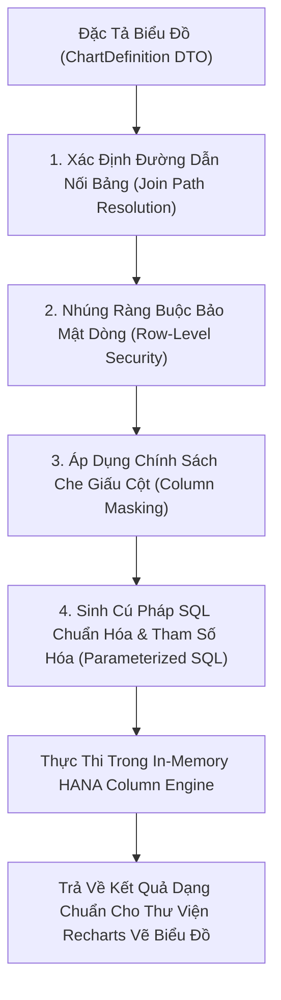

# 03. Biên Soạn Truy Vấn SQL Động (Dynamic Query Composition)

> **Phân hệ:** BI Dashboard & Analytics Platform  
> **Chủ đề:** Động cơ sinh SQL tự động `ComposedQuery`, toán tử tập hợp, và nhúng chính sách bảo mật tại chỗ.

---

## 1. Cơ Chế Biên Soạn Truy Vấn Động (Dynamic SQL Composition)

Khi người dùng kéo thả các trường trên giao diện biểu đồ:
- Kéo trường `DIM_CUSTOMER.CITY` vào trục X.
- Kéo trường `FACT_SALES.TOTAL_AMOUNT` vào trục Y và chọn hàm tính `SUM`.
- Áp dụng bộ lọc `DIM_DATE.YEAR = 2026`.

Hệ thống không sử dụng các câu lệnh SQL tĩnh viết sẵn. Thay vào đó, module `composed_query` (`app/layer1_domain/entities/composed_query.py`) tự động dịch đặc tả biểu đồ thành một câu truy vấn SQL tối ưu hóa cho SAP HANA:

```sql
SELECT 
    c."CITY" AS "dimension_0",
    SUM(f."TOTAL_AMOUNT") AS "measure_0"
FROM "OLAP_STAR"."FACT_SALES" f
JOIN "OLAP_STAR"."DIM_CUSTOMER" c 
    ON f."CUSTOMER_KEY" = c."CUSTOMER_KEY"
JOIN "OLAP_STAR"."DIM_DATE" d 
    ON f."DATE_KEY" = d."DATE_KEY"
WHERE f."TENANT_ID" = :tenant_id
  AND d."YEAR" = 2026
GROUP BY c."CITY"
ORDER BY "measure_0" DESC
LIMIT 50;
```

---

## 2. Quy Trình 4 Bước Biên Soạn Truy Vấn An Toàn



---

## 3. Nhúng Chính Sách Bảo Mật Vào Câu Lệnh SQL

Để đảm bảo người dùng không thể can thiệp vào câu lệnh SQL:
1. **Chống SQL Injection Tuyệt Đối:** Mọi giá trị người dùng nhập vào bộ lọc đều được truyền qua biến tham số (`:tenant_id`, `:year`), không bao giờ ghép chuỗi trực tiếp.
2. **Nhúng RLS Tự Động Vào Mệnh Đề `WHERE`:**
   - Nếu người dùng có vai trò `REGIONAL_MANAGER_NORTH`, hệ thống tự động chèn thêm điều kiện:
   ```sql
   AND c."REGION" = 'NORTH'
   ```
3. **Nhúng Column Masking Vào Danh Sách `SELECT`:**
   - Nếu người dùng không có quyền xem thông tin doanh thu chi tiết:
   ```sql
   -- Tự động che giấu số liệu nhạy cảm
   CASE 
       WHEN :has_financial_role = TRUE THEN f."TOTAL_AMOUNT"
       ELSE NULL 
   END AS "measure_0"
   ```
