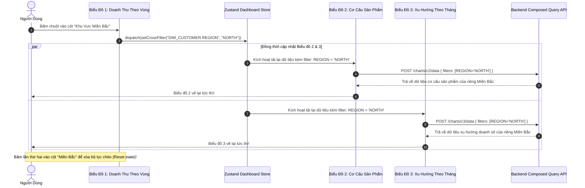

# 02. Không Gian Kéo Thả & Lọc Chéo Biểu Đồ (Canvas & Cross-Filtering)

> **Phân hệ:** BI Dashboard & Analytics Platform  
> **Chủ đề:** Giao diện Canvas Studio kéo thả với `@dnd-kit`, quản lý Layout lưới, và tương tác Lọc Chéo (Interactive Cross-Filtering).

---

## 1. Giao Diện Canvas Studio Kéo Thả (Drag & Drop Canvas)

Ứng dụng frontend `apps/frontend/apps/dashboard-ai` xây dựng trên **React 19** và bộ thư viện **`@dnd-kit`**:
- Cho phép người dùng tự do bố trí các Widget biểu đồ trên một hệ thống lưới 12 cột (12-Column Responsive Grid).
- **Thao tác trực quan:** Kéo thả để đổi vị trí, kéo góc để thay đổi kích thước (Resize chiều rộng `w` và chiều cao `h`).
- Toàn bộ cấu trúc bố cục (Layouts) và vị trí tọa độ của từng biểu đồ được lưu tự động vào thực thể `DashboardDefinition`.

---

## 2. Tính Năng Lọc Chéo Tương Tác: Interactive Cross-Filtering

Một Dashboard xuất sắc không phải là tập hợp các bức ảnh tĩnh rời rạc, mà là một không gian tương tác sống động, nơi hành động trên biểu đồ này tác động tức thì tới các biểu đồ khác.

Module `cross_filter` (`app/layer1_domain/entities/cross_filter.py`) kết hợp cùng **Zustand Store** ở Frontend:

---

## 3. Khả Năng Lưu Trữ Trạng Thái: Dashboard State

- **`GET /dashboards/{dashboard_id}/state`:** Endpoint cung cấp trạng thái toàn diện của một workspace bao gồm:
  1. Danh sách các Chart Slots (Vị trí, kích thước x, y, w, h).
  2. Dữ liệu số liệu hiện tại của từng biểu đồ đã được áp dụng bảo mật RLS.
  3. Bộ lọc toàn cục (Global Dashboard Filters) đang kích hoạt (ví dụ: Khoảng ngày tháng đã chọn).
- Giúp người dùng có thể chia sẻ liên kết Dashboard cho đồng nghiệp mà vẫn giữ nguyên vẹn trạng thái lọc dữ liệu đang xem (Shareable Deep Links).
