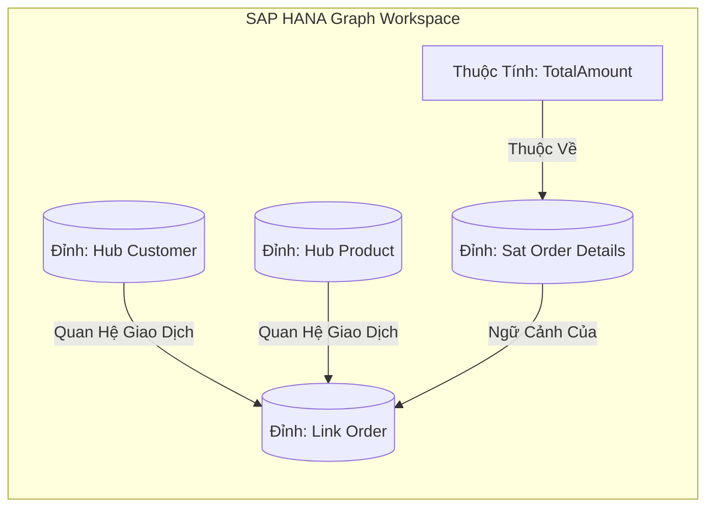
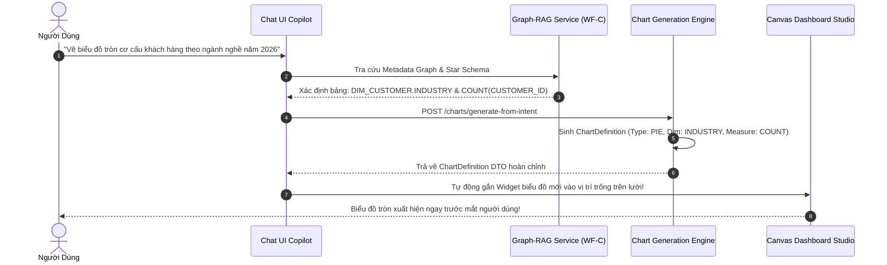

# 03. Đồ Thị Tri Thức & Trợ Lý AI Chat-to-Chart

> **Phân hệ:** BI Dashboard & Analytics Platform  
> **Chủ đề:** Xây dựng đồ thị tri thức từ Data Vault, tích hợp Graph-RAG, và tính năng Chat-to-Chart AI Copilot.

---

## 1. Xây Dựng Đồ Thị Tri Thức Từ Data Vault (`metadata_graph`)

Một kho dữ liệu lớn thường có hàng trăm bảng và hàng ngàn cột khiến ngay cả các kỹ sư dữ liệu kỳ cựu cũng khó nhớ hết ý nghĩa và mối liên kết giữa các bảng.

Giai đoạn **WF-B (Knowledge Graph Building)** tự động bóc tách cấu trúc Data Vault và biến thành một mạng lưới tri thức sống trong **SAP HANA Graph Workspace**:
- **Đỉnh (Vertices):** Đại diện cho các Hubs (Khách hàng, Đơn hàng, Sản phẩm), Satellites và các Cột dữ liệu.
- **Cạnh (Edges):** Đại diện cho các Links kinh doanh, quan hệ khóa ngoại và nguồn dữ liệu xuất xứ (Lineage).

---

## 2. Tính Năng Chat-to-Chart AI Copilot

Tích hợp gói thư viện `@ldc/chat-sdk` tại giao diện Dashboard AI, người dùng có thể tạo biểu đồ hoàn chỉnh chỉ bằng một câu lệnh ngôn ngữ tự nhiên:

### Ưu Điểm Đột Phá:
- **Xóa Bỏ Rào Cản Kỹ Thuật:** Người dùng kinh doanh (Giám đốc, Kế toán, Chuyên viên bán hàng) không cần học cú pháp SQL, không cần biết cấu trúc bảng biểu vẫn có thể tự tạo báo cáo theo ý muốn trong 5 giây.
- **Không Bị Lạc Đề (No Hallucination):** Nhờ việc đối chiếu với Đồ Thị Tri Thức Metadata Graph, AI chỉ dùng đúng các bảng và cột thực tế đang có trong kho dữ liệu SAP HANA.
