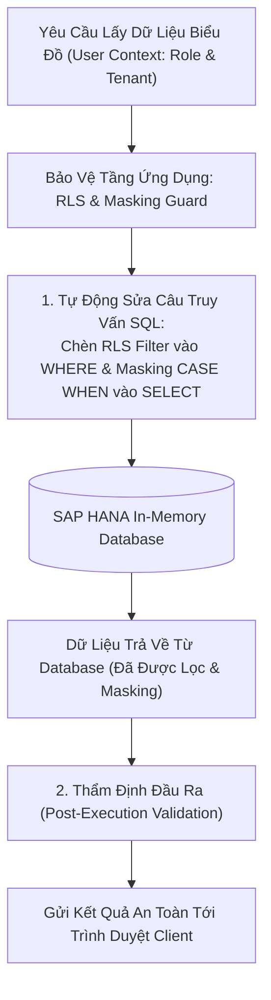

# 01. Bảo Mật Dòng & Che Giấu Cột Dữ Liệu (RLS & Column Masking)

> **Phân hệ:** BI Dashboard & Analytics Platform  
> **Chủ đề:** Bảo mật phân quyền cấp dòng (Row-Level Security), phân quyền cấp cột (CLS) và các chính sách che giấu dữ liệu (Dynamic Masking).

---

## 1. Bảo Mật Phân Quyền Cấp Dòng (Row-Level Security - RLS)

Trong môi trường tập đoàn đa chi nhánh:
- Giám đốc chi nhánh Miền Bắc chỉ được phép xem các đơn hàng và doanh thu phát sinh tại Miền Bắc.
- Giám đốc chi nhánh Miền Nam tuyệt đối không được nhìn thấy số liệu của Miền Bắc trên cùng một biểu đồ dùng chung.

Hệ thống quản lý quy tắc này qua thực thể `TableAccessRule` (`app/layer1_domain/entities/table_access_rule.py`):

```json
{
  "rule_id": "rule-rls-north",
  "table_name": "FACT_SALES",
  "target_role": "MANAGER_NORTH",
  "filter_condition": "c.REGION = 'NORTH'",
  "is_active": true
}
```

- **Cơ chế nhúng cưỡng bức:** Khi người dùng có vai trò `MANAGER_NORTH` mở bất kỳ biểu đồ nào kết nối tới bảng `FACT_SALES`, bộ sinh truy vấn tự động chèn mệnh đề `AND c.REGION = 'NORTH'` vào câu lệnh SQL trước khi gửi tới SAP HANA. Người dùng không có cách nào vượt qua rào cản này.

---

## 2. Chính Sách Che Giấu Cột Dữ Liệu (Dynamic Column Masking)

Một số trường dữ liệu mang tính bảo mật cao (Số thẻ tín dụng, Số tài khoản ngân hàng, Tiền lương nhân sự, Doanh thu chi tiết).

Thực thể `ColumnMaskingPolicy` (`app/layer1_domain/entities/column_masking_policy.py`) cung cấp 4 chiến lược làm mờ:

| Chiến Lược | Cú Pháp / Cách Biến Đổi | Ví Dụ Kết Quả Hiển Thị |
|---|---|---|
| **`FULL_MASK`** | Thay thế toàn bộ ký tự bằng chuỗi cố định. | `****************` |
| **`PARTIAL_MASK`** | Giữ lại các ký tự đầu hoặc cuối, che phần giữa. | `1234-****-****-5678` |
| **`HASH_MASK`** | Mã hóa băm một chiều (SHA256) để vẫn dùng để đếm distinct nhưng không đọc được nội dung gốc. | `0x5f4dcc3b5aa765d...` |
| **`NULLIFY`** | Trả về giá trị `NULL` hoàn toàn đối với vai trò không được phép. | `null` |

---

## 3. Kiến Trúc Bảo Vệ Hai Lớp (Two-Tier Security Guard)


