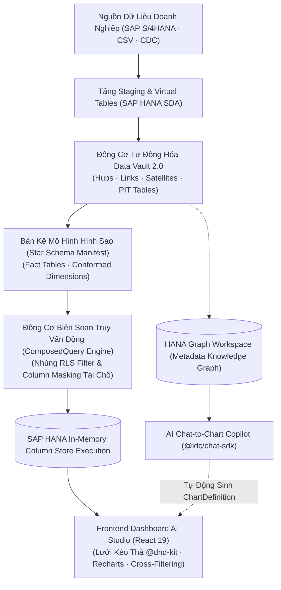

# Tài Liệu Thiết Kế Kiến Trúc: BI Dashboard & Analytics Platform

> **Nền tảng Business Intelligence thế hệ mới kết hợp Data Vault 2.0 và OLAP Star Schema**  
> *Được tối ưu hóa cho cơ sở dữ liệu SAP HANA In-Memory Columnar Engine, tích hợp giao diện kéo thả Canvas React 19 và trợ lý AI Copilot Chat-to-Chart.*

---

## 📚 Mục Lục Toàn Bộ Tài Liệu Chi Tiết

Tài liệu được phân tách thành 5 phân hệ chuyên sâu theo cấu trúc module hóa:

### 1. [Kiến Trúc Tổng Thể (Architecture)](./01-architecture/)
- [01. Tổng Quan & Các Khái Niệm Cốt Lõi](./01-architecture/01-overview-and-concepts.md): Động lực, chuỗi chuyển đổi dữ liệu 3 tầng (Staging ➔ Data Vault 2.0 ➔ Star Schema ➔ Canvas), và Clean Architecture 4 lớp.
- [02. Topology Hệ Thống & Cổng Giao Tiếp](./01-architecture/02-system-topology.md): Bản đồ dịch vụ, kết nối Backend FastAPI (:8001) và Frontend React 19 (:3000), tích hợp SAP HANA và XSUAA.
- [03. Chuỗi 11 Giai Đoạn Vận Hành Pipeline](./01-architecture/03-end-to-end-pipeline-stages.md): Chuỗi tuyến tính khép kín từ WF1 đến WF6 (Onboarding, Staging, Vault, Knowledge Graph, Star Schema, Dashboard) và luồng truyền biến Variable Bus.

### 2. [Động Cơ Data Vault 2.0 (Data Vault Engine)](./02-data-vault-engine/)
- [01. Mô Hình Hóa Data Vault 2.0](./02-data-vault-engine/01-data-vault-2.0-modeling.md): Cấu trúc Hubs (Business Concepts), Links (Transactions), Satellites (Context & History), cơ chế Hash Diff và kỹ thuật Satellite Splitting.
- [02. Bảng Thời Điểm PIT & Bảng Cầu Nối Bridge Tables](./02-data-vault-engine/02-pit-and-bridge-tables.md): Tăng tốc truy vấn lịch sử từ hàng phút xuống dưới 100ms bằng bảng Point-In-Time (PIT) snapshots và Bridge Tables.
- [03. Tự Động Sinh DDL & Nạp Dữ Liệu](./02-data-vault-engine/03-schema-generation-and-ddl.md): Tự động hóa DDL trên cột `VARBINARY(32)` của SAP HANA, kịch bản nạp dữ liệu ELT Pushdown, và tự thích ứng Schema Drift.

### 3. [Mô Hình Hình Sao & Truy Vấn OLAP (OLAP Star Schema)](./03-olap-star-schema/)
- [01. Bản Kê Mô Hình Hình Sao (Star Schema Manifest)](./03-olap-star-schema/01-star-schema-manifest.md): Tự động chuyển đổi Vault sang Fact Tables, Dimension Tables, và Conformed Dimensions hỗ trợ Drill-Across.
- [02. Bộ Sinh Chiều Thời Gian Đa Cấp (Date Dimension Generator)](./03-olap-star-schema/02-date-dimension-generator.md): Bảng `DIM_DATE` với hai hệ phân cấp song song: Lịch dương chuẩn (Calendar) và Năm tài chính doanh nghiệp (Fiscal Year).
- [03. Biên Soạn Truy Vấn SQL Động (Dynamic Query Composition)](./03-olap-star-schema/03-dynamic-query-composition.md): Động cơ sinh SQL tự động `ComposedQuery`, toán tử tập hợp in-memory, và nhúng chính sách bảo mật tại chỗ.

### 4. [Xưởng Biểu Đồ & Không Gian Làm Việc (Dashboard & Charts)](./04-dashboard-and-charts/)
- [01. Xưởng Thiết Kế Biểu Đồ (Chart Studio & Catalog)](./04-dashboard-and-charts/01-chart-studio-and-types.md): Thực thể `ChartDefinition`, danh mục 11 loại biểu đồ phân tích (Bar, Line, Area, Pie, Funnel, Treemap, KPI...) và cá nhân hóa `ChartPersonalization`.
- [02. Không Gian Kéo Thả & Lọc Chéo Biểu Đồ (Canvas & Cross-Filtering)](./04-dashboard-and-charts/02-dashboard-canvas-and-cross-filtering.md): Giao diện Canvas lưới responsive với `@dnd-kit`, tương tác lọc chéo đồng bộ qua Zustand Store, và lưu trữ trạng thái Dashboard State.
- [03. Đồ Thị Tri Thức & Trợ Lý AI Chat-to-Chart](./04-dashboard-and-charts/03-knowledge-graph-and-ai-chat.md): Xây dựng Metadata Knowledge Graph trong HANA Graph Workspace, Graph-RAG, và trợ lý AI tự động tạo biểu đồ từ ngôn ngữ tự nhiên.

### 5. [Bảo Mật & Quản Trị Hệ Thống (Governance & Resilience)](./05-governance-and-resilience/)
- [01. Bảo Mật Dòng & Che Giấu Cột Dữ Liệu (RLS & Column Masking)](./05-governance-and-resilience/01-row-level-security-and-masking.md): Phân quyền cấp dòng (Row-Level Security) theo chi nhánh/phòng ban, và 4 chiến lược làm mờ cột nhạy cảm (`FULL_MASK`, `PARTIAL_MASK`, `HASH_MASK`, `NULLIFY`).
- [02. Phát Hiện Lệch Cấu Trúc & Giám Sát](./05-governance-and-resilience/02-schema-drift-and-monitoring.md): Tự động phát hiện biến đổi schema nguồn (`SAFE_ADD`, `TYPE_WIDEN`, `BREAKING`), hàng đợi Dead-Letter Queue và vết kiểm toán Audit Trail.

---

## 🚀 Sơ Đồ Kiến Trúc Luồng Xử Lý & Trực Quan Hóa

