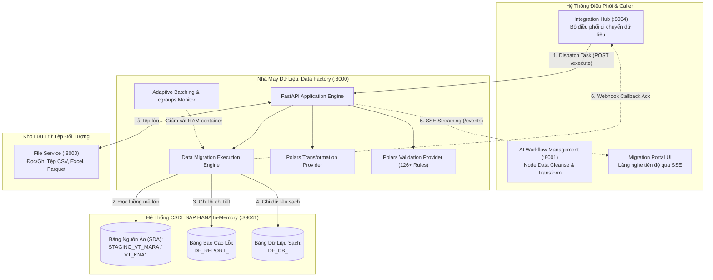

# 02. Topology Hệ Thống & Cổng Giao Tiếp (System Topology)

> **Phân hệ:** Data Factory Platform  
> **Chủ đề:** Bản đồ kết nối dịch vụ, tích hợp SAP HANA Virtual Tables, Integration Hub, và luồng dữ liệu hai chiều.

---

## 1. Sơ Đồ Topology Toàn Diện

---

## 2. Các Cổng Giao Tiếp & Biến Môi Trường Cốt Lõi

| Thành Phần | Cổng / Đường Dẫn | Biến Môi Trường | Chức Năng Chính |
|---|---|---|---|
| **Data Factory API** | `8000` | `PORT=8000`, `HOST=0.0.0.0` | Cổng HTTP tiếp nhận lệnh thực thi di chuyển và kiểm tra dữ liệu. |
| **File Server Base URL** | `8000` | `FILE_SERVER_URL` | Địa chỉ kết nối vi dịch vụ File Service để tải tệp. |
| **Rules Database** | File JSON / SQLite | `RULES_DB_PATH=validation_rules_db.json` | Nơi lưu trữ danh mục các quy tắc xác thực chuẩn. |
| **HANA Target Connection** | `39041` (hoặc Cloud `443`) | Dynamic qua payload request | Kết nối tới SAP HANA bằng thông tin `connection` trong body request. |

---

## 3. Cơ Chế Xác Thực Bằng Token Đơn Dụng (Single-Use Resolve-Token)

Để tránh việc gửi mật khẩu CSDL SAP HANA thô (`plaintext password`) qua mạng trong mỗi request:
- Caller (Integration Hub) gửi một trường `credential.token` dùng một lần (Single-use token).
- Data Factory gọi ngược lại endpoint bảo mật của Integration Hub (`resolve_url`) để đổi token lấy mật khẩu kết nối.
- Sau khi kết nối thành công tới SAP HANA, token này lập tức bị hủy bỏ (Expiring immediately), đảm bảo tính an toàn tối đa kể cả khi log request bị lộ.
