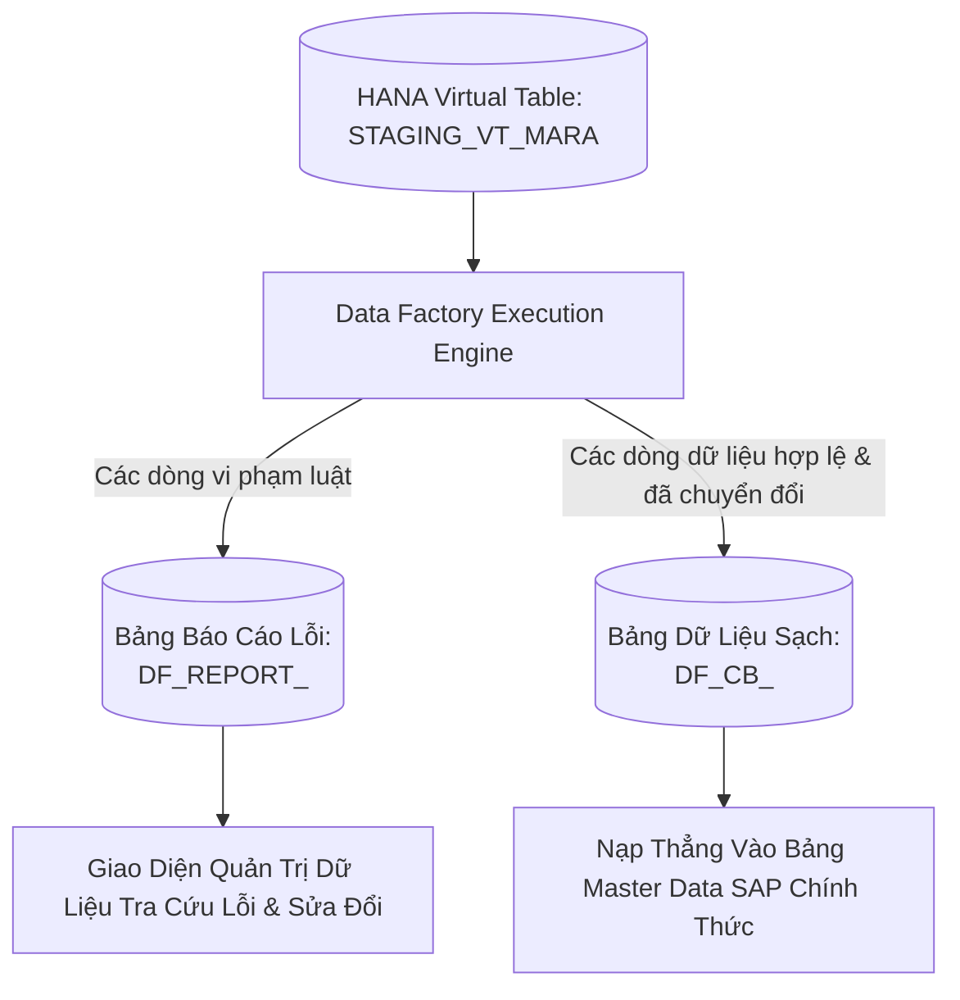

# 02. Các Bảng Kết Quả & Báo Cáo Vi Phạm (Delivery Tables)

> **Phân hệ:** Data Factory Platform  
> **Chủ đề:** Cấu trúc hai bảng xuất xưởng trên SAP HANA: `DF_REPORT_<job_id>` và `DF_CB_<job_id>`.

---

## 1. Cơ Chế Xuất Xưởng Trực Tiếp Vào CSDL (In-Database Delivery)

Thay vì xuất file Excel hay trả về JSON qua mạng, Data Factory tạo trực tiếp hai bảng vật lý ngay trong schema đích của SAP HANA:

---

## 2. Cấu Trúc Bảng Báo Cáo Vi Phạm: `DF_REPORT_<job_id>`

Bảng này lưu trữ toàn bộ các lỗi phát hiện được trong quá trình chạy kiểm tra. Một dòng dữ liệu nguồn có thể vi phạm nhiều luật khác nhau:

| Tên Cột | Kiểu Dữ Liệu | Mục Đích Sử Dụng |
|---|---|---|
| `ROW_INDEX` | `BIGINT` | Số thứ tự dòng trong tệp/bảng nguồn. |
| `ROW_ID` | `NVARCHAR(128)` | Mã định danh dòng duy nhất (từ File Service canonicalization). |
| `FIELD_NAME` | `NVARCHAR(128)` | Tên trường dữ liệu phát hiện vi phạm (ví dụ: `MATNR`, `WERKS`). |
| `RULE_NAME` | `NVARCHAR(128)` | Tên quy tắc kiểm tra (ví dụ: `RULE_REQ_MATERIAL_ID`). |
| `SEVERITY` | `NVARCHAR(16)` | Mức độ nghiêm trọng (`ERROR` - Chặn nạp, `WARNING` - Cảnh báo). |
| `INVALID_VALUE` | `NCLOB` | Giá trị dữ liệu thô gây ra lỗi vi phạm. |
| `ERROR_MESSAGE` | `NVARCHAR(512)` | Thông báo lỗi chi tiết hiển thị cho người dùng nghiệp vụ. |
| `VIOLATED_AT` | `TIMESTAMP` | Thời điểm ghi nhận lỗi. |

---

## 3. Cấu Trúc Bảng Dữ Liệu Sạch: `DF_CB_<job_id>`

- **Bản sao đã làm sạch:** Bảng này có cấu trúc cột tương thích hoàn toàn với bảng đích của SAP (Target Table Schema).
- **Chỉ nạp các dòng ĐẠT CHUẨN (Passed Rows):** Các dòng vi phạm lỗi cấp độ `ERROR` sẽ bị chặn lại và không xuất hiện trong bảng này.
- **Đã qua chuyển đổi:** Các giá trị trong bảng đã được áp dụng toàn bộ các quy tắc Transformation (chuẩn hóa viết hoa, định dạng ngày tháng, tra cứu mã danh mục).
- **Sẵn sàng cho SAP BAPI / Migration Cockpit:** Hệ thống di chuyển dữ liệu chỉ cần chạy một lệnh `INSERT INTO SAP_TABLE SELECT * FROM DF_CB_<job_id>` để hoàn tất nạp dữ liệu vào SAP mà không lo bị từ chối.
