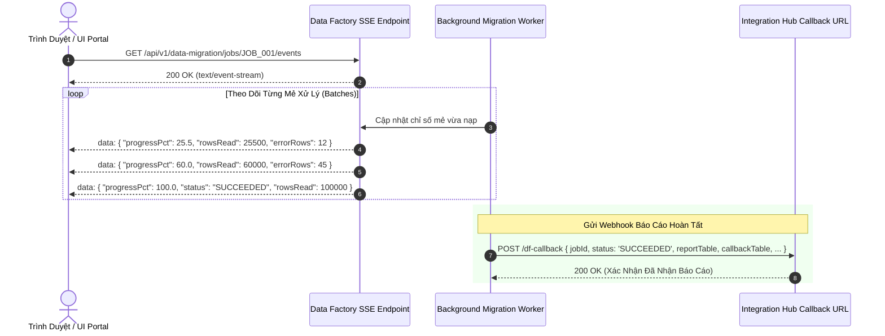

# 03. Truyền Phát Tiến Độ & Webhook Callback (SSE & Callbacks)

> **Phân hệ:** Data Factory Platform  
> **Chủ đề:** Truyền phát tiến độ thời gian thực qua Server-Sent Events (SSE), Polling fallback, và Webhook Callback Ack.

---

## 1. Truyền Phát Tiến Độ Thời Gian Thực: Server-Sent Events (SSE)

Khi một mẻ di chuyển dữ liệu lớn đang chạy ngầm trong CSDL, giao diện người dùng (Frontend UI) cần hiển thị thanh tiến trình % sống động và thống kê số lỗi phát sinh theo thời gian thực.

Endpoint `GET /api/v1/data-migration/jobs/{id}/events` mở một luồng **Server-Sent Events (SSE)** đẩy dữ liệu liên tục về trình duyệt:



---

## 2. Cấu Trúc Khung Tin SSE (Event Frame Payload)

Mỗi khung tin SSE phản ánh chính xác trạng thái tức thời của mẻ di chuyển:

```json
{
  "jobId": "EDAD7E50B12D454586BEB49F81CE2151",
  "status": "RUNNING",
  "rowsRead": 45000,
  "rowsPassed": 44850,
  "rowsWritten": 44850,
  "progressPct": 45.0,
  "rulesApplied": 540000,
  "rulesViolated": 150,
  "errorRows": 150,
  "violations": {
    "RULE_VAL_MATNR_REQUIRED": 12,
    "RULE_VAL_WERKS_LOOKUP": 138
  },
  "elapsedSec": 12.4
}
```

---

## 3. Webhook Callback & Độ Tin Cậy Phân Tán

Khi mẻ di chuyển hoàn tất toàn bộ (trạng thái `SUCCEEDED` hoặc `FAILED`):
- Data Factory chủ động gửi một bản tin **`POST` tới địa chỉ `callback.url`** do Integration Hub chỉ định ban đầu.
- Bản tin mang toàn bộ số liệu thống kê cuối cùng và danh sách các bảng kết quả.
- **Tính Bền Bỉ (Reliability):** Nếu kết nối SSE của trình duyệt bị rớt mạng giữa chừng, toàn bộ mẻ di chuyển vẫn tiếp tục chạy độc lập trong backend và Webhook Callback đảm bảo Integration Hub luôn nhận được kết quả cuối cùng 100%.
