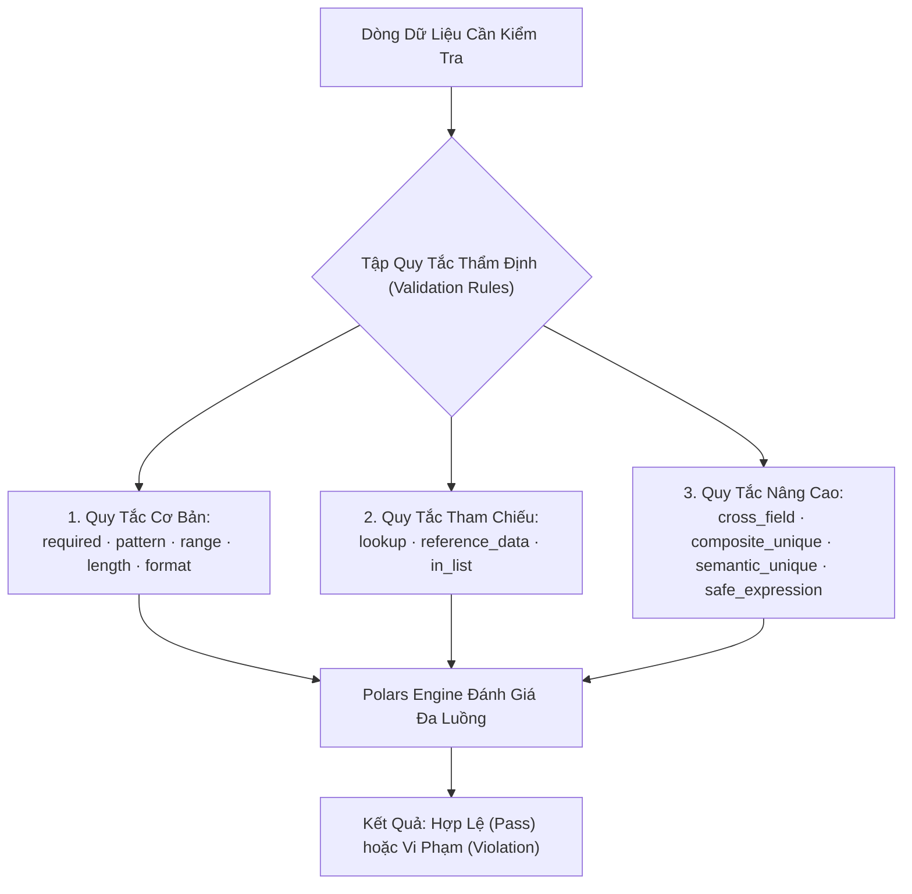

# 01. Danh Mục Các Quy Tắc Thẩm Định (Validation Rules Catalog)

> **Phân hệ:** Data Factory Platform  
> **Chủ đề:** Danh mục hơn 12 loại quy tắc kiểm tra chất lượng dữ liệu (Data Validation Rules) và cấu trúc tham số.

---

## 1. Vai Trò Của Bộ Quy Tắc Xác Thực

Dữ liệu di chuyển vào SAP bắt buộc phải tuân thủ nghiêm ngặt hàng trăm ràng buộc nghiệp vụ. Nếu nạp dữ liệu sai vào SAP, chi phí sửa chữa trên hệ thống ERP thực tế là cực kỳ đắt đỏ.

Data Factory cung cấp một bộ thư viện quy tắc phong phú, thực thi song song trên nhân xử lý vector của **Polars**:



---

## 2. Chi Tiết Các Loại Quy Tắc Sản Xuất (Production Rules)

| Loại Quy Tắc | Tên Mã (`type`) | Tham Số Cấu Hình | Mô Tả Ý Nghĩa Nghiệp Vụ |
|---|---|---|---|
| **Bắt Buộc** | `required` | Không có | Trường dữ liệu không được phép `NULL`, chuỗi rỗng `""` hoặc chỉ chứa khoảng trắng. |
| **Mẫu Biểu Thức** | `pattern` | `regex: str` | Giá trị chuỗi phải khớp với biểu thức chính quy (Regex: Mã số thuế, Email, Mã ISO). |
| **Khoảng Giá Trị** | `range` | `min: float, max: float` | Giá trị số hoặc ngày tháng phải nằm trong khoảng cho phép (`min <= value <= max`). |
| **Độ Dài Chuỗi** | `length` | `min: int, max: int` | Số lượng ký tự của chuỗi phải nằm trong giới hạn quy định. |
| **Định Dạng Chuẩn** | `format` | `format: "DATE" \| "EMAIL"` | Kiểm tra cú pháp định dạng ngày tháng (YYYY-MM-DD), số thực, tiền tệ. |
| **Tra Cứu Danh Mục** | `lookup` | `dataset: str, key_field: str` | Giá trị phải tồn tại trong bảng dữ liệu tham chiếu (ví dụ: Mã đơn vị tiền tệ phải nằm trong bảng `TCURR`). |
| **So Sánh Chéo Cột** | `cross_field` | `compare_to: str, operator: str` | So sánh tương quan giữa 2 cột trong cùng một dòng (ví dụ: `START_DATE <= END_DATE`). |
| **Tính Duy Nhất Tổ Hợp**| `composite_unique` | `fields: list[str]` | Tổ hợp giá trị của nhóm cột (ví dụ: `COMPANY_CODE` + `MATERIAL_ID`) không được phép trùng lặp. |
| **Biểu Thức Tùy Biến** | `custom_expression`| `expression: str` | Thực thi logic điều kiện phức tạp an toàn (ví dụ: `IF country == 'VN' THEN tax_rate == 0.1 ELSE tax_rate == 0`). |

---

## 3. Cấu Trúc Đặc Tả Quy Tắc (Rule Specification DTO)

```json
{
  "rule_name": "RULE_CHECK_POSTAL_CODE_FORMAT",
  "type": "pattern",
  "field": "POSTAL_CODE",
  "params": {
    "regex": "^[0-9]{5,6}$"
  },
  "error_message": "Mã bưu chính phải là chuỗi từ 5 đến 6 chữ số",
  "severity": "ERROR"
}
```

Caller có thể gửi danh sách gồm hàng trăm quy tắc như trên trong một lần gọi API duy nhất, hệ thống tự động tối ưu hóa và thực thi đồng loạt.
