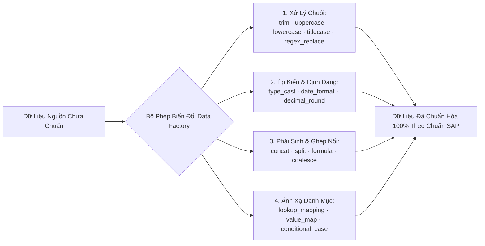

# 01. Động Cơ Biến Đổi Dòng & Cột (Transformation Engine)

> **Phân hệ:** Data Factory Platform  
> **Chủ đề:** Bộ máy chuyển đổi dữ liệu cấp cột (Column-level) và cấp dòng (Row-level) dựa trên nhân hiệu năng cao Polars.

---

## 1. Nhu Cầu Biến Đổi Dữ Liệu Trong Di Chuyển Lên SAP

Dữ liệu trích xuất từ các hệ thống cũ (Legacy) hiếm khi khớp trực tiếp với chuẩn của SAP:
- Tên khách hàng viết toàn chữ thường hoặc chữ hoa lung tung.
- Ngày tháng định dạng kiểu Mỹ `MM/DD/YYYY` trong khi SAP yêu cầu `YYYYMMDD` hoặc ISO `YYYY-MM-DD`.
- Giá trị chuỗi tiếng Việt cần ánh xạ thành mã code chuẩn của SAP (ví dụ: `"Miền Bắc"` ➔ `"NORTH_01"`, `"Thanh toán trả chậm 30 ngày"` ➔ `"Z030"`).

Data Factory cung cấp hai động cơ chuyển đổi chuyên biệt:
1. **`PolarsTransformerProvider`:** Biến đổi nhanh cấp độ toàn cột (Column-level Vectorized Transforms).
2. **`PolarsRowTransformerProvider`:** Biến đổi và phái sinh dữ liệu phức tạp theo từng dòng (Row-level & Cross-column Derivations).

---

## 2. Danh Mục Các Phép Biến Đổi Dữ Liệu Được Hỗ Trợ

### Chi Tiết Từng Nhóm Phép Biến Đổi:

| Tên Phép Biến Đổi | Ví Dụ Đầu Vào | Tham Số Cấu Hình | Kết Quả Đầu Ra |
|---|---|---|---|
| `trim` | `"  Hà Nội   "` | — | `"Hà Nội"` |
| `case_conversion` | `"cong ty tnhh abc"` | `mode: "UPPER"` | `"CONG TY TNHH ABC"` |
| `regex_replace` | `"090-123.4567"` | `pattern: "[^0-9]", replace: ""` | `"0901234567"` |
| `date_format` | `"15/03/2026"` | `from: "DD/MM/YYYY", to: "YYYY-MM-DD"`| `"2026-03-15"` |
| `lookup_mapping` | `"Thanh toán tiền mặt"`| `mapping_table: "ZPAY_TERMS"` | `"CASH"` |
| `concat` | Cột `STREET` + Cột `CITY` | `separator: ", "` | `"88 Lê Duẩn, Hà Nội"` |
| `split` | `"Nguyễn Văn A"` | `delimiter: " ", target_cols: [Họ, Tên]`| `Họ: "Nguyễn", Tên: "A"` |
| `formula` | `PRICE=100, QTY=5` | `expr: "PRICE * QTY * 1.1"` | `550.0` (Tổng tiền kèm thuế) |
| `conditional_case` | `STATUS = "A"` | `when: "A" -> "ACTIVE", else: "INACTIVE"` | `"ACTIVE"` |

---

## 3. Thực Thi Vector Hóa Siêu Tốc Bằng Polars

Khác với thư viện Pandas hay các vòng lặp Python thuần túy:
- Polars xử lý toàn bộ các phép biến đổi trên bằng mã máy C/Rust đã được biên dịch tối ưu (Vectorized Arrow-memory operations).
- Toàn bộ 1,000,000 dòng dữ liệu có thể hoàn tất đổi định dạng ngày tháng và tra cứu mapping chỉ trong **chưa đầy 2 giây**, giúp tiết kiệm 95% thời gian di chuyển dữ liệu cho doanh nghiệp.
