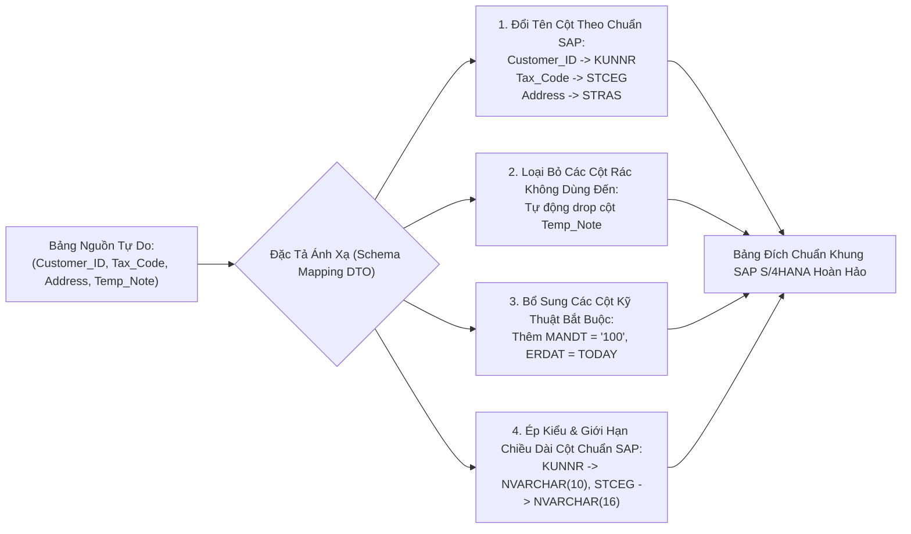

# 02. Chuyển Đổi & Ánh Xạ Lược Đồ Bảng (Schema Transformation)

> **Phân hệ:** Data Factory Platform  
> **Chủ đề:** Ánh xạ cấu trúc bảng từ hệ thống nguồn sang cấu trúc chuẩn SAP Target Schema (`/api/v1/schema-transform`).

---

## 1. Bài Toán Khác Biệt Lược Đồ (Schema Mismatch)

Khi di chuyển dữ liệu từ các hệ thống CRM/ERP ngoài vào SAP S/4HANA:
- Hệ thống nguồn đặt tên cột tự do: `Customer_ID`, `Company_Tax_Code`, `Delivery_Address`, `Phone_Number`.
- Hệ thống đích SAP sử dụng các mã định danh kỹ thuật chuẩn hóa tiếng Đức/Anh: `KUNNR`, `STCEG`, `STRAS`, `TELF1`.
- Ngoài ra, bảng SAP luôn yêu cầu các trường kỹ thuật bắt buộc của hệ thống ERP như:
  - `MANDT`: Mã phân vùng Client của SAP (ví dụ: `"100"` hoặc `"300"`).
  - `ERDAT`: Ngày khởi tạo bản ghi trong SAP.
  - `ERNAM`: Tên người dùng tạo bản ghi.

Module **`PolarsSchemaTransformerProvider`** (`app/layer4_frameworks/providers/transformation/polars_schema_transformer_provider.py`) tự động hóa toàn bộ việc tái cấu trúc lược đồ này.

---

## 2. Quy Trình Ánh Xạ & Chuyển Đổi Lược Đồ



---

## 3. Cấu Trúc Bản Kê Ánh Xạ Lược Đồ (Schema Mapping Specification)

```json
{
  "source_table": "EXT_CUSTOMERS",
  "target_table": "KNA1",
  "column_mappings": [
    { "source": "Customer_ID", "target": "KUNNR", "target_type": "STRING", "max_length": 10, "pad_left": "0" },
    { "source": "Tax_Code", "target": "STCEG", "target_type": "STRING", "max_length": 16 },
    { "source": "Address", "target": "STRAS", "target_type": "STRING", "max_length": 35 }
  ],
  "technical_defaults": [
    { "field": "MANDT", "value": "100" },
    { "field": "SPRAS", "value": "E" },
    { "field": "ERDAT", "value": "$CURRENT_DATE" }
  ],
  "drop_unmapped_columns": true
}
```

Nhờ cơ chế này, quá trình tạo bảng staging và nạp dữ liệu vào SAP hoàn toàn tự động hóa, loại bỏ hoàn toàn các lỗi sai sót do con người khi map tay bằng file Excel.
