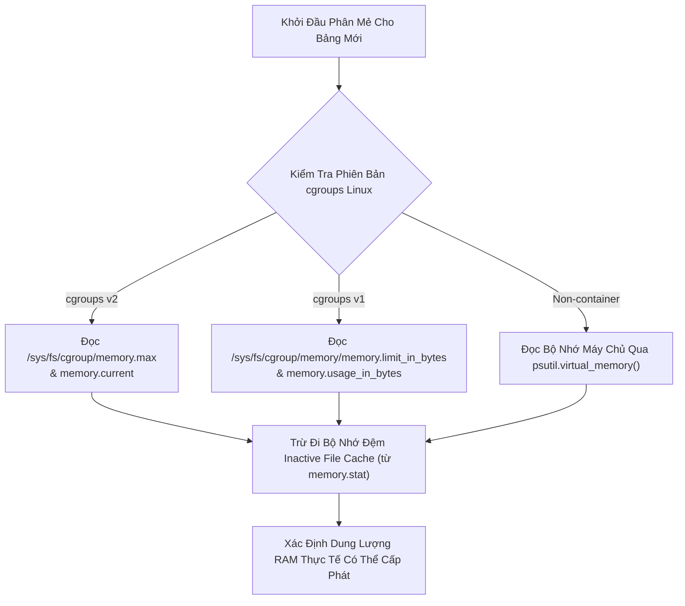

# 01. Phân Mẻ Thích Ứng & Nhận Diện Bộ Nhớ Container (Adaptive Batching)

> **Phân hệ:** Data Factory Platform  
> **Chủ đề:** Thuật toán điều chỉnh kích thước mẻ thông minh theo dung lượng RAM container Linux (`cgroups v1/v2`), loại bỏ hoàn toàn lỗi tràn bộ nhớ `OOM-Killed`.

---

## 1. Cạm Bẫy Của Kích Thước Mẻ Cố Định (Fixed Batch Size)

Trong các hệ thống xử lý dữ liệu lớn, kỹ sư thường cấu hình một con số cố định, ví dụ `BATCH_SIZE = 10000`:
- **Trường hợp bảng hẹp (Narrow Table):** Bảng chỉ gồm 5 cột số nhỏ. 10,000 dòng chỉ chiếm 2MB RAM ➔ Việc chia mẻ 10,000 là quá nhỏ, gây lãng phí hàng ngàn lượt round-trip I/O và làm chậm toàn bộ tiến trình.
- **Trường hợp bảng rộng (Wide Table):** Bảng có 150 cột văn bản dài, địa chỉ và JSON. 10,000 dòng chiếm tới **800MB – 1.2GB RAM**. Nếu container Kubernetes được cấp giới hạn `1Gi Memory Limit`, Pod sẽ lập tức bị hệ điều hành Linux tiêu diệt với lỗi **`OOMKilled (Exit Code 137)`**!

Module **`AdaptiveBatching`** (`app/layer4_frameworks/providers/adaptive_batching.py`) giải quyết triệt để nghịch lý này bằng việc **tự động tính toán kích thước mẻ dựa trên thực tế bộ nhớ khả dụng của container**.

---

## 2. Cơ Chế Đọc Chỉ Số Bộ Nhớ Container (cgroups v1 & v2 Awareness)

Hệ thống tự động phát hiện và đọc trực tiếp các tệp thống kê của nhân Linux (Linux Kernel cgroups):

---

## 3. Thuật Toán Tính Toán Kích Thước Mẻ Tối Ưu

### Bước 1: Ước lượng dung lượng dòng (Bytes Per Row Estimation)
- Lấy mẫu ngẫu nhiên $N$ dòng dữ liệu đầu tiên từ bảng nguồn.
- Tính toán kích thước trung bình của một dòng dữ liệu trong RAM:
  $$\text{BytesPerRow} = \frac{\text{Kích thước mẫu RAM}}{N}$$

### Bước 2: Tính toán Batch Size an toàn
Hệ thống áp dụng hệ số an toàn (**Safety Factor = 0.65**) để luôn dự phòng 35% RAM cho các tác vụ đột biến:

$$\text{OptimalBatchSize} = \frac{\text{Available RAM} \times 0.65}{\text{BytesPerRow}}$$

Sau đó chặn trên và chặn dưới:
$$\text{BatchSize} = \max(\text{MIN\_BATCH\_SIZE}, \min(\text{MAX\_BATCH\_SIZE}, \text{OptimalBatchSize}))$$

### Kết Quả Đạt Được:
- **Bảng nhỏ, hẹp:** Tự động tăng batch lên **50,000 – 100,000 dòng/mẻ** để đạt tốc độ tối đa.
- **Bảng lớn, rộng:** Tự động giảm batch xuống **2,000 – 5,000 dòng/mẻ** để bảo vệ an toàn cho container.
- **Tỷ lệ OOM-Killed trên môi trường Production giảm về con số 0 tuyệt đối!**
