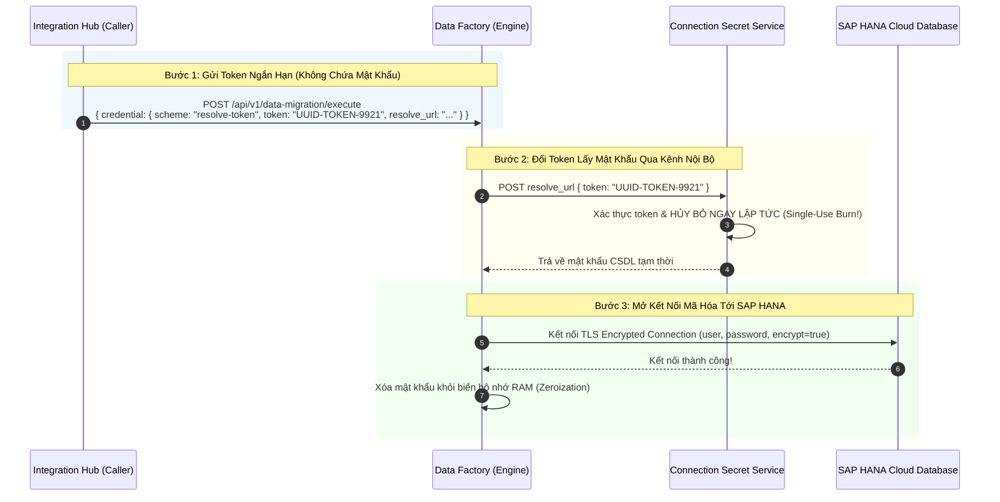

# 02. Bảo Mật & Giải Quyết Chứng Thư Kết Nối (Credential Security)

> **Phân hệ:** Data Factory Platform  
> **Chủ đề:** Cơ chế bảo vệ thông tin đăng nhập SAP HANA qua mã thông báo đơn dụng `resolve-token` và bảo mật kết nối TLS.

---

## 1. Rủi Ro Lộ Lọt Mật Khẩu Khi Truyền Plaintext

Trong các môi trường doanh nghiệp chuẩn SOX, ISO 27001 và ngân hàng:
- Mọi kết nối tới CSDL SAP HANA chứa dữ liệu kinh doanh nhạy cảm (Material, Financial, Customer Data).
- Nếu API di chuyển dữ liệu yêu cầu gửi mật khẩu CSDL trực tiếp trong HTTP request body:
  - Mật khẩu sẽ bị ghi lại (Logged) trong các hệ thống giám sát mạng, Proxy logs, Ingress Gateway logs.
  - Bất kỳ lập trình viên nào có quyền xem log đều có thể thấy mật khẩu quản trị CSDL!

Data Factory giải quyết triệt để rủi ro này bằng mô hình **Cơ chế đổi mã thông báo đơn dụng (Single-Use Resolve-Token Scheme)**.

---

## 2. Quy Trình Giải Quyết Chứng Thư 3 Bước

---

## 3. Các Tiêu Chuẩn Bảo Mật Bổ Sung

1. **Hủy Token Ngay Sau Lần Dùng Đầu Tiên (Single-Use Token):**
   - Kể cả khi kẻ tấn công nghe lén được token trong gói tin HTTP, token đó đã hoàn toàn vô giá trị vì đã bị đốt (burned) ngay ở bước 2.
2. **Mã Hóa Đường Truyền CSDL Bắt Buộc (TLS Encryption):**
   - Kết nối tới SAP HANA luôn bật cờ `encrypt: true` đảm bảo toàn bộ hàng triệu dòng dữ liệu trung chuyển trên mạng đều được mã hóa bằng thuật toán TLS 1.3.
3. **Phòng Chống Thất Thoát Mã Thông Báo Khi Retry (Idempotency Protection):**
   - Khi request mang cùng một `job_id` được gửi lại (do mạng lag), Data Factory phát hiện `job_id` trùng lặp và không gọi lại `resolve_url`, ngăn chặn việc gây ra lỗi `403 Forbidden` do token đã hết hạn.
