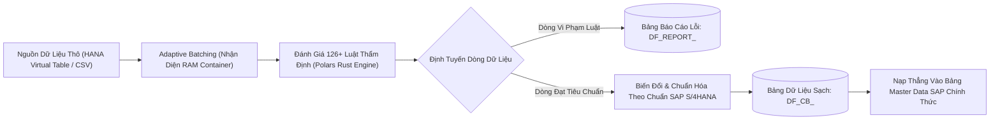

# Tài Liệu Thiết Kế Kiến Trúc: Data Factory Platform

> **Nhà máy xử lý, chuyển đổi, xác thực chất lượng và di chuyển dữ liệu lớn (Data Migration, Transformation & Validation Engine)**  
> *Được xây dựng trên Python, FastAPI, Clean Architecture 4 lớp, tối ưu hóa bằng nhân vector Polars, tích hợp SAP HANA Virtual Tables và thuật toán Adaptive Batching nhận diện bộ nhớ container.*

---

## 📚 Mục Lục Toàn Bộ Tài Liệu Chi Tiết

Tài liệu được phân tách thành 5 phân hệ chuyên sâu theo cấu trúc module hóa:

### 1. [Kiến Trúc Tổng Thể (Architecture)](./01-architecture/)
- [01. Tổng Quan & Các Khái Niệm Cốt Lõi](./01-architecture/01-overview-and-concepts.md): Mục đích kiến trúc, bài toán di chuyển dữ liệu lớn lên SAP S/4HANA, mô hình "HTTP as Trigger, Database as Delivery", và các định dạng hỗ trợ (CSV, JSON, Excel, Parquet).
- [02. Topology Hệ Thống & Cổng Giao Tiếp](./01-architecture/02-system-topology.md): Bản đồ kết nối vi dịch vụ, tích hợp SAP HANA Virtual Tables (Smart Data Access), Integration Hub, File Service, và cơ chế xác thực resolve-token.
- [03. Kiến Trúc Phân Tầng Clean Architecture](./01-architecture/03-clean-architecture-and-layers.md): Chi tiết 4 tầng Clean Architecture, các Providers hiệu năng cao (Polars, SafeExpression, Adaptive Batching).

### 2. [Động Cơ Di Chuyển Dữ Liệu (Data Migration Engine)](./02-data-migration-engine/)
- [01. Điều Phối Tác Vụ & Tính Bất Biến](./02-data-migration-engine/01-job-dispatch-and-idempotency.md): Khởi tạo tác vụ qua `POST /api/v1/data-migration/execute`, phản hồi 202 Accepted ngay tức thì và cơ chế chống lặp `job_id` (Idempotency).
- [02. Các Bảng Kết Quả & Báo Cáo Vi Phạm](./02-data-migration-engine/02-delivery-tables-and-reporting.md): Xuất xưởng trực tiếp trên SAP HANA với hai bảng vật lý `DF_REPORT_<job_id>` (báo cáo lỗi chi tiết) và `DF_CB_<job_id>` (dữ liệu sạch sẵn sàng nạp SAP).
- [03. Truyền Phát Tiến Độ & Webhook Callback](./02-data-migration-engine/03-sse-events-and-progress-tracking.md): Truyền phát tiến độ thời gian thực qua Server-Sent Events (SSE) `/jobs/{id}/events`, polling fallback và Webhook callback báo hoàn tất.

### 3. [Động Cơ Thẩm Định & Danh Mục Quy Tắc (Validation & Rules)](./03-validation-and-rule-engine/)
- [01. Danh Mục Các Quy Tắc Thẩm Định](./03-validation-and-rule-engine/01-validation-rules-catalog.md): Danh mục hơn 12 loại quy tắc kiểm tra chất lượng dữ liệu (`required`, `pattern`, `range`, `length`, `format`, `lookup`, `cross_field`, `composite_unique`).
- [02. Định Tuyến Độ Khó Quy Tắc](./03-validation-and-rule-engine/02-rule-difficulty-router.md): Cơ chế phân loại độ khó (Simple vs Medium vs Hard), đẩy thẳng SQL Pushdown cho luật đơn giản và tối ưu đường dẫn thực thi đạt hơn 1,000,000 dòng/giây.

### 4. [Động Cơ Biến Đổi Dữ Liệu (Transformation Engine)](./04-transformation-engine/)
- [01. Động Cơ Biến Đổi Dòng & Cột](./04-transformation-engine/01-row-and-column-transformations.md): Biến đổi dữ liệu cấp cột và cấp dòng bằng nhân Polars (Trim, Case, Regex, Date format, Lookup mapping, Concat, Split, Formula).
- [02. Chuyển Đổi & Ánh Xạ Lược Đồ Bảng](./04-transformation-engine/02-schema-transformation.md): Ánh xạ cấu trúc bảng nguồn sang cấu trúc chuẩn SAP Target Schema, ép kiểu và tự động bổ sung cột kỹ thuật ERP (`MANDT`, `ERDAT`).

### 5. [Hiệu Năng & Khả Năng Vận Hành (Performance & Resilience)](./05-performance-and-resilience/)
- [01. Phân Mẻ Thích Ứng & Nhận Diện Bộ Nhớ Container](./05-performance-and-resilience/01-adaptive-batching-and-cgroups.md): Thuật toán tự động đọc Linux cgroups v1/v2, ước lượng kích thước dòng và điều chỉnh Batch Size linh hoạt để loại bỏ lỗi `OOM-Killed`.
- [02. Bảo Mật & Giải Quyết Chứng Thư Kết Nối](./05-performance-and-resilience/02-credential-resolution-and-security.md): Bảo vệ thông tin đăng nhập CSDL SAP HANA bằng mã thông báo đơn dụng `resolve-token` tự hủy và kết nối mã hóa TLS bắt buộc.

---

## 🚀 Sơ Đồ Khái Niệm Động Cơ Data Factory

