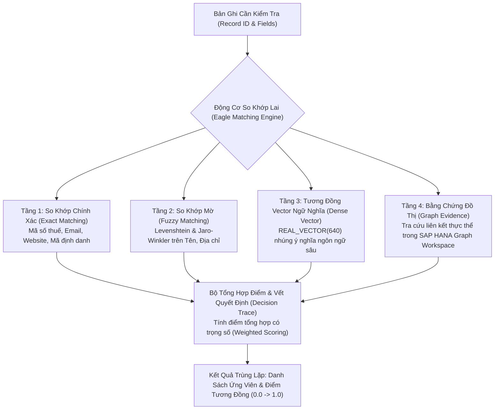

# 01. Tổng Quan & Các Khái Niệm Cốt Lõi (Overview & Core Concepts)

> **Phân hệ:** AI Eagle Platform  
> **Chủ đề:** Mục đích kiến trúc, giải bài toán trùng lặp dữ liệu doanh nghiệp (Deduplication), so khớp lai (Hybrid Matching), và phân tích tài liệu kỹ thuật SDS.

---

## 1. Bối Cảnh & Vấn Đề Trùng Lặp Dữ Liệu Doanh Nghiệp

Trong các hệ thống quản trị dữ liệu tổng thể (Master Data Governance - MDG) và di chuyển dữ liệu (Data Migration), vấn đề nhức nhối hàng đầu là **Dữ liệu trùng lặp (Duplicate Data / Dirty Data)**:
- **Tên đối tác kinh doanh viết khác nhau:** `"Công ty TNHH Giải Pháp Công Nghệ Alpha"`, `"Alpha Tech Solutions Ltd"`, `"Alpha Technology Co."`.
- **Địa chỉ biến thể:** `"Tầng 5, Tòa nhà Landmark 81, 720A Điện Biên Phủ, P. 22, Bình Thạnh"` vs `"720A Dien Bien Phu, Binh Thanh District"`.
- **Mã số thuế / Số điện thoại gõ sai hoặc thiếu số 0:** `"0101234567"` vs `"101234567"`.

Nếu chỉ dựa vào các câu lệnh so khớp SQL truyền thống (`WHERE col1 = col2` hoặc `LIKE '%...%'`), hệ thống sẽ bỏ sót tới **70–80% các bản ghi trùng lặp thực tế**, dẫn đến việc tạo các Master Data rác, gây lãng phí chi phí marketing, sai lệch báo cáo tài chính và rủi ro chuỗi cung ứng.

**AI Eagle Platform** (`apps/backend/eagle`) được thiết kế riêng để giải quyết triệt để bài toán này thông qua một động cơ so khớp lai 4 tầng thông minh kết hợp trí tuệ nhân tạo.

---

## 2. Đường Ống So Khớp Lai 4 Tầng (The 4-Stage Matching Pipeline)

Hệ thống kết hợp đồng thời 4 kỹ thuật so khớp khác nhau để đạt độ chính xác tối đa:

---

## 3. Các Trụ Cột Chức Năng Chính Của AI Eagle

1. **Kiểm Tra Trùng Lặp Theo Yêu Cầu (`/api/v1/duplicate-check`):**
   - Tiếp nhận một bản ghi và danh sách luật (rules) do caller định nghĩa linh hoạt theo thời gian thực (Request-driven rules).
2. **Tìm Kiếm Tương Đồng Ngữ Nghĩa (`/api/v1/search` & `/api/v1/similarity`):**
   - Cho phép tìm kiếm các thực thể tương tự trong kho lưu trữ dữ liệu lớn với ngưỡng tương đồng (`threshold`) cấu hình được.
3. **Phân Tích Tài Liệu An Toàn Hóa Chất (`/api/v1/material-sds-analysis`):**
   - Đọc và phân tích các bảng dữ liệu an toàn hóa chất (**Safety Data Sheet - SDS**), nhận diện các thành phần nguy hại (Hazardous Components) và gợi ý phân loại mã GHS.
4. **Nhập Dữ Liệu Chỉ Mục Ngầm (`/api/v1/import-jobs`):**
   - Tác vụ xử lý ngầm (Background Jobs) nạp hàng triệu bản ghi từ tệp vào các bảng `AE_*` trong SAP HANA để phục vụ tra cứu nhanh.
