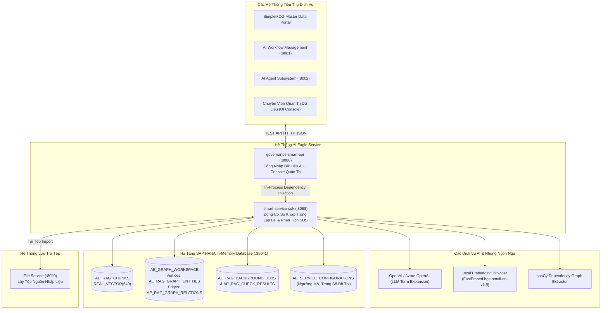

# 02. Topology Hệ Thống & Cổng Giao Tiếp (System Topology)

> **Phân hệ:** AI Eagle Platform  
> **Chủ đề:** Bản đồ liên kết dịch vụ, các bảng `AE_*` trên SAP HANA, và giao tiếp với các vi dịch vụ trong hệ sinh thái SimpleMDG.

---

## 1. Sơ Đồ Topology Mạng Toàn Diện

---

## 2. Các Cổng Giao Tiếp & Biến Môi Trường

| Thành Phần | Cổng Mặc Định | Biến Cấu Hình | Ghi Chú |
|---|---|---|---|
| **Governance Smart API** | `8080` (hoặc CloudFoundry `$PORT`) | `PORT=8080`, `HOST=0.0.0.0` | Cổng HTTP tiếp nhận tệp tải lên, import data và UI console. |
| **Smart Service SDK API** | `8088` (chạy độc lập) | `PORT=8088` | Cung cấp toàn bộ các API `/api/v1/duplicate-check`, `/similarity`, `/search`. |
| **SAP HANA Database** | `39041` (hoặc `443`) | `HANA_ADDRESS`, `HANA_PORT`, `HANA_USER`, `HANA_PASSWORD` | Lưu trữ chỉ mục vector, đồ thị tri thức và cấu hình runtime. |
| **OpenAI / Azure Gateway** | HTTPS | `OPENAI_API_KEY`, `OPENAI_BASE_URL` | Phục vụ mở rộng từ khóa ngữ nghĩa và phân tích nâng cao. |
| **File Service Client** | `8000` | `FILE_SERVICE_BASE_URL` | Kết nối vi dịch vụ tệp để tải các file import lớn. |

---

## 3. Kiến Trúc Tiến Trình Đồng Nhất (In-Process Runtime Composition)

Điểm đặc sắc trong thiết kế của AI Eagle là:
- `governance-smart-api` không gọi sang `smart-service-sdk` qua mạng HTTP trung gian (tránh tốn độ trễ mạng).
- Thay vào đó, nó **nhúng trực tiếp SDK vào cùng một tiến trình FastAPI** (`smart_create_app(container_enricher=...)`).
- Kết quả: Toàn bộ Use Cases và Repository của cả hai thành phần đều chia sẻ chung một Dependency Container và Connection Pool SAP HANA duy nhất trong RAM, mang lại tốc độ thực thi tối đa.
