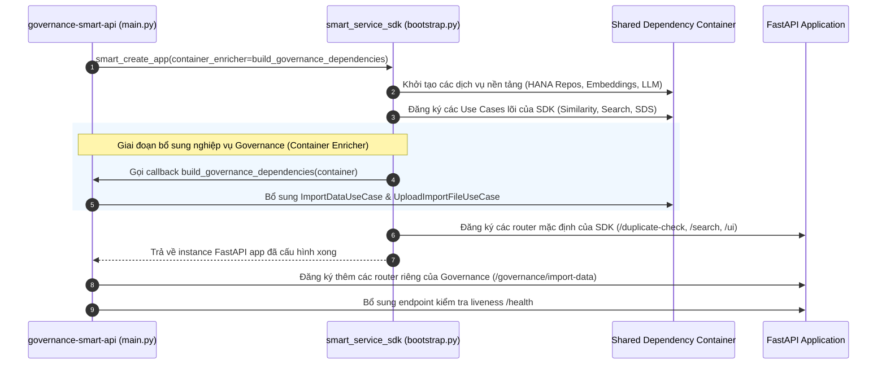

# 03. Kiến Trúc Phân Tầng & Hợp Nhất Tiến Trình (Clean Architecture & Composition)

> **Phân hệ:** AI Eagle Platform  
> **Chủ đề:** Chi tiết 4 tầng Clean Architecture của Smart Service SDK, cơ chế Bootstrap Container, và mô hình nhúng hợp nhất tiến trình.

---

## 1. Mô Hình 4 Tầng Clean Architecture

Dự án áp dụng nguyên tắc kiến trúc sạch nghiêm ngặt: Tầng nghiệp vụ không phụ thuộc vào tầng hạ tầng và cơ sở dữ liệu:

```
smart_service_sdk/
├── layer1_domain/          # Thực thể lõi: DuplicateRecord, RetrievalCandidate, Rule
├── layer2_application/     # Use Cases: So khớp trùng lặp, Tìm kiếm, Phân tích SDS
├── layer3_adapters/        # REST Controllers, DTOs, Serializers
└── layer4_frameworks/      # SAP HANA Repositories, FastEmbed, spaCy, File Service Client
```

---

## 2. Chi Tiết Từng Tầng Trong Mã Nguồn

### 2.1. Layer 1: Domain Core (`layer1_domain/`)
- **`DuplicateRecord`:** Đại diện cho bản ghi cần kiểm tra kèm từ điển các trường dữ liệu (`fields: dict[str, Any]`).
- **`DuplicateMatchRule`:** Đặc tả một luật so khớp cụ thể: Tên trường (`field`), kiểu so khớp (`exact` hoặc `fuzzy`), và ngưỡng chấp nhận (`threshold`).
- **`RetrievalCandidate`:** Đại diện cho một bản ghi ứng viên tiềm năng được tìm thấy trong CSDL SAP HANA kèm điểm số tương đồng.
- **`BackgroundJobRecord`:** Thực thể theo dõi trạng thái tác vụ nhập chỉ mục ngầm (`ACTIVE`, `COMPLETED`, `FAILED`).

---

### 2.2. Layer 2: Application Core (`layer2_application/`)
Bao gồm các Use Cases tính năng độc lập:
- **`similarity`:** Điều phối quy trình so khớp trùng lặp 4 tầng (Exact + Fuzzy + Vector + Graph).
- **`search`:** Thực hiện tìm kiếm hỗn hợp văn bản và vector trên chỉ mục chunk.
- **`material_sds_analysis`:** Đọc nội dung bảng dữ liệu an toàn hóa chất và trích xuất thành phần nguy hại.
- **`background_job`:** Quản lý vòng đời tác vụ nạp chỉ mục dữ liệu lớn.
- **`rule_suggestion`:** Phân tích dữ liệu mẫu và gợi ý các luật kiểm tra tối ưu.

---

### 2.3. Layer 3: Adapters (`layer3_adapters/`)
- Cung cấp các REST Controllers gắn vào FastAPI:
  - `duplicate_controller`: Endpoint `/api/v1/duplicate-check`.
  - `similarity_controller`: Endpoints `/api/v1/similarity` và cấu hình runtime.
  - `search_controller`: Endpoints `/api/v1/search`.
  - `material_sds_analysis_controller`: Endpoints phân tích tài liệu hóa chất SDS.
  - `ui_console_controller`: Giao diện web console nội bộ `/api/v1/ui`.

---

### 2.4. Layer 4: Frameworks & Drivers (`layer4_frameworks/`)
- **`HanaChunkRepository`:** Quản lý bảng `AE_RAG_CHUNKS` với cột vector `REAL_VECTOR(640)` và thực thi các câu lệnh so khớp tương đồng in-memory.
- **`HanaGraphRepository`:** Quản lý đỉnh và cạnh trong `AE_GRAPH_WORKSPACE`.
- **`HanaBackgroundJobRepository`:** Quản lý trạng thái tác vụ nạp trong `AE_RAG_BACKGROUND_JOBS`.
- **`LocalEmbeddingProvider`:** Sử dụng thư viện `fastembed` sinh vector nhúng 640 chiều mà không cần gọi ra ngoài Internet.
- **`SpacyDependencyGraphExtractor`:** Trích xuất thực thể và quan hệ bằng mô hình xử lý ngôn ngữ tự nhiên `spaCy`.

---

## 3. Cơ Chế Nhúng Hợp Nhất Tiến Trình (Runtime Composition)

Hệ thống sử dụng mô hình Composition Root qua hàm `smart_create_app`:


