# 01. Đường Ống So Khớp Trùng Lặp Lai (Hybrid Matching Pipeline)

> **Phân hệ:** AI Eagle Platform  
> **Chủ đề:** Chi tiết các phương thức so khớp Chính xác (Exact), So khớp Mờ (Fuzzy), Tương đồng Vector và Bằng chứng Đồ thị.

---

## 1. Bản Chất Đa Dạng Của Dữ Liệu Trùng Lặp

Trong thực tế doanh nghiệp, dữ liệu trùng lặp xuất hiện dưới nhiều biến thể:
1. **Biến thể định dạng (Exact-like):** Khác biệt về khoảng trắng thừa, dấu chấm, dấu gạch nối hoặc chữ hoa/chữ thường.
2. **Lỗi chính tả / Gõ nhầm (Typos):** Sai một vài ký tự trong tên riêng hoặc tên phố (`"Trần Hưng Đạo"` vs `"Tran Hung Dao"` hoặc `"Tran Hung Daox"`).
3. **Biến thể ngữ nghĩa (Semantic Variation):** Dùng từ đồng nghĩa hoặc ngôn ngữ khác nhau (`"Alpha Technology Co., Ltd"` vs `"Công ty TNHH Công nghệ Alpha"`).
4. **Biến thể ẩn qua quan hệ (Relational Evidence):** Hai công ty có tên và địa chỉ khác nhau nhưng cùng một người đại diện pháp luật và chung số điện thoại liên lạc!

Không một phương pháp đơn lẻ nào có thể bắt trọn được cả 4 loại trùng lặp trên. Vì vậy, AI Eagle xây dựng một **Đường ống so khớp lai (Hybrid Pipeline)**.

---

## 2. Chi Tiết Các Tầng So Khớp

```mermaid
flowchart LR
    subgraph S1["1. Exact Matcher"]
        EXACT_INPUT["Chuẩn Hóa Ký Tự:<br/>Loại bỏ khoảng trắng thừa, đưa về chữ thường, bỏ dấu câu"]
        EXACT_EXEC["So Sánh Bằng Tuyệt Đối (=)"]
    end

    subgraph S2["2. Fuzzy Matcher"]
        FUZZY_ALGO["Thuật Toán Jaro-Winkler & Levenshtein Distance"]
        FUZZY_EVAL["So Khớp Ngưỡng Điểm:<br/>Score >= Threshold (VD: 0.80)"]
    end

    subgraph S3["3. Dense Vector Matcher"]
        VEC_EMB["Mã Hóa Vector REAL_VECTOR(640)"]
        VEC_COS["Tính Khoảng Cách Cosine In-Memory Trên SAP HANA"]
    end

    subgraph S4["4. Graph Evidence Matcher"]
        GRAPH_TRAV["Duyệt Đồ Thị 1-Hop & 2-Hop Trong AE_GRAPH_WORKSPACE"]
        GRAPH_SCORE["Tìm Điểm Chung: Chung người đại diện, chung địa chỉ, chung số điện thoại"]
    end

    S1 --> S2 --> S3 --> S4
```

### 2.1. So Khớp Chính Xác (Exact Matching)
- **Áp dụng cho:** Các trường định danh có tính độc bản cao: Mã số thuế (`tax_number`), Email, Website URL, Số căn cước.
- **Tiền xử lý:** Chuẩn hóa chuỗi (Lowercase, Strip spaces, bỏ ký tự đặc biệt). Nếu hai trường này trùng nhau sau chuẩn hóa ➔ Điểm `1.0`.

### 2.2. So Khớp Mờ (Fuzzy Matching)
- **Áp dụng cho:** Tên tổ chức (`organization_name_1`), Tên đường phố (`street`), Họ và tên người (`first_name`, `last_name`).
- **Thuật toán:** Kết hợp **Jaro-Winkler Similarity** (ưu tiên tiền tố giống nhau) và **Levenshtein Distance** (đếm số thao tác sửa đổi ký tự).
- Cho phép caller cấu hình ngưỡng `threshold` riêng cho từng trường (ví dụ: Tên công ty yêu cầu `0.85`, tên đường chỉ cần `0.75`).

### 2.3. Tương Đồng Vector (Dense Vector Matching)
- **Áp dụng cho:** Mô tả ngành nghề, ghi chú kinh doanh, tên sản phẩm hoặc tên doanh nghiệp đa ngữ.
- Sử dụng mô hình nhúng ngôn ngữ chuyển toàn bộ văn bản thành vector 640 chiều, tính toán góc Cosine tương đồng.

### 2.4. Bằng Chứng Đồ Thị (Graph Evidence Matching)
- Tra cứu các mối quan hệ chéo trong CSDL đồ thị.
- Nếu hai bản ghi ứng viên không trùng tên nhưng có liên kết trỏ tới cùng một thực thể trung gian (ví dụ: cùng chung giám đốc điều hành) ➔ Tăng điểm trọng số trùng lặp!

---

## 3. Công Thức Tổng Hợp Điểm (Score Fusion Formula)

Hệ thống tính toán điểm tương đồng cuối cùng dựa trên trọng số có thể cấu hình được trong bảng `AE_SERVICE_CONFIGURATIONS`:

$$\text{Final Score} = w_{\text{rules}} \cdot \text{RuleScore} + w_{\text{vector}} \cdot \text{VectorScore} + w_{\text{graph}} \cdot \text{GraphScore}$$

Khi `Final Score >= 0.85` (ngưỡng cấu hình), bản ghi được đánh dấu là **TRÙNG LẶP CAO (High-Confidence Duplicate)** và kích hoạt cảnh báo tới chuyên viên quản trị dữ liệu.
