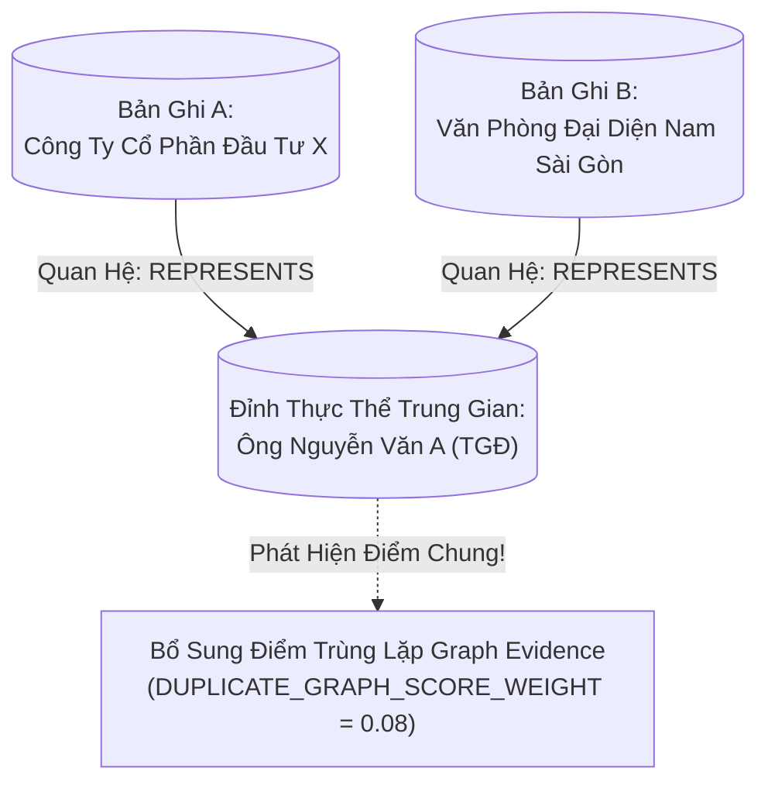

# 03. Bằng Chứng Đồ Thị & Vết Quyết Định (Graph Evidence & Decision Trace)

> **Phân hệ:** AI Eagle Platform  
> **Chủ đề:** Tra cứu liên kết quan hệ trong đồ thị tri thức, và cấu trúc vết quyết định minh bạch `decision_trace`.

---

## 1. Bằng Chứng Đồ Thị (Graph-Style Related Entity Evidence)

Một trong những thách thức lớn nhất của việc phát hiện trùng lặp là các bản ghi cố tình che giấu hoặc bị lỗi nhập liệu nặng:
- Bản ghi A: `"Công Ty Cổ Phần Đầu Tư X"` (Địa chỉ: Tòa nhà Bitexco, TP.HCM).
- Bản ghi B: `"Văn Phòng Đại Diện Nam Sài Gòn"` (Địa chỉ: Quận 7, TP.HCM).
- Tên và địa chỉ hoàn toàn khác nhau (điểm Fuzzy và Exact đều rất thấp).
- **Tuy nhiên:** Trong CSDL đồ thị tri thức `AE_GRAPH_WORKSPACE`, cả hai thực thể này đều có mối quan hệ liên kết:
  - Đều có cạnh `REPRESENTS` trỏ tới cùng một đỉnh cá nhân: `"Nguyễn Văn A"` (Tổng Giám Đốc).
  - Hoặc đều có quan hệ `SUBSIDIARY_OF` trỏ về cùng một công ty mẹ `"Tập Đoàn Alpha"`.



---

## 2. Vết Quyết Định Minh Bạch: `decision_trace`

Trong các quy trình phê duyệt dữ liệu doanh nghiệp (MDG Governance), quyết định từ chối hoặc hợp nhất hai bản ghi liên quan trực tiếp tới trách nhiệm pháp lý. Do đó, AI không thể là một "hộp đen" bí ẩn.

Mỗi khi thực hiện kiểm tra trùng lặp qua `/api/v1/duplicate-check`, hệ thống sinh ra một khối dữ liệu **`decision_trace`** minh bạch đến từng chi tiết:

```json
{
  "record_id": "REQ-10001",
  "overall_score": 0.892,
  "verdict": "DUPLICATE_DETECTED",
  "decision_trace": {
    "exact_matches": [
      { "field": "tax_number", "value": "0101234567", "matched": true, "score": 1.0 }
    ],
    "fuzzy_matches": [
      {
        "field": "organization_name_1",
        "input_value": "Cong Ty TNHH Alpha Tech",
        "candidate_value": "Công Ty TNHH Công Nghệ Alpha",
        "algorithm": "jaro_winkler",
        "threshold": 0.80,
        "score": 0.865
      },
      {
        "field": "street",
        "input_value": "88 Le Duan",
        "candidate_value": "88 Lê Duẩn, Hoàn Kiếm",
        "algorithm": "levenshtein",
        "threshold": 0.75,
        "score": 0.782
      }
    ],
    "vector_similarity": {
      "model": "bge-small-en-v1.5",
      "score": 0.915,
      "semantic_summary": "Khớp lĩnh vực kinh doanh phần mềm và giải pháp CNTT"
    },
    "graph_evidence": {
      "shared_entities": [
        { "entity_type": "INDIVIDUAL", "canonical_name": "Nguyen Van A", "relation": "LEGAL_REPRESENTATIVE" }
      ],
      "graph_boost": 0.08
    }
  }
}
```

### Lợi Ích Của Decision Trace:
- **Minh Bạch Cho Người Dùng:** Chuyên viên quản trị dữ liệu nhìn vào bảng điều khiển biết ngay lý do tại sao hệ thống báo trùng lặp (do trùng mã số thuế và cùng người đại diện).
- **Lưu Vết Kiểm Toán (Audit Trail):** Toàn bộ vết quyết định này được lưu vĩnh viễn vào bảng `AE_RAG_CHECK_RESULTS` trên SAP HANA phục vụ thanh tra.
